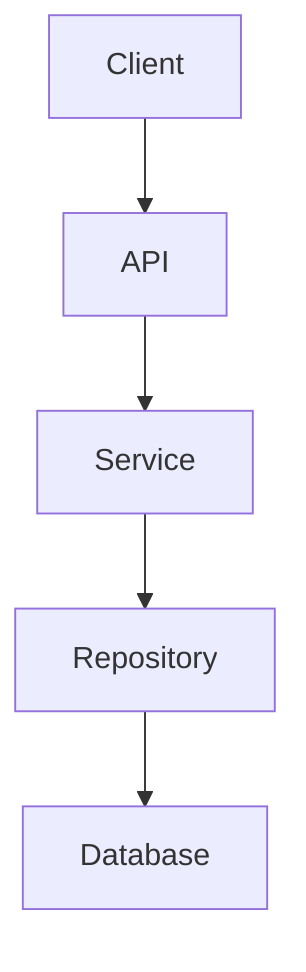

# Reverse Engineering Template - 使い方ガイド

## 概要

このガイドでは、既存コードから仕様書を生成するリバースエンジニアリングテンプレートの使用方法を説明します。

## 前提条件

- 対象モジュールのコードベースへのアクセス
- Cline AI Assistantの利用可能性
- 基本的なMarkdown知識
- Docusaurus環境（オプション、プレビュー用）

## クイックスタート

### Step 1: テンプレートファイルをClineに提供

```bash
# スターターテンプレートを表示
cat .dodo/.cline-instruction-template/BASE_TEMPLATE/REVERSE_TEMPLATE/reverse-starter-template.md
```

このファイルの内容をClineに提供してください。

### Step 2: 対象モジュールを指定

テンプレート内の`{MODULE_NAME}`を実際のモジュール名に置き換えます：

```markdown
## Target Module

**Module Name**: task-ms
```

### Step 3: 分析開始

Clineが自動的に以下を実行します：

1. ディレクトリ構造の分析
2. API仕様の抽出
3. データモデルの抽出
4. ビジネスロジックの文書化
5. テストカバレッジの分析
6. 仕様書の生成

## 詳細な使用手順

### Phase 1: 準備

#### 1.1 対象モジュールの確認

```bash
# モジュールの存在確認
ls -la task-ms/

# 主要ファイルの確認
ls task-ms/src/
ls task-ms/test/
```

#### 1.2 分析範囲の決定

`.dodo/.cline-instruction-template/BASE_TEMPLATE/REVERSE_TEMPLATE/reverse-sections/analysis-scope-section.md`を参照し、分析範囲を決定：

- **SIMPLE** (0-4点): 小規模モジュール、シンプルなロジック
- **STANDARD** (5-8点): 通常のマイクロサービス
- **COMPLEX** (9-15点): 大規模・複雑なシステム

### Phase 2: リバース実行

#### 2.1 Clineへのプロンプト提供

**基本プロンプト**:
```
以下のテンプレートを使用して、task-msモジュールの仕様書をリバースエンジニアリングしてください。

{reverse-starter-template.mdの内容をコピー}
```

**カスタマイズプロンプト**（特定セクションのみ）:
```
task-msモジュールのAPI仕様のみをリバースエンジニアリングしてください。

対象: REST API endpoints
出力先: docusaurus/docs/task-ms/1.Specification/03-api-specification.md

{api-extraction-section.mdの内容をコピー}
```

#### 2.2 進捗確認

Clineは以下の順序で作業を進めます：

1. ✅ ディレクトリ構造マッピング
2. ✅ エントリーポイント特定
3. ✅ 依存関係分析
4. ✅ API仕様抽出
5. ✅ データモデル抽出
6. ✅ ビジネスロジック文書化
7. ✅ テストカバレッジ分析
8. ✅ 仕様書生成

### Phase 3: レビューと検証

#### 3.1 生成された仕様書の確認

```bash
# 生成されたファイルの確認
ls -la docusaurus/docs/task-ms/

# ファイル内容の確認
cat docusaurus/docs/task-ms/1.Specification/01-overview.md
```

#### 3.2 Markdownリンティング

```bash
cd docusaurus/docs
npm run lint:md

# エラーがある場合は手動で修正
# 自動修正は使用しない（MDXを壊す可能性）
```

#### 3.3 Docusaurusでプレビュー

```bash
cd docusaurus
npm run start

# ブラウザで http://localhost:4000 を開く
# 生成された仕様書を確認
```

### Phase 4: 仕上げ

#### 4.1 不足情報の補完

Clineが「Implementation details unclear」とマークした箇所を確認：

```markdown
## Payment Processing

⚠️ **Implementation details unclear - requires clarification**

{この部分を手動で補完}
```

#### 4.2 図の追加・改善

必要に応じてMermaid図を追加または改善：



#### 4.3 コミット

```bash
git add docusaurus/docs/task-ms/
git commit -m "docs: add reverse-engineered specification for task-ms"
git push
```

## 使用例

### 例1: 新規マイクロサービスの仕様書生成

**シナリオ**: 既存のauth-msの仕様書を生成したい

**手順**:

1. テンプレート準備
```bash
cat .dodo/.cline-instruction-template/BASE_TEMPLATE/REVERSE_TEMPLATE/reverse-starter-template.md
```

2. Clineにプロンプト提供
```
auth-msモジュールの完全な仕様書をリバースエンジニアリングしてください。

Module Name: auth-ms
Analysis Level: STANDARD
Priority: P0 + P1

{スターターテンプレートの内容}
```

3. 結果確認
```bash
ls docusaurus/docs/auth-ms/
# 1.Specification/
# 2.Implementation/
# 3.Testing/
# 4.Operations/
```

### 例2: API仕様のみ抽出

**シナリオ**: payment-msのAPI仕様だけが必要

**手順**:

1. API抽出セクションのみ使用
```bash
cat .dodo/.cline-instruction-template/BASE_TEMPLATE/REVERSE_TEMPLATE/reverse-sections/api-extraction-section.md
```

2. Clineにプロンプト提供
```
payment-msのAPI仕様のみを抽出してください。

Module: payment-ms
Output: docusaurus/docs/payment-ms/1.Specification/03-api-specification.md

{api-extraction-section.mdの内容}
```

### 例3: データモデルの文書化

**シナリオ**: user-tenant-msのデータモデルを文書化したい

**手順**:

1. データモデルセクション使用
```bash
cat .dodo/.cline-instruction-template/BASE_TEMPLATE/REVERSE_TEMPLATE/reverse-sections/data-model-section.md
```

2. Clineにプロンプト提供
```
user-tenant-msのデータモデルを完全に文書化してください。

Include:
- Database schema
- Entity definitions
- ER diagrams
- ORM mappings

{data-model-section.mdの内容}
```

## トラブルシューティング

### 問題1: 生成された仕様書が不完全

**症状**: 一部のセクションが空またはプレースホルダーのまま

**解決策**:

1. コードベースを確認
```bash
# 該当ファイルが存在するか確認
ls -la {module}/src/
```

2. より詳細な指示を提供
```
task-msのAPI仕様を抽出してください。

重要: 以下のファイルを必ず確認してください：
- src/presentation/routes/*.ts
- src/presentation/controllers/*.ts
- src/application/dto/*.ts
```

### 問題2: Mermaid図がレンダリングされない

**症状**: Docusaurusで図が表示されない

**解決策**:

1. 構文チェック
```bash
# Mermaid Live Editorで検証
# https://mermaid.live/
```

2. 特殊文字のエスケープ
```markdown
# 悪い例
node["Price < $100"]

# 良い例
node["Price less than $100"]
```

### 問題3: リンクが切れている

**症状**: ドキュメント内のリンクが404になる

**解決策**:

1. 相対パスの確認
```markdown
# 悪い例
[Link](/absolute/path/file.md)

# 良い例
[Link](./relative/file.md)
[Link](../parent/file.md)
```

2. リンクチェック
```bash
cd docusaurus
npm run build  # ビルドエラーで切れたリンクを検出
```

### 問題4: 分析時間が長すぎる

**症状**: 大規模モジュールの分析に時間がかかる

**解決策**:

1. 分析範囲を分割
```
# Phase 1: Core APIs only
Module: large-ms
Scope: src/presentation/ + src/application/

# Phase 2: Data layer
Module: large-ms  
Scope: src/domain/ + src/infrastructure/
```

2. 優先度を設定
```
Priority: P0 (Critical) only
Skip: P2, P3
```

## ベストプラクティス

### 1. 段階的アプローチ

大規模モジュールは段階的にリバース：

```
Day 1: Overview + Architecture
Day 2: API Specification
Day 3: Data Model
Day 4: Business Logic
Day 5: Testing + Review
```

### 2. 既存ドキュメントの活用

README等を参照情報として提供：

```
以下の既存情報も参考にしてください：

- README.md: {内容をコピー}
- ARCHITECTURE.md: {内容をコピー}
```

### 3. チームレビューの組み込み

```
1. 初回ドラフト生成（80%完成度目標）
2. モジュールオーナーレビュー
3. フィードバック反映
4. 最終レビュー
5. 承認・公開
```

### 4. 定期的な更新

```
# 四半期ごとにリバース実行
Q1: payment-ms, auth-ms
Q2: user-tenant-ms, docs-ms
Q3: ai-router-ms, task-ms
Q4: 全モジュール最新化チェック
```

### 5. テンプレートのカスタマイズ

プロジェクト固有の要件に合わせてセクションを追加：

```bash
# カスタムセクション作成
touch reverse-sections/security-analysis-section.md
touch reverse-sections/performance-metrics-section.md
```

## よくある質問 (FAQ)

### Q1: 既存の仕様書がある場合はどうする？

**A**: 比較して差分を確認してください。

```bash
# 新旧比較
diff docusaurus/docs/task-ms/old/ docusaurus/docs/task-ms/new/
```

### Q2: 複数のマイクロサービスを一度にリバースできる？

**A**: 可能ですが、推奨しません。1つずつ丁寧にリバースする方が品質が高くなります。

### Q3: 自動化できる？

**A**: CI/CDに組み込むことは可能ですが、人間のレビューは必須です。

```yaml
# .github/workflows/doc-reverse.yml
name: Reverse Engineering
on:
  schedule:
    - cron: '0 0 1 * *'  # 月1回
jobs:
  reverse:
    runs-on: ubuntu-latest
    steps:
      - uses: actions/checkout@v2
      - name: Generate specs
        run: |
          # Cline APIを使用して自動生成
      - name: Create PR
        run: |
          # 生成された仕様書でPR作成
```

### Q4: 非英語コメントのコードでも動作する？

**A**: はい、ただし生成される仕様書は英語になります。

### Q5: プライベートリポジトリでも使える？

**A**: はい、Clineがアクセスできれば問題ありません。

## 参考資料

### 関連ドキュメント

- [BASE_TEMPLATE/README.md](../README.md) - 通常のテンプレート
- [.clinerules/03-work-plans.md](../../../../.clinerules/03-work-plans.md) - 作業計画ルール
- [.clinerules/09-docusaurus-updates.md](../../../../.clinerules/09-docusaurus-updates.md) - ドキュメント更新ルール

### 外部リソース

- [Mermaid Documentation](https://mermaid.js.org/)
- [Docusaurus Guide](https://docusaurus.io/docs)
- [Markdown Guide](https://www.markdownguide.org/)

## サポート

問題が発生した場合：

1. このガイドのトラブルシューティングセクションを確認
2. READMEの注意事項を確認
3. チームメンバーに相談
4. Issue作成（リポジトリに応じて）

## 更新履歴

| 日付 | 変更内容 | 担当者 |
|------|---------|--------|
| 2025-01-15 | 初版作成 | - |

---

**Happy Reverse Engineering! 🔄📚**
