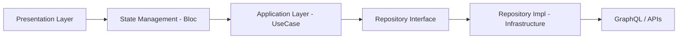

# 02. Architecture Principles

## 2.1 What is Modular Onion Architecture?

Modular Onion Architecture fuses three design philosophies:

1. **Onion Architecture**:
   * Dependencies are limited inward (toward inner circles)
   * Business logic is at the center, with UI and infrastructure at the periphery

2. **Flutter Modular DI/Routing**:
   * Complete DI and routing separation by module unit, separating responsibilities

3. **Atomic Design**:
   * Unified UI composition at Atom/Molecule/Organism granularity

This achieves "domain-closed business rules," "loosely coupled UI," "reusable components," and "improved testability through DI" simultaneously.

## 2.2 Layer Structure (Dependency Direction)

💡 Dependency direction is always outer → inner, and the UI layer never directly depends on infrastructure.

## 2.3 Layer Classification Mapping

| Layer | Flutter Implementation | Overview |
|-------|----------------------|----------|
| Domain | `core/`, `features/*/domain/` | Pure contracts like Entity, Repository Interface |
| Application | `features/*/application/` | UseCase-based business operation implementation |
| Presentation | `features/*/presentation/`, `pages/` | State management with Bloc, UI reflection |
| Infrastructure | `features/*/infrastructure/`, `infrastructure/` | API clients, Storage implementations, etc. |
| Composition | `app/`, `modular/` | DI, Routing configuration |
