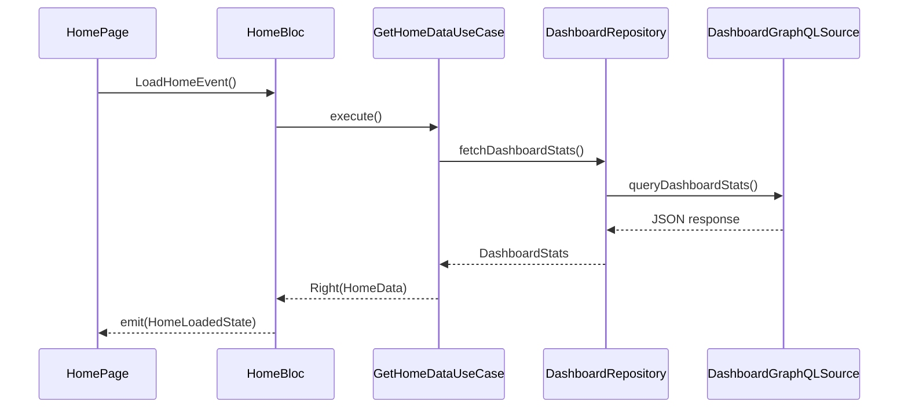

# 06. Bloc + UseCase + Repository Integration Design

When combining Bloc, UseCase, and Repository to compose the main functions of the app, this defines standard collaboration patterns. This composition contributes to responsibility clarification, testability, and explicit state transitions.

## 6.1 Flow Overview (Home Screen Example)



## 6.2 Bloc

* `HomeBloc` receives `LoadHomeEvent` and executes `GetHomeDataUseCase`
* Emits `HomeLoadingState` → `HomeLoadedState` or `HomeErrorState` according to results

```dart
on<LoadHomeEvent>((event, emit) async {
  emit(HomeLoadingState());
  final result = await getHomeDataUseCase();
  result.fold(
    (failure) => emit(HomeErrorState(failure)),
    (data) => emit(HomeLoadedState(data))
  );
});
```

## 6.3 UseCase

* `GetHomeDataUseCase` combines multiple Repositories and aggregates data necessary for the screen
* Depends only on Repository Interface for external dependencies

```dart
class GetHomeDataUseCase {
  final UserRepository userRepo;
  final DashboardRepository dashboardRepo;

  GetHomeDataUseCase(this.userRepo, this.dashboardRepo);

  Future<Either<Failure, HomeData>> call() async {
    try {
      final user = await userRepo.fetchCurrentUser();
      final stats = await dashboardRepo.fetchDashboardStats();
      return Right(HomeData(user: user, stats: stats));
    } catch (e) {
      return Left(Failure(e));
    }
  }
}
```

## 6.4 Repository Interface

* Contract to cut dependency on Infrastructure layer

```dart
abstract class DashboardRepository {
  Future<DashboardStats> fetchDashboardStats();
}
```

## 6.5 Repository Implementation + DataSource

* Data acquisition means like GraphQL are confined to DataSource
* RepositoryImpl also handles Entity conversion and failure handling

```dart
class DashboardRepositoryImpl implements DashboardRepository {
  final DashboardGraphQLSource source;

  DashboardRepositoryImpl(this.source);

  @override
  Future<DashboardStats> fetchDashboardStats() async {
    final result = await source.queryDashboardStats();
    if (result.hasException) throw ServerException(result.exception);
    return DashboardStats.fromJson(result.data);
  }
}
```

## 6.6 DI (Modular)

* Use Modular's Bind to resolve dependencies

```dart
class HomeModule extends Module {
  @override
  List<Bind> get binds => [
    Bind.factory((i) => DashboardGraphQLSource(i())),
    Bind.factory<DashboardRepository>((i) => DashboardRepositoryImpl(i())),
    Bind.factory((i) => GetHomeDataUseCase(i(), i())),
    Bind.factory((i) => HomeBloc(i())),
  ];
}
```
