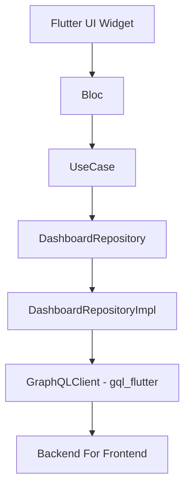
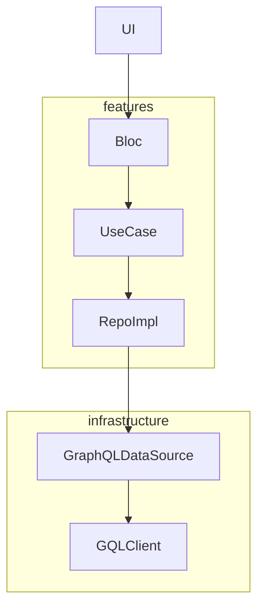

# 07. GraphQL + BFF Integration Design

GraphQL is a query-based API design method optimized for mobile and SPA, with extremely good compatibility with Flutter. This project can optionally adopt a BFF (Backend For Frontend) configuration to acquire screen-optimized data from a single GraphQL endpoint.

## BFF Considerations

**BFF is not mandatory** and should be considered based on application characteristics:

* **Recommended for large-scale systems**: When dealing with multiple microservices, BFF can aggregate and optimize data for frontend consumption
* **Consider for complex data requirements**: When frontend needs data from multiple backend services with different formats
* **Evaluate team resources**: BFF adds architectural complexity and requires additional maintenance
* **Microservices environments**: In systems with many microservices, BFF helps reduce frontend complexity by providing a unified interface

**Key considerations for large-scale systems:**
- Data aggregation complexity increases with the number of backend services
- Network latency optimization becomes more critical
- Authentication and authorization coordination across services
- Caching strategies need careful planning
- Error handling and fallback mechanisms become more complex

## 7.1 Configuration Diagram (GraphQL + Repository Path)



## 7.2 Implementation Layer Configuration

| Layer | File Example | Role |
|-------|--------------|------|
| DataSource | `dashboard_graphql_source.dart` | GraphQL query execution and result return |
| RepositoryImpl | `dashboard_repository_impl.dart` | Convert GraphQL results to Entity. Also handles failure processing |
| UseCase | `get_home_data_usecase.dart` | Bundle multiple repositories and compose objects to pass to Bloc |
| Bloc | `home_bloc.dart` | Execute UseCase according to events and emit state |
| UI | `home_page.dart` | Widget display according to Bloc state |

## 7.3 GraphQL Client Initialization

```dart
class GraphQLService {
  late final GraphQLClient client;
  GraphQLService() {
    final httpLink = HttpLink('https://api.example.com/graphql');
    final authLink = AuthLink(getToken: () async => 'Bearer ${await getToken()}');
    final link = authLink.concat(httpLink);
    client = GraphQLClient(link: link, cache: GraphQLCache());
  }
}
```

* Place in `infrastructure/services/`
* Manage as `Bind.singleton` in Modular DI

## 7.4 Data Acquisition Responsibility Separation



* Confine GraphQL syntax/exception handling to Source
* Response → Domain Entity conversion to RepositoryImpl
* UseCase depends on Repository Interface and can integrate multiple
* Bloc manages only state
