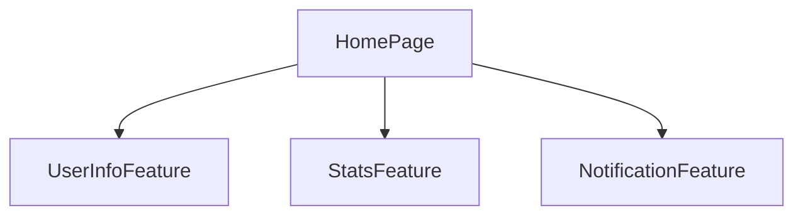

# 08. Page and Feature Separation Guidelines

In large-scale Flutter apps, separating responsibilities between functional units (Feature) and screen units (Page) is important for enhancing reusability, maintainability, and testability.

## 8.1 Responsibility Differences Between Page and Feature

| Type | Description |
|------|-------------|
| Page | Modular routing target. Screen unit. Place for UI construction integrating multiple Features. |
| Feature | Specific business use case. Self-contained with Bloc, Widget, and UseCase within Feature. |

## 8.2 Mermaid Structure Diagram: Feature Calls from Page Perspective

Each Feature has individual Bloc and state, and the page side only assembles with MultiBlocProvider and Column.

## 8.3 Reusability Perspective

* Same Feature can be reused across multiple Pages
* Features don't depend on screen context (e.g., `UserProfileCardWidget` can be used in both profile screen and side menu)
* Bloc is managed completely within Feature without regeneration outside screen

This structure clarifies screen and function responsibilities, significantly improving development and review efficiency.
