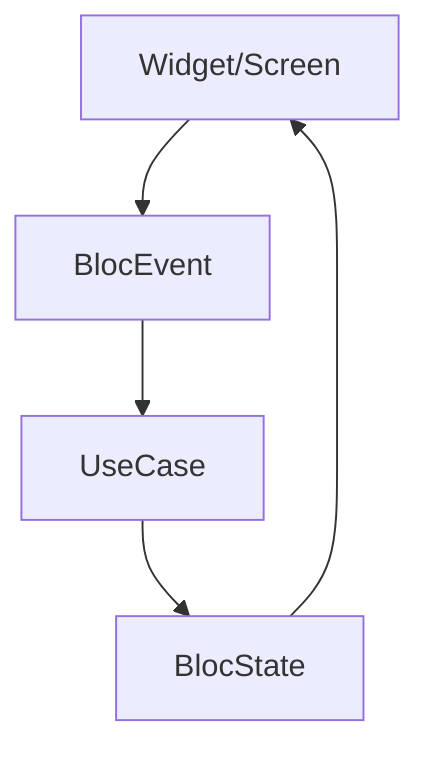

# 09. UI Layer Responsibility Constraints and Atomic Design Application

The UI layer is a layer responsible only for the app's "appearance" and "operation," holding no business logic and handling screen composition according to state as a principle. Here we define explicit constraints on UI and consistent integration with Atomic Design.

## 9.1 UI Layer Principles: UI is "Stupid," Logic is "Smart"

| Item | Principle |
|------|-----------|
| State Dependency | React only to BlocState or Provider State (Widget switching according to state) |
| API Prohibition | Direct API/DB access from UI layer prohibited. Always go through Bloc/Event |
| Business Logic Prohibition | Don't write domain rules in UI layer (button activation judgment also processed on State side) |
| Navigation Permission | `Modular.to.pushNamed(...)` etc. based on Bloc or State instructions is acceptable |

## 9.2 Responsibility Separation: UI and State and Event

By adhering to the role of "UI only displays State," change propagation is minimized.

## 9.3 Integration with Atomic Design

Flutter's Atomic Design composes Widgets according to the following hierarchy to ensure UI reusability and maintainability.

| Hierarchy | Content | Placement Example |
|-----------|---------|-------------------|
| Atom | Minimum UI unit. Text, Icon, Button, etc. | `shared/presentation/components/atoms/` |
| Molecule | Combination of multiple Atoms. Labeled forms, etc. | `shared/presentation/components/molecules/` |
| Organism | Headers, cards, lists and other large composition elements | `shared/presentation/components/organisms/` |
| Page | Overall layout (Scaffold unit) | `features/{feature}/presentation/pages/` |

## 9.4 Considerations in UI Composition

* State passing is the responsibility of upper Widgets
  * GlobalBloc → Page → Organism → Molecule → Atom
  * Lower components don't directly depend on Bloc (receive via arguments)
* Cut out common Widgets to shared
  * Consider placement under `shared/presentation/components/` if used in 2+ places
* Styles depend on Theme
  * Follow centralized management like `AppColors`, `AppTextStyle`, avoid defining original colors/sizes as much as possible

## 9.5 Story (Widgetbook) Integration

* Atoms/Molecules/Organisms must have Widgetbook stories
* Stories are hierarchized in `lib/widgetbook/stories/atoms/`, `molecules/`, `organisms/`
* Stories enable easy design confirmation and regression testing
