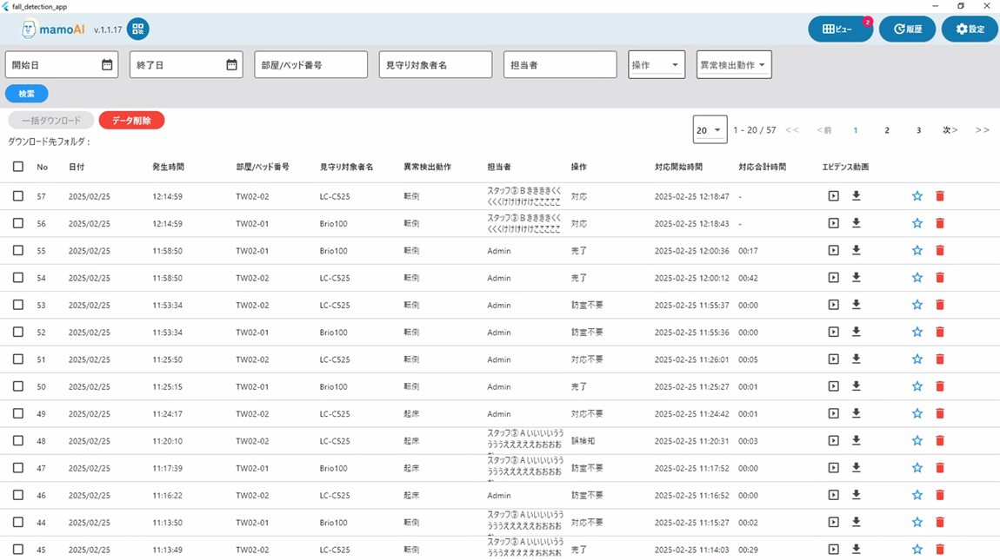

# 履歴画面設計書

## 1. 画面概要

- **目的**: 発生済み、発生中の異常検知結果の履歴一覧を表示し、対象の異常検知結果の検索、内容閲覧、および履歴動画の視聴／ファイルダウンロードリンクを提供する
- **主な機能**:
  - **共通／その他**
    - ［QRコード］ボタン：モバイル機器がログインするためのQRコードを表示したポップアップ画面を表示する
    - ［ビュー］ボタン：ビュー画面へ遷移する
    - ［履歴］ボタン：本画面へ遷移する
    - ［設定］ボタン：設定画面：共通設定へ遷移する
  - **異常検知結果の一覧表示**
    - 初期表示：最新の異常検知結果を降順に20件表示する
  - **異常検知一覧の条件検索**
    - 後述の検索条件に合致した異常検知結果を降順に20件表示する
    - ［条件項目］発生日(From)／発生日(To)／部屋/ベッド番号／見守り対象者名／担当者（＝スタッフ名）／操作（対応時の押下ボタン名）／異常検出動作（異常検出された姿勢）
  - **異常検知履歴動画の視聴**
    - 対象行の履歴動画再生アイコンをクリックすることで、対象の履歴動画を同画面上で視聴する
  - **異常検知履歴動画のダウンロード**
    - 対象行の履歴動画ダウンロードアイコンをクリックすることで、対象の履歴動画をローカルフォルダへダウンロードする（動画ファイル形式）

---

## 2. 画面レイアウト

<!-- 画像ファイルを以下のパスに配置してください: docusaurus/static/img/docs/frontend/history-screen.png -->

---

## 3. 一覧表示

| No. | セクション名         | ページネーション | 既存ソート       | 表示件数                | 備考           |
| --- | -------------------- | ---------------- | ---------------- | ----------------------- | -------------- |
| 1   | 異常検知履歴一覧     | あり             | 履歴番号：降順   | 20/50/100 ※初期表示：20 | 履歴番号：降順 |

---

## 4. 画面項目定義

### 4.1 アイテム要素

| No. | 画面項目名           | 種別         | 入出力 | 取得元/API                            | パラメータ/キー | 編集/表示仕様                                                                                   | 長さ | 初期値 | 必須 | 備考                                                                 |
| --- | -------------------- | ------------ | ------ | ------------------------------------- | --------------- | ----------------------------------------------------------------------------------------------- | ---- | ------ | ---- | -------------------------------------------------------------------- |
| 1   | チェックボックス     | CheckBox     | 入力   | -                                     | -               | 複数チェック可                                                                                  | -    | -      | ○    | デフォルトは"Off"                                                    |
| 2   | 履歴番号             | text         | 出力   | `GET /incidents/{incidentId}/actions` | incidentId      | 表示のみ                                                                                        | -    | -      | ○    | 降順                                                                 |
| 3   | 日付                 | text         | 出力   | `GET /incidents/{incidentId}/actions` | createdAt       | yyyy/mm/dd                                                                                      | -    | -      | ○    |                                                                      |
| 4   | 発生時間             | text         | 出力   | `GET /incidents/{incidentId}/actions` | createdAt       | hh:MM:ss                                                                                        | -    | -      | ○    |                                                                      |
| 5   | 部屋/ベッド番号      | text         | 出力   | `GET /incidents/{incidentId}/actions` | ？なし？        | 表示のみ                                                                                        | -    | -      | -    | 個別設定画面での登録情報よりブランクの可能性あり                     |
| 6   | 見守り対象者名       | text         | 出力   | `GET /incidents/{incidentId}/actions` | ？なし？        | 表示のみ                                                                                        | -    | -      | -    | 個別設定画面での登録情報よりブランクの可能性あり                     |
| 7   | 異常検出動作         | text         | 出力   | `GET /incidents/{incidentId}/actions` | ？なし？        | 表示のみ                                                                                        | -    | -      | -    | ［起床／端坐位／転倒／離床］のいずれかを表示                         |
| 8   | 担当者               | text         | 出力   | `GET /incidents/{incidentId}/actions` | staffId         | 表示のみ                                                                                        | -    | -      | -    | 自動完了した場合は"スタッフ名" + "(SYSTEM)"を表示                    |
| 9   | 操作                 | text         | 出力   | `GET /incidents/{incidentId}/actions` | actionType      | 表示のみ                                                                                        | -    | -      | -    | ［ブランク／対応／完了／訪室不要／対応不要／誤検知］のいずれかを表示 |
| 10  | 対応開始時間         | text         | 出力   | `GET /incidents/{incidentId}/actions` | startAt         | yyyy/mm/dd hh:MM:ss                                                                             | -    | -      | -    |                                                                      |
| 11  | 対応合計時間         | text         | 出力   | `GET /incidents/{incidentId}/actions` | endAt           | mm:ss                                                                                           | -    | -      | -    |                                                                      |
| 12  | 動画再生アイコン     | link/button  | 入力   | `GET /videos/{videoId}/file`          | videoId         | 表示のみ                                                                                        | -    | -      | ○    | サーバーに保存された履歴動画ファイルへのリンク                       |
| 13  | 動画ダウンロードアイコン | link/button  | 入力   | `GET /videos/{videoId}/file`          | videoId         | 表示のみ                                                                                        | -    | -      | ○    | サーバーに保存された履歴動画ファイルへのリンク                       |

### 4.2 他画面遷移ボタン

| No. | 項目名           | 種別        | 入出力 | 取得元/API | パラメータ/キー | 動作                                   | 備考                                   |
| --- | ---------------- | ----------- | ------ | ---------- | --------------- | -------------------------------------- | -------------------------------------- |
| 1   | QRコード         | link/button | 出力   | -          | -               | QRコードウィンドウをポップアップ表示   | モーダル形式のウィンドウをポップアップ表示する |
| 2   | ビュー           | link/button | 出力   | -          | -               | ビュー画面へ遷移                       |                                        |
| 3   | 見守り対象者名   | link/button | 出力   | -          | -               | 履歴画面へ遷移                         | 本画面を再表示                         |
| 4   | 異常姿勢         | link/button | 出力   | -          | -               | 設定画面：共通設定へ遷移               |                                        |

### 4.3 検索機能関連

| No. | 項目名           | 種別     | 入出力 | 取得元/API       | パラメータ/キー | 動作                                       | 備考                                                                                 |
| --- | ---------------- | -------- | ------ | ---------------- | --------------- | ------------------------------------------ | ------------------------------------------------------------------------------------ |
| 1   | 開始日           | Calendar | 入力   | -                | -               | Calendarウィンドウをモーダルで表示/選択    | 「日付」のFrom日　初期値：ブランク                                                   |
| 2   | 終了日           | Calendar | 入力   | -                | -               | Calendarウィンドウをモーダルで表示/選択    | 「日付」のTo日　初期値：ブランク                                                     |
| 3   | 部屋/ベッド番号  | textarea | 入力   | -                | -               |                                            | 「部屋/ベッド番号」の一部/全部　初期値：ブランク                                     |
| 4   | 見守り対象者名   | textarea | 入力   | -                | -               |                                            | 初期値：ブランク                                                                     |
| 5   | 担当者           | textarea | 入力   | -                | -               |                                            | 初期値：ブランク                                                                     |
| 6   | 操作             | dropbox  | 入力   | -                | -               |                                            | ［ブランク／対応／完了／訪室不要／対応不要／誤検知］のいずれかを選択　初期値：ブランク |
| 7   | 異常検出動作     | dropbox  | 入力   | -                | -               |                                            | ［ブランク／起床／端坐位／転倒／離床］のいずれかを選択　初期値：ブランク             |
| 8   | 検索             | button   | 出力   | GET /incidents/  |                 | 入力された検索条件に合致する履歴データを一覧表示 |                                                                                      |
| 9   | 検索ページ選択   | button   | 入力   | ※UI上で実現     | -               | ページネーション操作を提供                 | 初期値：1ページ目                                                                    |

---

## 5. 画面イベント一覧

| No. | イベント名       | トリガー                                 | 概要                                                                                     |
| --- | ---------------- | ---------------------------------------- | ---------------------------------------------------------------------------------------- |
| 1   | 初期表示         | 画面表示時                               | 最新の異常検知結果を降順に20件表示する                                                   |
| 2   | 検索             | ［検索］ボタン押下                       | 入力された検索条件に合致する履歴データを一覧表示                                         |
| 3   | 検索ページ選択   | ページネーションボタン押下               | 指定されたページの履歴データを表示                                                       |
| 4   | 動画再生         | 動画再生アイコン押下                     | 対象の履歴動画を同画面上で視聴                                                           |
| 5   | ダウンロード     | 動画ダウンロードアイコン押下             | 対象の履歴動画をローカルフォルダへダウンロード                                           |

---

## 6. イベント詳細

### 6.1 初期表示
- 画面表示時に最新の異常検知結果を履歴番号降順で20件取得し表示する
- API: `GET /incidents/`

### 6.2 検索
- 検索条件（開始日、終了日、部屋/ベッド番号、見守り対象者名、担当者、操作、異常検出動作）に合致する履歴データを取得し表示する
- API: `GET /incidents/` (クエリパラメータ付き)

### 6.3 検索ページ選択
- ページネーションボタンで指定されたページの履歴データを表示する
- UI上で実現（オフセット計算）

### 6.4 動画再生
- 対象行の履歴動画を同画面上で再生する
- API: `GET /videos/{videoId}/file`

### 6.5 ダウンロード
- 対象行の履歴動画をローカルフォルダへダウンロードする
- API: `GET /videos/{videoId}/file`

---

## 7. 非機能・UI/UX補足

- レスポンシブデザイン対応
- 動画再生時のパフォーマンス最適化
- 一括操作時の進捗表示
- エラーハンドリングとユーザーへの適切なフィードバック

---

## 8. パラメータ/用語集

| 用語             | 説明                                                                                     |
| ---------------- | ---------------------------------------------------------------------------------------- |
| 異常検知         | システムが検出した異常な姿勢や動作                                                       |
| 履歴番号         | 各異常検知イベントに割り当てられる一意の識別番号                                         |
| 対応開始時間     | スタッフが異常検知に対応を開始した時刻                                                   |
| 対応合計時間     | 対応開始から完了までの経過時間                                                           |

---

## 9. 変更履歴

| 日付       | 担当 | 変更内容 |
| ---------- | ---- | -------- |
| 2025/10/14 | Nara | 初版作成 |
