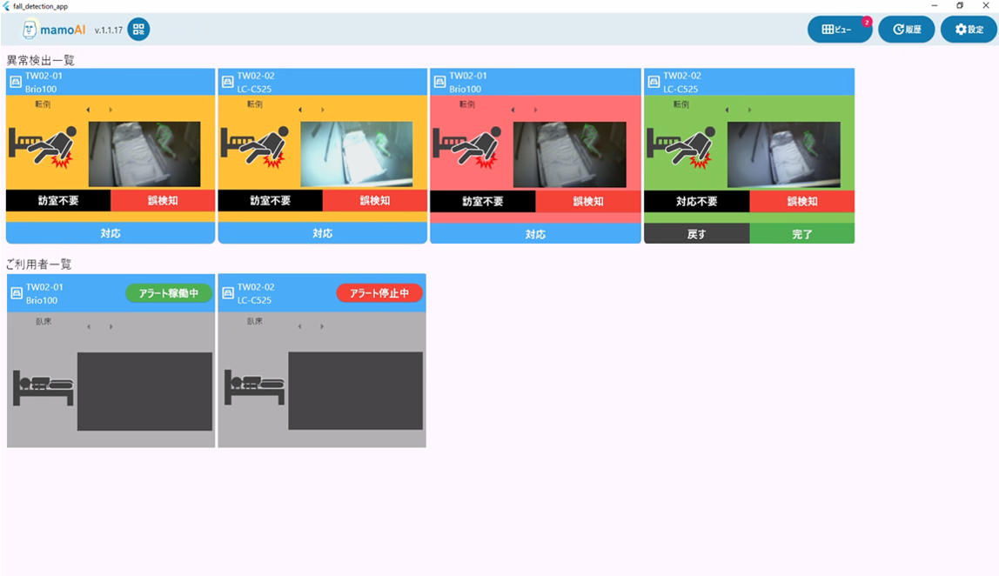

# ビュー画面設計書

## 1. 画面概要

- **目的**: 見守り対象の全ベッドの異常検知状態を表示し、対象のベッドへの介助に応じた操作を行う
- **主な機能**:
  - **共通／その他**
    - ［QRコード］ボタン：モバイル機器がログインするためのQRコードを表示したポップアップ画面を表示する
    - ［ビュー］ボタン：本画面へ遷移する
    - ［履歴］ボタン：履歴画面へ遷移する
    - ［設定］ボタン：設定画面：共通設定へ遷移する
    - 各アイテム：AIサーバーに接続されたカメラ台数分が表示され、そのアイテム内へ現時点の見守り対象者の情報をDBから取得～表示する
  - **異常検知時："未対応"ステータス**
    - ［対応］ボタン：異常検知された見守り対象者を介助するために、操作者が訪室意思を宣言する際に押下する → "対応中"ステータスに遷移し、［完了］［戻る］［対応不要］［誤検知］ボタンが表示される
    - ［訪室不要］ボタン：異常検知された見守り対象者の状況から、訪室不要と判断して異常検知状態を解除する → "対応済"ステータスに遷移し、異常検知一覧からご利用者一覧へアイテムが移動
    - ［誤検知］ボタン：異常検知された見守り対象者の状況から、異常検知結果が誤検知と判断して異常検知状態を解除する → "対応済"ステータスに遷移し、異常検知一覧からご利用者一覧へアイテムが移動
  - **異常検知時："対応中"ステータス**
    - ［完了］ボタン：異常検知された見守り対象者への介助が完了した際に押下する → "対応済"ステータスに遷移し、異常検知一覧からご利用者一覧へアイテムが移動
    - ［戻る］ボタン：当初"対応"ボタンを押下したスタッフが何らかの事情で介助ができなくなった場合に、ステータスを"未対応"に戻す際に押下する → "未対応"ステータスに遷移し、異常検知一覧内でアイテムが移動
    - ［対応不要］ボタン：訪室後に確認した見守り対象者の状況から、介助の対応不要と判断して異常検知状態を解除する → "対応済"ステータスに遷移し、異常検知一覧からご利用者一覧へアイテムが移動
    - ［誤検知］ボタン：訪室後に確認した見守り対象者の状況から、異常検知結果が誤検知と判断して異常検知状態を解除する → "対応済"ステータスに遷移し、異常検知一覧からご利用者一覧へアイテムが移動
  - **異常検知時："検知なし"ステータス**
    - ［アラート稼働中］ボタン：対象のベッド（＝カメラ）での異常検知を一時的に停止する
    - ［アラート停止中］ボタン：対象のベッド（＝カメラ）での異常検知を一時的に再開する
- **利用対象ユーザー**: ステーションに滞在するスタッフ（看護師／介護職員等）

---

## 2. 画面レイアウト

<!-- 画像ファイルを以下のパスに配置してください: docusaurus/static/img/docs/frontend/view-screen.png -->

---

## 3. 一覧表示

該当なし

---

## 4. 画面項目定義

### 4.1 アイテム要素

| No. | 画面項目名 | 種別 | 入出力 | 取得元/API | パラメータ/キー | 編集/表示仕様 | 長さ | 初期値 | 必須 | 備考 |
| --- | --- | --- | --- | --- | --- | --- | --- | --- | --- | --- |
| 1 | 部屋/ベッド番号 | text | 出力 | `GET /incidents/{incidentId}` | roomId | 表示のみ | 20 | - | - | 設定画面：個別設定の同名項目、文字列長が超過する場合は超過分を省略 |
| 2 | 見守り対象者名 | text | 出力 | `GET /incidents/{incidentId}` | personId | 表示のみ | 20 | - | - | 設定画面：個別設定の同名項目、文字列長が超過する場合は超過分を省略 |
| 3 | 異常姿勢 | text | 出力 | `GET /incidents/{incidentId}/notifications` | notificationType | 省略不可 | 4 | - | ○ | 異常検知が発生している場合は"起床／端坐位／転倒／離床"のいずれかの異常姿勢を表示、検知なしの場合は"臥床"を表示 |
| 4 | 異常姿勢（画像） | image | 出力 | システム内アセットより画像取得 | - | 複数表示可 | - | - | ○ | 項目「異常姿勢」の内容に応じた画像を表示 |
| 5 | 検知画像 | image | 出力 | `GET /incidents/{incidentId}/notifications` | - | 複数表示可 | - | - | ○ | 異常検知が発生している場合は異常検知時の当該フレームおよびその１フレーム前の画像情報を2枚表示（2枚目をデフォルト表示、１枚目はカーソルで画像遷移）、検知なしの場合はブランク |

### 4.2 他画面遷移ボタン

| No. | 項目名 | 種別 | 入出力 | 取得元/API | パラメータ/キー | 動作 | 備考 |
| --- | --- | --- | --- | --- | --- | --- | --- |
| 1 | QRコード | link/button | 入力 | - | - | QRコードウィンドウをポップアップ表示 | モーダル形式のウィンドウをポップアップ表示する |
| 2 | ビュー | link/button | 入力 | - | - | ビュー画面へ遷移 | 本画面を再表示 |
| 3 | 履歴 | link/button | 入力 | - | - | 履歴画面へ遷移 | |
| 4 | 設定 | link/button | 入力 | - | - | 設定画面：共通設定へ遷移 | |

### 4.3 異常検知時の操作ボタン

#### 異常検知時："未対応"ステータス

| No. | 項目名 | 種別 | 入出力 | 取得元/API | パラメータ/キー | 動作 | 備考 |
| --- | --- | --- | --- | --- | --- | --- | --- |
| 1 | 対応 | button | 入力 | `POST /incidents/{incidentId}/actions` | actionType | 当該アイテムのステータスを"対応中"に移行し、同時にアイテム内容を"対応中"表記へ変更 | |
| 2 | 訪室不要 | button | 入力 | `POST /incidents/{incidentId}/actions` | actionType | 当該アイテムのステータスを"検知なし"に移行し、アイテム自体をご利用者一覧へ移動 | |
| 3 | 誤検知 | button | 入力 | `POST /incidents/{incidentId}/actions` | actionType | 当該アイテムのステータスを"検知なし"に移行し、アイテム自体をご利用者一覧へ移動 | |
| 4 | 画像選択 | button | 入力 | すでに画面上のメモリに保存されたものの操作 | - | 異常検知時に獲得された画像2枚の表示対象を選択する | |

#### 異常検知時："対応中"ステータス

| No. | 項目名 | 種別 | 入出力 | 取得元/API | パラメータ/キー | 動作 | 備考 |
| --- | --- | --- | --- | --- | --- | --- | --- |
| 1 | 戻す | button | 入力 | `POST /incidents/{incidentId}/actions` | actionType | 当該アイテムのステータスを"未対応"に移行し、同時にアイテム内容を"未対応"表記へ変更 | |
| 2 | 完了 | button | 入力 | `POST /incidents/{incidentId}/actions` | actionType | 当該アイテムのステータスを"検知なし"に移行し、アイテム自体をご利用者一覧へ移動 | |
| 3 | 対応不要 | button | 入力 | `POST /incidents/{incidentId}/actions` | actionType | 当該アイテムのステータスを"検知なし"に移行し、アイテム自体をご利用者一覧へ移動 | |
| 4 | 誤検知 | button | 入力 | `POST /incidents/{incidentId}/actions` | actionType | 当該アイテムのステータスを"検知なし"に移行し、アイテム自体をご利用者一覧へ移動 | |
| 5 | 画像選択 | button | 入力 | すでに画面上のメモリに保存されたものの操作 | - | 異常検知時に獲得された画像2枚の表示対象を選択する | |

### 4.4 検知なし時の操作ボタン

#### 異常検知時："検知なし"ステータス

| No. | 項目名 | 種別 | 入出力 | 取得元/API | パラメータ/キー | 動作 | 備考 |
| --- | --- | --- | --- | --- | --- | --- | --- |
| 1 | アラート稼働中 | button | 入力 | - | - | 当該アイテムの異常検知状態を"停止状態"に移行し、同ボタンを"アラート停止中"に変更 | |
| 2 | アラート停止中 | button | 入力 | - | - | 当該アイテムの異常検知状態を"稼働状態"に移行し、同ボタンを"アラート稼働中"に変更 | |
| 3 | 画像選択 | button | - | - | - | 表示する画像対象が存在しないため、無効化された状態で配置 | |

---

## 5. 画面イベント一覧

| No. | イベント名 | トリガー | 概要 | 正常時遷移先 | 通信 | 備考 |
| --- | --- | --- | --- | --- | --- | --- |
| 1 | 初期表示 | 画面遷移時 | すべてのアイテムについて、DBに格納されたステータス内容等を表示 | ビュー画面 | あり | |
| 2 | 異常検知 | 異常検知 | 任意のベッドで異常検知された際、その異常検知内容を対象のアイテムに表示 | 遷移なし | あり | |
| 3 | 対応中 | 対応ボタン押下 | 任意のベッドのアイテム上の対応ボタン押下を受けて、ステータス変更後の内容を対象のアイテムに表示 | 遷移なし | あり | 押下対象ボタン：対応 |
| 4 | 完了 | 完了等のボタン押下 | 任意のベッドのアイテム上の完了ボタン等の押下を受けて、ステータス変更後の内容を対象のアイテムに表示 | 遷移なし | あり | 押下対象ボタン：訪室不要、対応不要、誤検知、完了 |

---

## 6. イベント詳細（処理フロー）

### 6.1 初期表示

1. **前提/バリデーション**: AIサーバーとの正常接続確認、API Gatewayへの正常接続確認
2. **処理**:
   1. 接続されたカメラ台数分の各アイテムの諸情報を取得（詳細は4.1.アイテム要素 参照）
   2. 各アイテムの異常検知ステータスを元に各アイテムを所定の位置へ配置／整列
   3. 上記が実現できない場合、該当するエラー時メッセージを表示

**エラーメッセージ（例）**

| ID | 文言（仮） | 対応方針（仮） |
| --- | --- | --- |
| error.access.aiserver | AIサーバーへの接続が失敗しました | 設定画面：システム設定での環境設定見直し |
| error.access.apigateway | API-Gatewayへの接続が失敗しました | Webアプリの再起動 |

### 6.2 異常検知の発生（→異常検知ステータス"未対応"への遷移）

1. **前提/バリデーション**: なし
2. **処理**:
   1. 任意のカメラにて異常検知された旨を、API-Gateway経由でAIサーバーから通知を受ける（その際、同時に最新のステータスをDB更新する）
   2. 対象のアイテムの異常検知ステータスおよびアイテムの各情報を更新し、画面上の「異常検知一覧」へアイテムを再配置（ボタンの配置、アイテム背景色を"黄色"へ変更）
   3. 異常検知履歴情報に本異常検知の情報を追加、および異常検知が発生した旨のログを出力する
   4. ポップアップで異常検知された旨を表示し、かつ異常検知された際のアラート音を再生

### 6.3 異常検知への対応処理（→異常検知ステータス"対応中"への遷移）

1. **前提/バリデーション**: なし
2. **処理**:
   1. 対象のアイテム上のボタン［対応］押下のトリガーを受けて、対象のアイテムの異常検知ステータスを更新（ボタンの再配置、アイテム背景色を"緑色"へ変更）（その際、同時に最新のステータスをDB更新する）
   2. 対象のアイテムの異常検知ステータスおよびアイテムの各情報を更新
   3. 異常検知履歴情報を更新、および異常検知を操作した旨のログを出力する
   4. ポップアップをCloseし、かつアラート音の再生を停止

### 6.4 異常検知への完了処理（→異常検知ステータス"検知なし"への遷移）

1. **前提/バリデーション**: なし
2. **処理**:
   1. 対象のアイテム上のボタン［完了／訪室不要／対応不要／誤検知］押下のトリガーを受けて、対象のアイテムの異常検知ステータスを更新（ボタンの削除、アイテム背景色を"灰色"へ変更）（その際、同時に最新のステータスをDB更新する）
   2. 対象のアイテムの異常検知ステータスおよびアイテムの各情報を更新し、画面上の「ご利用者一覧」へアイテムを再配置
   3. 異常検知履歴情報を更新、および異常検知を操作した旨のログを出力する
   4. 対象アイテムに紐づけられているカメラへ異常検知の再開をAPI-Gateway経由でAIサーバーへ指示する

### 6.5 異常検知の停止

1. **前提/バリデーション**: なし
2. **処理**:
   1. 対象のアイテム上の［アラート稼働中］ボタン押下のトリガーを受けて、紐づけられているカメラの見守り稼働状態を"停止状態"へ移行するよう、API-Gateway経由でAIサーバーへ指示する
   2. 対象のアイテム上のボタンを再配置する（ボタン名［アラート稼働中］→［アラート停止中］）
   3. 本件操作した旨のログを出力する

### 6.6 異常検知の稼働

1. **前提/バリデーション**: なし
2. **処理**:
   1. 対象のアイテム上の［アラート停止中］ボタン押下のトリガーを受けて、紐づけられているカメラの見守り稼働状態を"稼働状態"へ移行するよう、API-Gateway経由でAIサーバーへ指示する
   2. 対象のアイテム上のボタンを再配置する（ボタン名［アラート停止中］→［アラート稼働中］）
   3. 本件操作した旨のログを出力する

### 6.7 異常検知の再通知

1. **前提/バリデーション**: なし
2. **処理**:
   1. 異常検知発生後、設定画面：共通設定上の「再アラート時間」で設定した時間を超過した場合、その旨のトリガーを受け付ける
   2. 対象のアイテムの異常検知ステータスおよびアイテムの各情報を更新し、画面上の「異常検知一覧」へアイテムを再配置（アイテム背景色を"赤色"へ変更）
   3. 本件操作した旨のログを出力する

---

## 7. 非機能・UI/UX補足

- レスポンシブデザイン対応
- リアルタイム更新機能
- アラート音の再生機能
- エラーハンドリングとユーザーへの適切なフィードバック

---

## 8. パラメータ/用語集

| 用語 | 説明 |
| --- | --- |
| 異常検知 | システムが検出した異常な姿勢や動作 |
| 未対応 | 異常検知が発生したが、まだスタッフが対応を開始していない状態 |
| 対応中 | スタッフが対応を開始した状態 |
| 検知なし | 異常検知が発生していない、または対応が完了した状態 |
| アラート稼働中 | 異常検知機能が有効な状態 |
| アラート停止中 | 異常検知機能が一時停止している状態 |

---

## 9. 変更履歴

| 日付 | 担当 | 変更内容 |
| --- | --- | --- |
| 2025/10/14 | Nara | 初版作成 |
