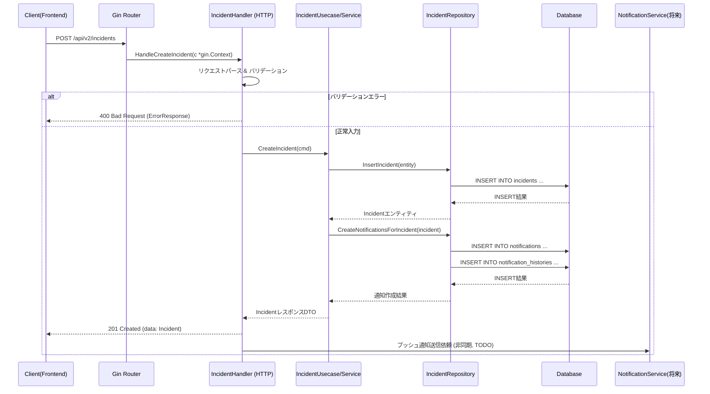
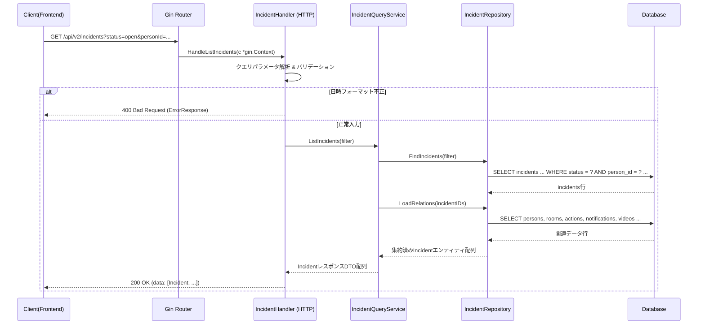

# 詳細機能設計書 (sample-project/backend)

このドキュメントは `sample-project/backend` のソースコードから生成されたAPI処理シーケンスです。

## 1. API処理シーケンス（Goレイヤ構造ベース）

### 1.1 異常イベント作成API (`POST /api/v2/incidents`)

異常検知から通知生成までの処理フロー

**レイヤ構造の説明**:
- **Router**: `cmd/api/main.go` で定義される Gin のルーター
- **Handler**: `internal/handlers/incident_handler.go` の HTTPハンドラー層
  - HTTPリクエストのパース、バリデーション、レスポンス整形を担当
- **Usecase/Service**: ビジネスロジック層（現状は Handler に含まれているが、設計上は分離を想定）
  - ドメインロジック・ユースケースの実装
- **Repository**: `internal/models/incident.go` と紐づくリポジトリ層
  - DBアクセスの抽象化とSQL発行
- **Database**: 実際のPostgreSQLデータベース
- **NotificationService**: 将来の通知サービス層（現状TODO）

**主要処理ステップ**:
1. Gin Router がリクエストを受け、対応する Handler 関数を呼び出し
2. Handler でリクエストボディのパース & バリデーション（必須項目チェック）
3. Usecase層で CreateIncident ビジネスロジックを実行
4. Repository層で incidents テーブルに新規レコード挿入（トランザクション管理）
5. Repository層で通知対象スタッフの取得と notifications/notification_histories 作成
6. Usecase から Handler へレスポンスDTOを返却
7. Handler が 201 Created レスポンスを返却
8. （将来）非同期でプッシュ通知送信

**エラーハンドリング**:
- バリデーションエラー → Handler が 400 Bad Request を返却
- データベースエラー → Repository でトランザクションロールバック → 500 Internal Server Error

---

### 1.2 異常イベント一覧取得API (`GET /api/v2/incidents`)

フィルタリング条件付きの一覧取得処理

**レイヤ構造の説明**:
- **Router**: Gin のルーター
- **Handler**: HTTPハンドラー層（リクエスト/レスポンス処理）
- **QueryService**: 検索・集約ロジックを担当するサービス層
  - 複雑なクエリやデータ集約を Handler から分離
- **Repository**: DBアクセス層
  - SQL発行と結果のエンティティへのマッピング
- **Database**: PostgreSQL

**主要処理ステップ**:
1. Gin Router がリクエストを受け、Handler 関数を呼び出し
2. Handler でクエリパラメータの解析 & バリデーション
   - status: ステータスフィルタ
   - personId: 監視対象者フィルタ
   - from/to: 日時範囲フィルタ
3. QueryService で ListIncidents ロジックを実行
4. Repository で incidents テーブルから条件に合致するレコードを取得
   - persons, rooms, staffs テーブルとJOIN
   - 表示用フィールド（personName, roomNumber等）を取得
5. Repository で関連データの一括取得（N+1問題回避）
   - notifications: 通知情報
   - actions: 対応履歴
   - incident_videos: 動画情報
6. QueryService で各 incident に関連データを統合
7. Handler が 200 OK レスポンスを返却

**エラーハンドリング**:
- 日時フォーマットエラー → Handler が 400 Bad Request を返却
- データベースエラー → 500 Internal Server Error

**パフォーマンス最適化**:
- JOINによる一括取得でN+1問題を回避
- インデックス活用（detected_at DESC, status, person_id）
- 関連データの一括ロード（LoadRelations）

---

*生成日時: 2025/11/28*  
*ソース: sample-project/backend/*
