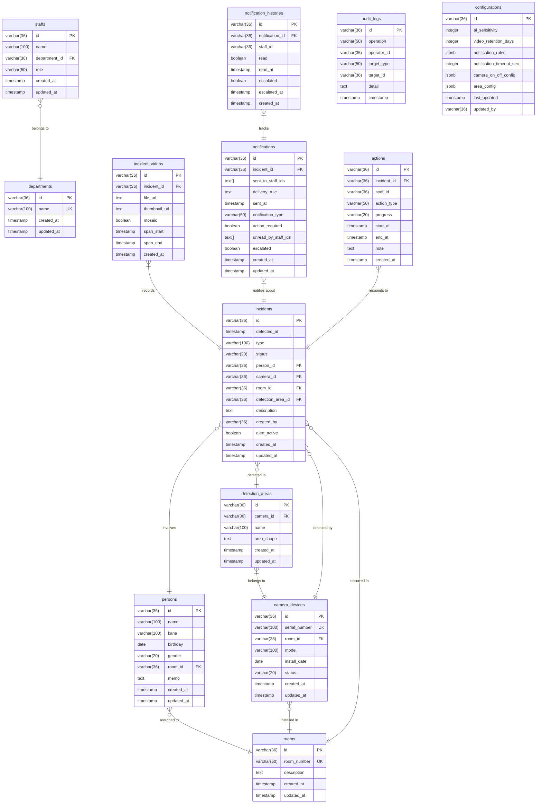

# 物理データモデル (sample-project/backend)

このドキュメントは `sample-project/backend` のデータベース構造を示す物理データモデルです。

## 1. 物理ER図

## 2. 物理テーブル詳細

### 2.1 基本エンティティ

#### departments (部署)
- **PK**: id (UUID)
- **UK**: name
- **用途**: スタッフの所属部署を管理

#### staffs (スタッフ)
- **PK**: id (UUID)
- **FK**: department_id → departments(id)
- **用途**: システムを利用するスタッフ情報
- **role**: care（介護）, nurse（看護）, admin（管理）

#### rooms (居室)
- **PK**: id (UUID)
- **UK**: room_number
- **用途**: 監視対象の物理的な部屋

#### persons (監視対象者)
- **PK**: id (UUID)
- **FK**: room_id → rooms(id)
- **用途**: 監視対象となる入居者・患者
- **gender**: male, female, other, unknown

#### camera_devices (カメラデバイス)
- **PK**: id (UUID)
- **UK**: serial_number
- **FK**: room_id → rooms(id)
- **用途**: AI異常検知カメラの管理
- **status**: normal, error, maintenance

#### detection_areas (検知エリア)
- **PK**: id (UUID)
- **FK**: camera_id → camera_devices(id)
- **用途**: カメラ内の監視エリア定義
- **area_shape**: JSON形式で座標情報を保存

### 2.2 イベント管理

#### incidents (異常イベント)
- **PK**: id (UUID)
- **FK**: 
  - person_id → persons(id)
  - camera_id → camera_devices(id)
  - room_id → rooms(id)
  - detection_area_id → detection_areas(id)
- **用途**: 検知された異常イベント
- **type**: fall（転倒）, leave_bed（離床）, enter_restricted_area（立入禁止エリア侵入）, other
- **status**: open, resolved, monitoring
- **alert_active**: アラート有効/無効フラグ（003_add_alert_active.sqlで追加）

#### incident_videos (異常動画)
- **PK**: id (UUID)
- **FK**: incident_id → incidents(id) CASCADE DELETE
- **用途**: 異常イベントの録画動画
- **mosaic**: プライバシー保護のモザイク処理有無

### 2.3 通知システム

#### notifications (通知)
- **PK**: id (UUID)
- **FK**: incident_id → incidents(id) CASCADE DELETE
- **用途**: 異常イベントに対する通知
- **sent_to_staff_ids**: 配列型で複数スタッフIDを保存
- **notification_type**: incident_detected, escalated, reminder
- **action_required**: 対応要否フラグ
- **unread_by_staff_ids**: 未読スタッフID配列

#### notification_histories (通知履歴)
- **PK**: id (UUID)
- **FK**: notification_id → notifications(id) CASCADE DELETE
- **用途**: 各スタッフの通知閲覧・エスカレーション履歴

### 2.4 対応管理

#### actions (対応履歴)
- **PK**: id (UUID)
- **FK**: incident_id → incidents(id) CASCADE DELETE
- **用途**: スタッフによる異常イベントへの対応記録
- **action_type**: respond, complete, escalate, note
- **progress**: in_progress, completed, monitoring

### 2.5 システム管理

#### audit_logs (監査ログ)
- **PK**: id (UUID)
- **用途**: システム操作の監査証跡
- **operation**: create, read, update, delete
- **target_type**: 操作対象のエンティティ種別

#### configurations (システム設定)
- **PK**: id (UUID)
- **用途**: システム全体の設定管理
- **ai_sensitivity**: AI検知感度（0-100）
- **video_retention_days**: 動画保存期間
- **notification_rules**: 通知ルール（JSONB）
- **camera_on_off_config**: カメラON/OFF設定（JSONB）

## 3. トリガー

`update_updated_at_column()` トリガーが以下のテーブルに設定され、更新時に自動的に `updated_at` を更新：
- departments
- staffs
- rooms
- persons
- camera_devices
- detection_areas
- incidents
- notifications

## 4. マイグレーション履歴

1. **001_create_base_tables.sql**: 基本テーブル作成
2. **003_add_alert_active.sql**: incidents テーブルに alert_active カラム追加
3. **seed_test_data.sql**: テストデータ投入
4. **reset_view_screen_seed.sql**: View Screen用シードデータ

---

*生成日時: 2025/11/28*  
*ソース: sample-project/backend/*
