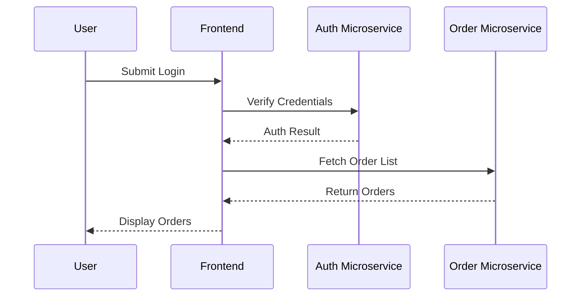

# Guide: Defining Microservice Sequence Diagrams

- Use this guide to define how microservices in your system interact across boundaries.
- Sequence diagrams must clarify the precise request, response, and data/control flows between microservices.
- **Always use Mermaid sequence diagrams to make microservice boundaries and individual service roles explicit.**

---

## What to Define

### 1. Scenario Context
- State the feature, business flow, or event sequence you are modeling.

### 2. Participants and Boundaries
- List all external actors (users, systems) and all microservices involved.
- Give each microservice a precise name matching system documentation.
- Show the boundary of each microservice clearly in the diagram.

### 3. Interaction Sequence
- Describe each step in order:
  - Who initiates the call (source)?
  - Who receives it (target)?
  - What operation/message or API?
  - Return values or events (sync/async).

### 4. Error / Exception Flows
- Include steps for error handling, validation failures, retries, or timeouts where relevant.

### 5. Service Discovery / Dynamic Calls (if used)
- Show any service registry, discovery, or dynamic routing that occurs.

### 6. Diagram Practices
- Use Mermaid's sequenceDiagram format.
- Each participant maps one-to-one to an actual microservice or boundary in your system.
- Do not merge multiple microservices into one participant.
- Add short inline comments if additional clarity is needed.

---

## Mermaid Diagram Sample

