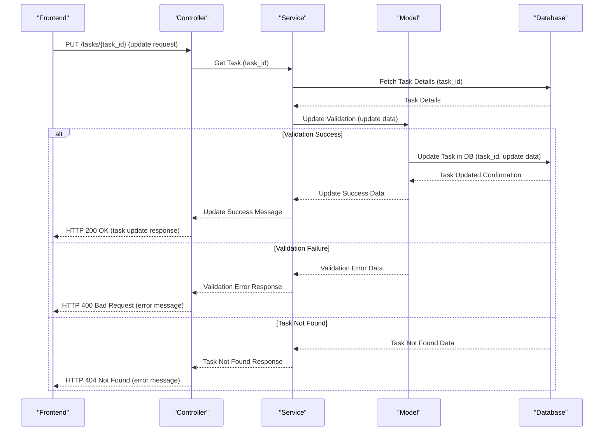

# API Design

## Instruction
Write a Markdown file that meets the following requirements.

## Overview
API design structures application interfaces, establishing clear protocols for data exchange and internal operations.

## Goals
- To create a seamless flow of operations within and across application components.
- To document interface structures for clarity and consistency in development.

## Key Points
- Clarify endpoint roles, expected requests, and potential responses.
- Outline error handling protocols.
- Develop sequence diagrams that illustrate both success and error workflows.

## Sample API Design

### Sample Sequence Diagram for Task Update Process
This sequence diagram shows a task update API process, including an initial data fetch and subsequent update steps.

### Procedure
1. Frontend makes a PUT request to the Controller with the `task_id` and update data.
2. Controller requests current task details from Service, which queries the Database.
3. Upon retrieval, Service sends update data to Model for validation.
4. If validation passes, Model instructs Database to update the task.
5. Database confirms update completion, sending data back through the Model and Service to the Controller.
6. Controller sends successful response to Frontend if task update is confirmed.
7. In case of validation failure or if task is not found, the Model notifies Service, which relays appropriate error messages through Controller to Frontend.
