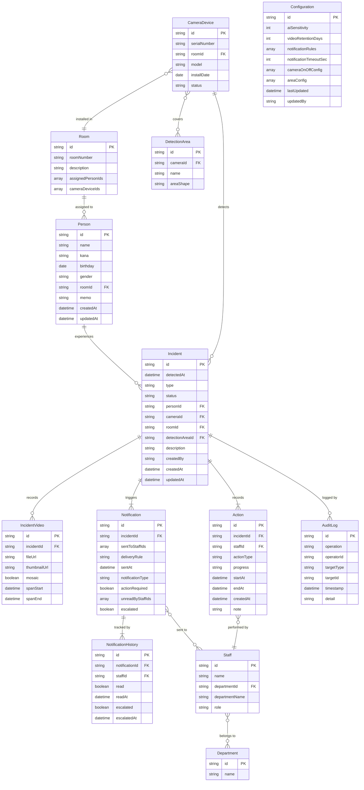

# ER Diagram

```mermaid
erDiagram

%% =====================================================
%% 1. インシデント・異常イベント領域
%% =====================================================

    Incident {
      string id PK
      datetime detectedAt
      string type
      string status
      string personId FK
      string cameraId FK
      string roomId FK
      string detectionAreaId FK
      string description
      string createdBy
      datetime createdAt
      datetime updatedAt
    }

    IncidentVideo {
      string id PK
      string incidentId FK
      string fileUrl
      string thumbnailUrl
      boolean mosaic
      datetime spanStart
      datetime spanEnd
    }

%% =====================================================
%% 2. 通知・履歴管理領域
%% =====================================================

    Notification {
      string id PK
      string incidentId FK
      array sentToStaffIds
      string deliveryRule
      datetime sentAt
      string notificationType
      boolean actionRequired
      array unreadByStaffIds
      boolean escalated
    }

    NotificationHistory {
      string id PK
      string notificationId FK
      string staffId FK
      boolean read
      datetime readAt
      boolean escalated
      datetime escalatedAt
    }

%% =====================================================
%% 3. 対応アクション領域
%% =====================================================

    Action {
      string id PK
      string incidentId FK
      string staffId FK
      string actionType
      string progress
      datetime startAt
      datetime endAt
      datetime createdAt
      string note
    }

%% =====================================================
%% 4. 対象者/スタッフ/組織・設備 領域
%% =====================================================

    Person {
      string id PK
      string name
      string kana
      date birthday
      string gender
      string roomId FK
      string memo
      datetime createdAt
      datetime updatedAt
    }

    Staff {
      string id PK
      string name
      string departmentId FK
      string departmentName
      string role
    }

    Department {
      string id PK
      string name
    }

    Room {
      string id PK
      string roomNumber
      string description
      array assignedPersonIds
      array cameraDeviceIds
    }

    CameraDevice {
      string id PK
      string serialNumber
      string roomId FK
      string model
      date installDate
      string status
    }

    DetectionArea {
      string id PK
      string cameraId FK
      string name
      string areaShape
    }

%% =====================================================
%% 5. システム証跡・履歴管理領域
%% =====================================================

    AuditLog {
      string id PK
      string operation
      string operatorId
      string targetType
      string targetId
      datetime timestamp
      string detail
    }

%% =====================================================
%% 6. システム設定領域
%% =====================================================

    Configuration {
      string id PK
      int aiSensitivity
      int videoRetentionDays
      array notificationRules
      int notificationTimeoutSec
      array cameraOnOffConfig
      array areaConfig
      datetime lastUpdated
      string updatedBy
    }

%% =====================================================
%% エンティティリレーション (関係定義)
%% =====================================================

    Person ||--o{ Incident : "experiences"
    Incident ||--|{ Notification : "triggers"
    Incident ||--|{ Action : "records"
    Incident ||--o{ IncidentVideo : "records"
    Notification ||--|{ NotificationHistory : "tracked by"
    Notification }o--o{ Staff : "sent to"
    Action }o--|| Staff : "performed by"
    Staff }o--o{ Department : "belongs to"
    CameraDevice ||--o{ Incident : "detects"
    CameraDevice }o--|| Room : "installed in"
    Room ||--o{ Person : "assigned to"
    CameraDevice }o--o{ DetectionArea : "covers"
    Incident ||--o{ AuditLog : "logged by"
```

