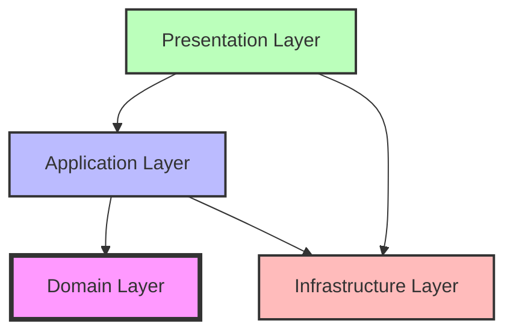
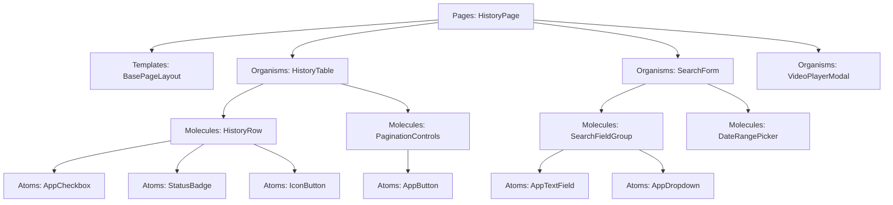
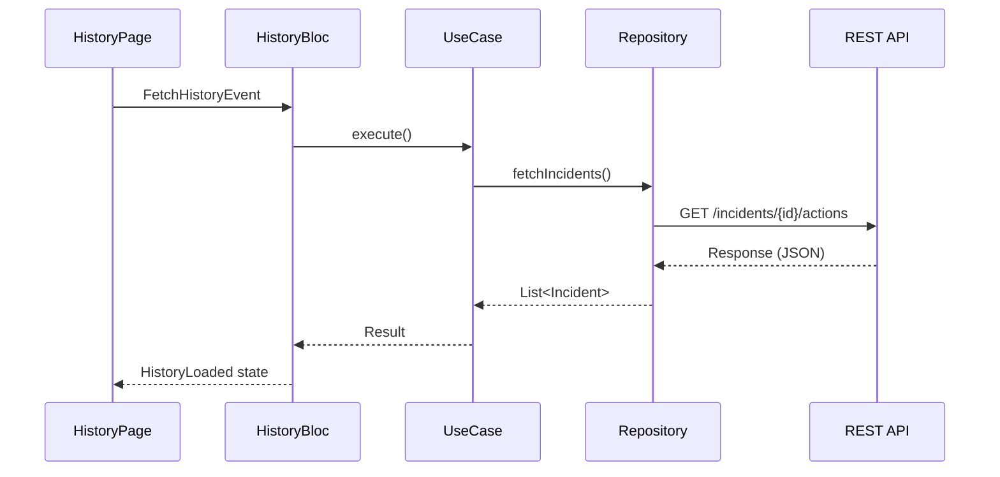
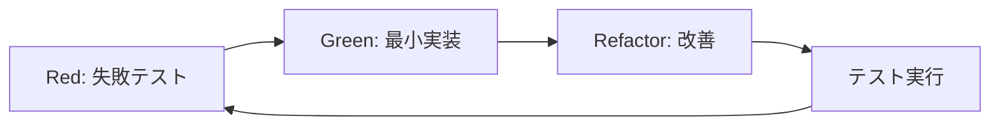

# 履歴画面フロントエンド実装プラン

## 1. プロジェクト概要

### 1.1 目的
異常検知・通知・現場対応システムの履歴画面をFlutterで構築し、Webアプリケーションとして提供する。

### 1.2 主要機能
- 異常検知結果の一覧表示（初期表示：最新20件、降順）
- 条件検索機能（発生日、部屋/ベッド番号、見守り対象者名、担当者、操作、異常検出動作）
- ページネーション（20/50/100件表示切替）
- 履歴動画の再生機能
- 履歴動画のダウンロード機能

### 1.3 技術スタック
- **フレームワーク**: Flutter (Web対応)
- **状態管理**: Bloc パターン
- **アーキテクチャ**: Modular Onion Architecture
- **UIデザイン**: Atomic Design
- **API通信**: GraphQL / REST API
- **コンポーネントカタログ**: Widgetbook
- **テスト**: Flutter Test (ユニットテスト), Integration Test (E2Eテスト)

---

## 2. アーキテクチャ設計

### 2.1 ディレクトリ構造

```
src/frontend/
├── app/
│   ├── main.dart                     # アプリケーションエントリーポイント
│   └── app_module.dart               # DI設定・ルーティング
├── core/
│   ├── config/
│   │   ├── app_config.dart           # 環境設定
│   │   └── api_config.dart           # API設定
│   ├── themes/
│   │   ├── app_colors.dart           # カラー定義
│   │   └── app_typography.dart       # タイポグラフィ定義
│   └── utils/
│       ├── date_formatter.dart       # 日付フォーマット
│       └── validators.dart           # バリデーション
├── features/
│   └── history/
│       ├── domain/
│       │   ├── entities/
│       │   │   ├── incident.dart         # 異常検知エンティティ
│       │   │   ├── action.dart           # 対応履歴エンティティ
│       │   │   └── video.dart            # 動画エンティティ
│       │   └── repositories/
│       │       ├── i_incident_repository.dart
│       │       └── i_video_repository.dart
│       ├── application/
│       │   ├── usecases/
│       │   │   ├── fetch_incidents_usecase.dart
│       │   │   ├── search_incidents_usecase.dart
│       │   │   ├── fetch_video_usecase.dart
│       │   │   └── download_video_usecase.dart
│       │   └── services/
│       │       └── history_service.dart
│       ├── infrastructure/
│       │   ├── repositories/
│       │   │   ├── incident_repository_impl.dart
│       │   │   └── video_repository_impl.dart
│       │   └── datasources/
│       │       ├── incident_remote_datasource.dart
│       │       └── video_remote_datasource.dart
│       └── presentation/
│           ├── blocs/
│           │   ├── history_bloc.dart
│           │   ├── history_event.dart
│           │   ├── history_state.dart
│           │   ├── search_bloc.dart
│           │   └── video_player_bloc.dart
│           ├── pages/
│           │   └── history_page.dart
│           └── widgets/
│               ├── organisms/
│               │   ├── history_table.dart
│               │   ├── search_form.dart
│               │   └── video_player_modal.dart
│               ├── molecules/
│               │   ├── history_row.dart
│               │   ├── search_field_group.dart
│               │   ├── pagination_controls.dart
│               │   └── date_range_picker.dart
│               └── atoms/
│                   ├── action_button.dart
│                   ├── status_badge.dart
│                   └── icon_button.dart
├── shared/
│   └── presentation/
│       └── components/
│           ├── atoms/
│           │   ├── app_button.dart
│           │   ├── app_text_field.dart
│           │   ├── app_dropdown.dart
│           │   └── app_checkbox.dart
│           ├── molecules/
│           │   ├── labeled_input.dart
│           │   └── dropdown_field.dart
│           ├── organisms/
│           │   ├── data_table.dart
│           │   └── modal_dialog.dart
│           └── templates/
│               └── base_page_layout.dart
└── widgetbook/
    ├── main.dart
    └── stories/
        ├── atoms/
        ├── molecules/
        └── organisms/
```

### 2.2 レイヤー責任分離（Onion Architecture）



| レイヤー | 責任 | 依存方向 |
|---------|------|---------|
| **Domain** | ビジネスロジック、エンティティ、リポジトリインターフェース | 他レイヤーに依存しない |
| **Application** | ユースケース、ビジネスプロセス調整 | Domain のみに依存 |
| **Infrastructure** | 外部システム統合（API、DB等） | Domain に依存 |
| **Presentation** | UI、Bloc、Widget | Application, Infrastructure に依存 |

---

## 3. 段階的実装計画（Phase分割）

### Phase 1: プロジェクトセットアップ・基盤構築 【期間: 1-2日】

#### 3.1.1 開発環境構築
- [ ] Flutter SDKのインストール・設定
- [ ] プロジェクト初期化（`flutter create --platforms web`）
- [ ] 必要なパッケージの導入
  ```yaml
  dependencies:
    flutter_bloc: ^8.1.3
    equatable: ^2.0.5
    dio: ^5.3.3
    graphql_flutter: ^5.1.2
    intl: ^0.18.1
    file_picker: ^6.0.0
    video_player: ^2.7.0
    
  dev_dependencies:
    flutter_test:
    mockito: ^5.4.2
    bloc_test: ^9.1.4
    widgetbook: ^3.4.0
  ```

#### 3.1.2 コアモジュール構築
- [ ] `core/config/` - 設定ファイル作成
- [ ] `core/themes/` - デザインシステム定義
- [ ] `core/utils/` - 共通ユーティリティ作成
- [ ] Widgetbook初期設定

**成果物**: 
- 実行可能な空のFlutterプロジェクト
- Widgetbookの起動確認

---

### Phase 2: Atomic Design - 共有UIコンポーネント開発 【期間: 2-3日】

#### 3.2.0 画面デザイン参照

**デザインモックアップ**:


このデザインを基に、以下のコンポーネントを設計・実装します。

#### 3.2.1 Atoms（基本パーツ）の実装
- [ ] `AppButton` - ボタンコンポーネント
  - Primary, Secondary, Text の3バリエーション
  - Enabled/Disabled状態
- [ ] `AppTextField` - テキスト入力フィールド
  - バリデーション機能付き
  - エラー表示対応
- [ ] `AppDropdown` - ドロップダウン選択
- [ ] `AppCheckbox` - チェックボックス
- [ ] `StatusBadge` - ステータス表示バッジ
- [ ] `IconButton` - アイコンボタン

**Widgetbook登録**: 各Atomコンポーネントのストーリー作成

#### 3.2.2 Molecules（複合パーツ）の実装
- [ ] `LabeledInput` - ラベル付き入力フィールド
- [ ] `DropdownField` - ラベル付きドロップダウン
- [ ] `DateRangePicker` - 日付範囲選択
- [ ] `PaginationControls` - ページネーションコントロール
- [ ] `SearchFieldGroup` - 検索条件入力グループ

**Widgetbook登録**: 各Moleculeコンポーネントのストーリー作成

#### 3.2.3 テスト実装（TDD）
- [ ] 各Atomのユニットテスト
  - レンダリングテスト
  - インタラクションテスト
  - スナップショットテスト
- [ ] 各Moleculeのユニットテスト

**成果物**:
- Widgetbookで確認可能な全UIコンポーネント
- カバレッジ80%以上のテストコード

---

### Phase 3: Domain Layer - ビジネスロジック定義 【期間: 1-2日】

#### 3.3.1 エンティティ定義
- [ ] `Incident` エンティティ
- [ ] `Action` エンティティ（対応履歴）
- [ ] `Video` エンティティ

#### 3.3.2 リポジトリインターフェース定義
- [ ] `IIncidentRepository`
- [ ] `IVideoRepository`

#### 3.3.3 テスト実装
- [ ] エンティティのユニットテスト
- [ ] リポジトリインターフェースのモックテスト

**成果物**:
- ビジネスロジックを表現するドメインモデル
- 外部依存のないピュアなDartコード

---

### Phase 4: Infrastructure Layer - API統合 【期間: 2-3日】

#### 3.4.1 API通信基盤構築
- [ ] Dio クライアント設定
- [ ] GraphQL クライアント設定（必要に応じて）
- [ ] エラーハンドリング実装
- [ ] レスポンスマッピング

#### 3.4.2 リポジトリ実装
- [ ] `IncidentRepositoryImpl`
- [ ] `VideoRepositoryImpl`

#### 3.4.3 DTOとマッピング
- [ ] `IncidentDTO`, `ActionDTO`
- [ ] DTO → Entity マッピング関数

#### 3.4.4 テスト実装
- [ ] Mockサーバーを使用したリポジトリテスト
- [ ] エラーケースのテスト

**成果物**:
- 実APIと通信可能なリポジトリ実装

---

### Phase 5: Application Layer - ユースケース実装 【期間: 1-2日】

#### 3.5.1 ユースケース実装
- [ ] `FetchIncidentsUseCase`
- [ ] `SearchIncidentsUseCase`
- [ ] `FetchVideoUseCase`
- [ ] `DownloadVideoUseCase`

#### 3.5.2 ビジネスサービス実装
- [ ] `HistoryService`

#### 3.5.3 テスト実装
- [ ] 各ユースケースのユニットテスト

**成果物**:
- ビジネスプロセスを表現するユースケース

---

### Phase 6: Presentation Layer - 画面固有UIコンポーネント 【期間: 2-3日】

#### 3.6.1 Organisms（複合セクション）の実装
- [ ] `HistoryTable`
- [ ] `SearchForm`
- [ ] `VideoPlayerModal`

#### 3.6.2 テスト実装
- [ ] 各Organismのウィジェットテスト

**Widgetbook登録**: 各Organismコンポーネントのストーリー作成

**成果物**:
- 履歴画面専用の複合UIコンポーネント

---

### Phase 7: 状態管理 - Bloc実装 【期間: 2-3日】

#### 3.7.1 Bloc実装
- [ ] `HistoryBloc`
- [ ] `SearchBloc`
- [ ] `VideoPlayerBloc`

#### 3.7.2 テスト実装（BlocTest使用）
- [ ] 各Blocのユニットテスト

**成果物**:
- 完全にテストされた状態管理コード

---

### Phase 8: ページ統合 - 画面全体の組み立て 【期間: 2-3日】

#### 3.8.1 履歴ページ実装
- [ ] `HistoryPage` - メイン画面
- [ ] ページレイアウト構成

#### 3.8.2 画面遷移・ルーティング
- [ ] ルーティング設定
- [ ] 他画面への遷移実装

#### 3.8.3 統合テスト

統合テストでは、Flutter Integration Testを使用して、実際のAPIとの連携を含むエンドツーエンドのテストを実施します。

**テスト環境セットアップ**
- [ ] `integration_test` パッケージの追加
- [ ] テスト用のモックAPIサーバー構築（オプション）
- [ ] テスト用の環境変数設定

**テストシナリオ**

1. **初期表示テスト**
   - [ ] アプリケーション起動
   - [ ] 履歴画面への遷移
   - [ ] 初期データ（最新20件）の表示確認
   - [ ] ローディング状態の確認

2. **検索機能テスト**
   - [ ] 検索フォームへの入力
   - [ ] 各検索条件（発生日、部屋番号、担当者など）での検索実行
   - [ ] 検索結果の表示確認
   - [ ] 検索条件のクリア

3. **ページネーションテスト**
   - [ ] 次ページへの遷移
   - [ ] 前ページへの遷移
   - [ ] 表示件数変更（20/50/100件）
   - [ ] ページ番号の直接指定

**テスト実行コマンド**

```bash
# 統合テストの実行
flutter test integration_test/history_page_test.dart

# Chrome上で実行
flutter test integration_test/history_page_test.dart -d chrome

# すべての統合テストを実行
flutter test integration_test/
```

**テストカバレッジ目標**
- [ ] 主要なユーザーフロー: 100%
- [ ] エラーハンドリング: 80%以上
- [ ] エッジケース: 60%以上

**CI/CD統合**
- [ ] GitHub Actions / GitLab CIでの自動実行設定
- [ ] テスト失敗時のビルド中断
- [ ] テストレポートの生成と保存

**成果物**:
- 完全に動作する履歴画面

---

### Phase 9: パフォーマンス最適化・最終調整 【期間: 1-2日】

#### 3.9.1 パフォーマンス最適化
- [ ] レンダリング最適化
- [ ] 動画ストリーミング最適化

#### 3.9.2 アクセシビリティ対応
- [ ] スクリーンリーダー対応
- [ ] キーボードナビゲーション

#### 3.9.3 エラーハンドリング
- [ ] ネットワークエラー処理
- [ ] リトライ機能

#### 3.9.4 最終テスト
- [ ] クロスブラウザテスト
- [ ] レスポンシブデザイン確認

**成果物**:
- プロダクションレディな履歴画面

---

## 4. UIコンポーネント分解（Atomic Design）

### 4.1 コンポーネント階層



### 4.2 Atoms（基本パーツ）

| コンポーネント名 | 説明 | プロパティ |
|-----------------|------|-----------|
| `AppButton` | ボタン | `label`, `onPressed`, `variant`, `disabled` |
| `AppTextField` | テキスト入力 | `value`, `onChange`, `placeholder`, `error` |
| `AppDropdown` | ドロップダウン | `options`, `value`, `onChange` |
| `AppCheckbox` | チェックボックス | `value`, `onChange`, `label` |
| `StatusBadge` | ステータスバッジ | `status`, `color` |
| `IconButton` | アイコンボタン | `icon`, `onPressed`, `tooltip` |

### 4.3 Molecules（複合パーツ）

| コンポーネント名 | 組み合わせ | 説明 |
|-----------------|----------|------|
| `LabeledInput` | AppTextField | ラベル付き入力 |
| `DropdownField` | AppDropdown | ラベル付きドロップダウン |
| `DateRangePicker` | AppTextField x2 | 日付範囲選択 |
| `PaginationControls` | AppButton, IconButton | ページネーション |
| `SearchFieldGroup` | LabeledInput, DropdownField | 検索条件グループ |

### 4.4 Organisms（複合セクション）

| コンポーネント名 | 説明 |
|-----------------|------|
| `HistoryTable` | 履歴一覧テーブル |
| `SearchForm` | 検索フォーム |
| `VideoPlayerModal` | 動画再生モーダル |

---

## 5. API統合設計

### 5.1 使用API

| API | メソッド | エンドポイント | 用途 |
|-----|---------|--------------|------|
| 異常検知履歴取得 | GET | `/incidents/{incidentId}/actions` | 履歴一覧取得 |
| 動画ファイル取得 | GET | `/videos/{videoId}/file` | 動画再生・ダウンロード |

### 5.2 データフロー



### 5.3 エラーハンドリング

| HTTPステータス | エラー内容 | 対応 |
|---------------|----------|------|
| 401 | 認証エラー | ログイン画面へリダイレクト |
| 404 | リソース未発見 | エラーメッセージ表示 |
| 500 | サーバーエラー | リトライ機能提供 |
| Network Error | ネットワークエラー | オフライン表示 |

---

## 6. テスト戦略

### 6.1 テストピラミッド

```
        /\
       /E2E\          10% - End-to-End Tests
      /------\
     /Integration\    20% - Integration Tests
    /------------\
   /  Unit Tests  \   70% - Unit Tests
  /----------------\
```

### 6.2 TDD実践フロー



**実践ルール**:
1. テストを書く前にコードを書かない
2. 失敗するテストのみ書く
3. テストをPassさせる最小限のコードのみ書く
4. テストがPassしたらリファクタリング

---

## 7. Widgetbook統合計画

### 7.1 Widgetbook構成

```
widgetbook/
├── main.dart                      # Widgetbookエントリーポイント
└── stories/
    ├── atoms/
    │   ├── app_button.stories.dart
    │   └── ...
    ├── molecules/
    │   ├── labeled_input.stories.dart
    │   └── ...
    └── organisms/
        ├── history_table.stories.dart
        └── ...
```

### 7.2 Story定義例

```dart
final appButtonStory = WidgetbookComponent(
  name: 'AppButton',
  useCases: [
    WidgetbookUseCase(
      name: 'Primary',
      builder: (_) => AppButton(
        label: 'プライマリボタン',
        onPressed: () {},
      ),
    ),
    WidgetbookUseCase(
      name: 'Disabled',
      builder: (_) => AppButton(
        label: '無効ボタン',
        disabled: true,
      ),
    ),
  ],
);
```

### 7.3 開発フロー統合

1. コンポーネント作成
2. Widgetbookにストーリー追加
3. デザイナーと確認
4. テスト作成
5. 実装完了

---

## 8. 開発環境セットアップ手順

### 8.1 必要なツール

- Flutter SDK (3.0以上)
- Dart SDK
- Visual Studio Code / Android Studio
- Chrome / Firefox（Web開発用）

### 8.2 セットアップコマンド

```bash
# プロジェクト作成
cd src
flutter create --platforms web frontend
cd frontend

# 依存パッケージインストール
flutter pub get

# Webアプリケーション起動
flutter run -d chrome

# Widgetbook起動
flutter run -d chrome -t lib/widgetbook/main.dart

# テスト実行
flutter test

# カバレッジ取得
flutter test --coverage
```

---

## 9. 品質基準

### 9.1 コード品質

- [ ] Dart Analyzer: 0 warnings
- [ ] コードカバレッジ: 80%以上
- [ ] すべてのWidgetにWidgetbookストーリー

### 9.2 パフォーマンス

- [ ] 初期表示: 2秒以内
- [ ] 検索実行: 1秒以内
- [ ] 動画ロード開始: 1秒以内

### 9.3 アクセシビリティ

- [ ] WCAG 2.1 Level AA準拠
- [ ] キーボード操作対応
- [ ] スクリーンリーダー対応

---

## 10. リスクと対策

### 10.1 技術的リスク

| リスク | 影響度 | 対策 |
|--------|-------|------|
| Flutter Web の制約 | 中 | 早期PoC実施、代替案検討 |
| 大量データ表示時のパフォーマンス | 高 | 仮想スクロール、ページネーション |
| 動画再生の互換性 | 中 | 複数ブラウザでの動作確認 |

### 10.2 スケジュールリスク

| リスク | 影響度 | 対策 |
|--------|-------|------|
| 要件変更 | 高 | Phase分割で柔軟に対応 |
| テスト工数不足 | 中 | TDD徹底で早期品質確保 |

---

## 11. 成果物チェックリスト

### 11.1 ドキュメント

- [ ] 本実装プラン
- [ ] API仕様書
- [ ] コンポーネントカタログ（Widgetbook）
- [ ] テスト仕様書

### 11.2 成果物

- [ ] 動作する履歴画面
- [ ] ユニットテスト（カバレッジ80%以上）
- [ ] 統合テスト
- [ ] Widgetbookストーリー（全コンポーネント）

---

## 12. 変更履歴

| 日付 | 担当 | 変更内容 |
|------|------|---------|
| 2025/10/21 | Cline | 初版作成 |
