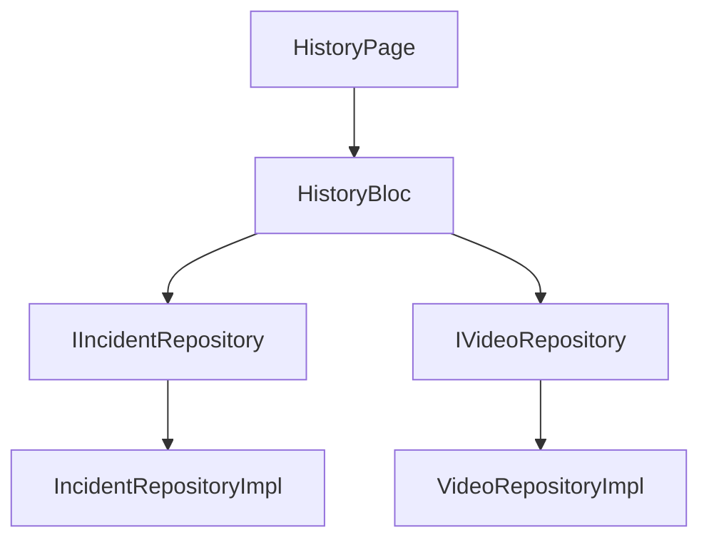

# Phase 7: BLoC実装（状態管理）プラン

## 1. 概要

Phase 7では、履歴画面の状態管理を行うBLoC（Business Logic Component）を実装します。TDD（Test-Driven Development）アプローチを徹底し、ビジネスロジックとUIを明確に分離します。

## 2. 実装対象

### 2.1 実装するBLoC

| BLoC名 | 責任範囲 | 優先度 |
|--------|---------|--------|
| **HistoryBloc** | 履歴データの取得・検索・ページネーション | 🔴 必須 |
| **VideoPlayerBloc** | 動画再生の状態管理 | 🟡 オプション |

**注**: SearchBlocは、HistoryBlocに統合する方針とします（検索もHistoryBlocのイベントとして扱う）。

### 2.2 依存関係



## 3. HistoryBloc設計

### 3.1 イベント設計

```dart
// history_event.dart

abstract class HistoryEvent extends Equatable {
  const HistoryEvent();
  
  @override
  List<Object?> get props => [];
}

/// 初期データ取得イベント
class HistoryInitialFetchRequested extends HistoryEvent {
  const HistoryInitialFetchRequested();
}

/// ページ変更イベント
class HistoryPageChanged extends HistoryEvent {
  final int page;
  final int pageSize;
  
  const HistoryPageChanged({
    required this.page,
    required this.pageSize,
  });
  
  @override
  List<Object?> get props => [page, pageSize];
}

/// ページサイズ変更イベント
class HistoryPageSizeChanged extends HistoryEvent {
  final int pageSize;
  
  const HistoryPageSizeChanged(this.pageSize);
  
  @override
  List<Object?> get props => [pageSize];
}

/// 検索実行イベント
class HistorySearchRequested extends HistoryEvent {
  final DateTime? startDate;
  final DateTime? endDate;
  final String? roomNumber;
  final String? bedNumber;
  final String? residentName;
  final String? performedBy;
  final String? detectionType;
  final IncidentStatus? status;
  
  const HistorySearchRequested({
    this.startDate,
    this.endDate,
    this.roomNumber,
    this.bedNumber,
    this.residentName,
    this.performedBy,
    this.detectionType,
    this.status,
  });
  
  @override
  List<Object?> get props => [
    startDate,
    endDate,
    roomNumber,
    bedNumber,
    residentName,
    performedBy,
    detectionType,
    status,
  ];
}

/// 検索条件クリアイベント
class HistorySearchCleared extends HistoryEvent {
  const HistorySearchCleared();
}

/// リフレッシュイベント
class HistoryRefreshRequested extends HistoryEvent {
  const HistoryRefreshRequested();
}

/// ソート変更イベント
class HistorySortChanged extends HistoryEvent {
  final String columnId;
  final SortOrder order;
  
  const HistorySortChanged({
    required this.columnId,
    required this.order,
  });
  
  @override
  List<Object?> get props => [columnId, order];
}
```

### 3.2 ステート設計

```dart
// history_state.dart

enum HistoryStatus {
  initial,
  loading,
  success,
  failure,
}

class HistoryState extends Equatable {
  final HistoryStatus status;
  final List<Incident> incidents;
  final int currentPage;
  final int pageSize;
  final int totalCount;
  final String? errorMessage;
  final Map<String, dynamic> searchFilters;
  final String sortBy;
  final SortOrder sortOrder;
  
  const HistoryState({
    this.status = HistoryStatus.initial,
    this.incidents = const [],
    this.currentPage = 1,
    this.pageSize = 20,
    this.totalCount = 0,
    this.errorMessage,
    this.searchFilters = const {},
    this.sortBy = 'detectedAt',
    this.sortOrder = SortOrder.descending,
  });
  
  // 計算プロパティ
  int get totalPages => (totalCount / pageSize).ceil();
  bool get hasData => incidents.isNotEmpty;
  bool get isLoading => status == HistoryStatus.loading;
  bool get isSuccess => status == HistoryStatus.success;
  bool get isFailure => status == HistoryStatus.failure;
  bool get hasError => errorMessage != null;
  bool get isSearching => searchFilters.isNotEmpty;
  
  HistoryState copyWith({
    HistoryStatus? status,
    List<Incident>? incidents,
    int? currentPage,
    int? pageSize,
    int? totalCount,
    String? errorMessage,
    Map<String, dynamic>? searchFilters,
    String? sortBy,
    SortOrder? sortOrder,
  }) {
    return HistoryState(
      status: status ?? this.status,
      incidents: incidents ?? this.incidents,
      currentPage: currentPage ?? this.currentPage,
      pageSize: pageSize ?? this.pageSize,
      totalCount: totalCount ?? this.totalCount,
      errorMessage: errorMessage,
      searchFilters: searchFilters ?? this.searchFilters,
      sortBy: sortBy ?? this.sortBy,
      sortOrder: sortOrder ?? this.sortOrder,
    );
  }
  
  @override
  List<Object?> get props => [
    status,
    incidents,
    currentPage,
    pageSize,
    totalCount,
    errorMessage,
    searchFilters,
    sortBy,
    sortOrder,
  ];
}
```

### 3.3 BLoC実装

```dart
// history_bloc.dart

class HistoryBloc extends Bloc<HistoryEvent, HistoryState> {
  final IIncidentRepository _incidentRepository;
  
  HistoryBloc({
    required IIncidentRepository incidentRepository,
  })  : _incidentRepository = incidentRepository,
        super(const HistoryState()) {
    on<HistoryInitialFetchRequested>(_onInitialFetchRequested);
    on<HistoryPageChanged>(_onPageChanged);
    on<HistoryPageSizeChanged>(_onPageSizeChanged);
    on<HistorySearchRequested>(_onSearchRequested);
    on<HistorySearchCleared>(_onSearchCleared);
    on<HistoryRefreshRequested>(_onRefreshRequested);
    on<HistorySortChanged>(_onSortChanged);
  }
  
  Future<void> _onInitialFetchRequested(
    HistoryInitialFetchRequested event,
    Emitter<HistoryState> emit,
  ) async {
    emit(state.copyWith(status: HistoryStatus.loading));
    
    try {
      final incidents = await _incidentRepository.fetchIncidents(
        limit: state.pageSize,
        offset: 0,
        orderBy: state.sortBy,
        descending: state.sortOrder == SortOrder.descending,
      );
      
      final totalCount = await _incidentRepository.countIncidents();
      
      emit(state.copyWith(
        status: HistoryStatus.success,
        incidents: incidents,
        currentPage: 1,
        totalCount: totalCount,
        errorMessage: null,
      ));
    } catch (e) {
      emit(state.copyWith(
        status: HistoryStatus.failure,
        errorMessage: 'データの取得に失敗しました: ${e.toString()}',
      ));
    }
  }
  
  Future<void> _onPageChanged(
    HistoryPageChanged event,
    Emitter<HistoryState> emit,
  ) async {
    emit(state.copyWith(status: HistoryStatus.loading));
    
    try {
      final offset = (event.page - 1) * event.pageSize;
      
      List<Incident> incidents;
      int totalCount;
      
      if (state.isSearching) {
        incidents = await _incidentRepository.searchIncidents(
          startDate: state.searchFilters['startDate'],
          endDate: state.searchFilters['endDate'],
          roomNumber: state.searchFilters['roomNumber'],
          bedNumber: state.searchFilters['bedNumber'],
          residentName: state.searchFilters['residentName'],
          performedBy: state.searchFilters['performedBy'],
          detectionType: state.searchFilters['detectionType'],
          status: state.searchFilters['status'],
          limit: event.pageSize,
          offset: offset,
        );
        
        totalCount = await _incidentRepository.countSearchResults(
          startDate: state.searchFilters['startDate'],
          endDate: state.searchFilters['endDate'],
          roomNumber: state.searchFilters['roomNumber'],
          bedNumber: state.searchFilters['bedNumber'],
          residentName: state.searchFilters['residentName'],
          performedBy: state.searchFilters['performedBy'],
          detectionType: state.searchFilters['detectionType'],
          status: state.searchFilters['status'],
        );
      } else {
        incidents = await _incidentRepository.fetchIncidents(
          limit: event.pageSize,
          offset: offset,
          orderBy: state.sortBy,
          descending: state.sortOrder == SortOrder.descending,
        );
        
        totalCount = await _incidentRepository.countIncidents();
      }
      
      emit(state.copyWith(
        status: HistoryStatus.success,
        incidents: incidents,
        currentPage: event.page,
        pageSize: event.pageSize,
        totalCount: totalCount,
        errorMessage: null,
      ));
    } catch (e) {
      emit(state.copyWith(
        status: HistoryStatus.failure,
        errorMessage: 'ページの取得に失敗しました: ${e.toString()}',
      ));
    }
  }
  
  Future<void> _onPageSizeChanged(
    HistoryPageSizeChanged event,
    Emitter<HistoryState> emit,
  ) async {
    // ページサイズ変更時は1ページ目に戻す
    add(HistoryPageChanged(page: 1, pageSize: event.pageSize));
  }
  
  Future<void> _onSearchRequested(
    HistorySearchRequested event,
    Emitter<HistoryState> emit,
  ) async {
    emit(state.copyWith(status: HistoryStatus.loading));
    
    try {
      final searchFilters = {
        'startDate': event.startDate,
        'endDate': event.endDate,
        'roomNumber': event.roomNumber,
        'bedNumber': event.bedNumber,
        'residentName': event.residentName,
        'performedBy': event.performedBy,
        'detectionType': event.detectionType,
        'status': event.status,
      };
      
      final incidents = await _incidentRepository.searchIncidents(
        startDate: event.startDate,
        endDate: event.endDate,
        roomNumber: event.roomNumber,
        bedNumber: event.bedNumber,
        residentName: event.residentName,
        performedBy: event.performedBy,
        detectionType: event.detectionType,
        status: event.status,
        limit: state.pageSize,
        offset: 0,
      );
      
      final totalCount = await _incidentRepository.countSearchResults(
        startDate: event.startDate,
        endDate: event.endDate,
        roomNumber: event.roomNumber,
        bedNumber: event.bedNumber,
        residentName: event.residentName,
        performedBy: event.performedBy,
        detectionType: event.detectionType,
        status: event.status,
      );
      
      emit(state.copyWith(
        status: HistoryStatus.success,
        incidents: incidents,
        currentPage: 1,
        totalCount: totalCount,
        searchFilters: searchFilters,
        errorMessage: null,
      ));
    } catch (e) {
      emit(state.copyWith(
        status: HistoryStatus.failure,
        errorMessage: '検索に失敗しました: ${e.toString()}',
      ));
    }
  }
  
  Future<void> _onSearchCleared(
    HistorySearchCleared event,
    Emitter<HistoryState> emit,
  ) async {
    emit(state.copyWith(
      searchFilters: {},
    ));
    
    // 検索クリア後は初期データを再取得
    add(const HistoryInitialFetchRequested());
  }
  
  Future<void> _onRefreshRequested(
    HistoryRefreshRequested event,
    Emitter<HistoryState> emit,
  ) async {
    if (state.isSearching) {
      // 検索中の場合は検索を再実行
      final filters = state.searchFilters;
      add(HistorySearchRequested(
        startDate: filters['startDate'],
        endDate: filters['endDate'],
        roomNumber: filters['roomNumber'],
        bedNumber: filters['bedNumber'],
        residentName: filters['residentName'],
        performedBy: filters['performedBy'],
        detectionType: filters['detectionType'],
        status: filters['status'],
      ));
    } else {
      // 通常データの場合は現在のページを再取得
      add(HistoryPageChanged(
        page: state.currentPage,
        pageSize: state.pageSize,
      ));
    }
  }
  
  Future<void> _onSortChanged(
    HistorySortChanged event,
    Emitter<HistoryState> emit,
  ) async {
    emit(state.copyWith(
      sortBy: event.columnId,
      sortOrder: event.order,
    ));
    
    // ソート変更後は1ページ目から再取得
    if (state.isSearching) {
      final filters = state.searchFilters;
      add(HistorySearchRequested(
        startDate: filters['startDate'],
        endDate: filters['endDate'],
        roomNumber: filters['roomNumber'],
        bedNumber: filters['bedNumber'],
        residentName: filters['residentName'],
        performedBy: filters['performedBy'],
        detectionType: filters['detectionType'],
        status: filters['status'],
      ));
    } else {
      add(const HistoryInitialFetchRequested());
    }
  }
}
```

## 4. VideoPlayerBloc設計（オプション）

VideoPlayerBlocは、動画再生の状態管理を行います。ただし、VideoPlayerModalが既にStatefulWidgetで状態管理を行っているため、必要に応じて実装します。

### 4.1 イベント設計

```dart
// video_player_event.dart

abstract class VideoPlayerEvent extends Equatable {
  const VideoPlayerEvent();
  
  @override
  List<Object?> get props => [];
}

class VideoPlayerInitialized extends VideoPlayerEvent {
  final String videoUrl;
  
  const VideoPlayerInitialized(this.videoUrl);
  
  @override
  List<Object?> get props => [videoUrl];
}

class VideoPlayerPlayPauseToggled extends VideoPlayerEvent {
  const VideoPlayerPlayPauseToggled();
}

class VideoPlayerSeeked extends VideoPlayerEvent {
  final Duration position;
  
  const VideoPlayerSeeked(this.position);
  
  @override
  List<Object?> get props => [position];
}

class VideoPlayerDisposed extends VideoPlayerEvent {
  const VideoPlayerDisposed();
}
```

### 4.2 ステート設計

```dart
// video_player_state.dart

enum VideoPlayerStatus {
  initial,
  initializing,
  ready,
  playing,
  paused,
  error,
}

class VideoPlayerState extends Equatable {
  final VideoPlayerStatus status;
  final Duration position;
  final Duration duration;
  final String? errorMessage;
  
  const VideoPlayerState({
    this.status = VideoPlayerStatus.initial,
    this.position = Duration.zero,
    this.duration = Duration.zero,
    this.errorMessage,
  });
  
  bool get isInitialized => status != VideoPlayerStatus.initial && 
                            status != VideoPlayerStatus.initializing;
  bool get isPlaying => status == VideoPlayerStatus.playing;
  bool get hasError => status == VideoPlayerStatus.error;
  
  VideoPlayerState copyWith({
    VideoPlayerStatus? status,
    Duration? position,
    Duration? duration,
    String? errorMessage,
  }) {
    return VideoPlayerState(
      status: status ?? this.status,
      position: position ?? this.position,
      duration: duration ?? this.duration,
      errorMessage: errorMessage,
    );
  }
  
  @override
  List<Object?> get props => [status, position, duration, errorMessage];
}
```

## 5. ディレクトリ構造

```
src/frontend/lib/features/history/presentation/
├── blocs/                         (NEW)
│   ├── history/                   (NEW)
│   │   ├── history_bloc.dart      (NEW)
│   │   ├── history_event.dart     (NEW)
│   │   └── history_state.dart     (NEW)
│   └── video_player/              (NEW, OPTIONAL)
│       ├── video_player_bloc.dart (NEW)
│       ├── video_player_event.dart(NEW)
│       └── video_player_state.dart(NEW)
├── organisms/
│   ├── history_table.dart
│   └── video_player_modal.dart
└── pages/                         (FUTURE)
    └── history_page.dart          (FUTURE)
```

## 6. テスト計画

### 6.1 HistoryBloc テストケース

```dart
// test/features/history/presentation/blocs/history/history_bloc_test.dart

void main() {
  group('HistoryBloc', () {
    late IIncidentRepository mockRepository;
    late HistoryBloc historyBloc;
    
    setUp(() {
      mockRepository = MockIncidentRepository();
      historyBloc = HistoryBloc(incidentRepository: mockRepository);
    });
    
    tearDown(() {
      historyBloc.close();
    });
    
    test('初期状態はHistoryStatus.initial', () {
      expect(historyBloc.state.status, HistoryStatus.initial);
      expect(historyBloc.state.incidents, isEmpty);
      expect(historyBloc.state.currentPage, 1);
      expect(historyBloc.state.pageSize, 20);
    });
    
    blocTest<HistoryBloc, HistoryState>(
      'HistoryInitialFetchRequested - 成功時',
      build: () {
        when(() => mockRepository.fetchIncidents(
          limit: any(named: 'limit'),
          offset: any(named: 'offset'),
          orderBy: any(named: 'orderBy'),
          descending: any(named: 'descending'),
        )).thenAnswer((_) async => [mockIncident]);
        
        when(() => mockRepository.countIncidents())
            .thenAnswer((_) async => 50);
        
        return historyBloc;
      },
      act: (bloc) => bloc.add(const HistoryInitialFetchRequested()),
      expect: () => [
        isA<HistoryState>()
            .having((s) => s.status, 'status', HistoryStatus.loading),
        isA<HistoryState>()
            .having((s) => s.status, 'status', HistoryStatus.success)
            .having((s) => s.incidents.length, 'incidents length', 1)
            .having((s) => s.totalCount, 'totalCount', 50),
      ],
      verify: (_) {
        verify(() => mockRepository.fetchIncidents(
          limit: 20,
          offset: 0,
          orderBy: 'detectedAt',
          descending: true,
        )).called(1);
        verify(() => mockRepository.countIncidents()).called(1);
      },
    );
    
    blocTest<HistoryBloc, HistoryState>(
      'HistoryInitialFetchRequested - 失敗時',
      build: () {
        when(() => mockRepository.fetchIncidents(
          limit: any(named: 'limit'),
          offset: any(named: 'offset'),
          orderBy: any(named: 'orderBy'),
          descending: any(named: 'descending'),
        )).thenThrow(Exception('Network error'));
        
        return historyBloc;
      },
      act: (bloc) => bloc.add(const HistoryInitialFetchRequested()),
      expect: () => [
        isA<HistoryState>()
            .having((s) => s.status, 'status', HistoryStatus.loading),
        isA<HistoryState>()
            .having((s) => s.status, 'status', HistoryStatus.failure)
            .having((s) => s.errorMessage, 'errorMessage', isNotNull),
      ],
    );
    
    blocTest<HistoryBloc, HistoryState>(
      'HistoryPageChanged - ページ変更',
      build: () {
        when(() => mockRepository.fetchIncidents(
          limit: any(named: 'limit'),
          offset: any(named: 'offset'),
          orderBy: any(named: 'orderBy'),
          descending: any(named: 'descending'),
        )).thenAnswer((_) async => [mockIncident]);
        
        when(() => mockRepository.countIncidents())
            .thenAnswer((_) async => 50);
        
        return historyBloc;
      },
      act: (bloc) => bloc.add(const HistoryPageChanged(page: 2, pageSize: 20)),
      expect: () => [
        isA<HistoryState>()
            .having((s) => s.status, 'status', HistoryStatus.loading),
        isA<HistoryState>()
            .having((s) => s.status, 'status', HistoryStatus.success)
            .having((s) => s.currentPage, 'currentPage', 2),
      ],
      verify: (_) {
        verify(() => mockRepository.fetchIncidents(
          limit: 20,
          offset: 20, // (page 2 - 1) * 20
          orderBy: 'detectedAt',
          descending: true,
        )).called(1);
      },
    );
    
    blocTest<HistoryBloc, HistoryState>(
      'HistoryPageSizeChanged - ページサイズ変更',
      build: () {
        when(() => mockRepository.fetchIncidents(
          limit: any(named: 'limit'),
          offset: any(named: 'offset'),
          orderBy: any(named: 'orderBy'),
          descending: any(named: 'descending'),
        )).thenAnswer((_) async => [mockIncident]);
        
        when(() => mockRepository.countIncidents())
            .thenAnswer((_) async => 50);
        
        return historyBloc;
      },
      act: (bloc) => bloc.add(const HistoryPageSizeChanged(50)),
      expect: () => [
        isA<HistoryState>()
            .having((s) => s.status, 'status', HistoryStatus.loading),
        isA<HistoryState>()
            .having((s) => s.status, 'status', HistoryStatus.success)
            .having((s) => s.pageSize, 'pageSize', 50)
            .having((s) => s.currentPage, 'currentPage', 1),
      ],
    );
    
    blocTest<HistoryBloc, HistoryState>(
      'HistorySearchRequested - 検索実行',
      build: () {
        when(() => mockRepository.searchIncidents(
          startDate: any(named: 'startDate'),
          endDate: any(named: 'endDate'),
          roomNumber: any(named: 'roomNumber'),
          limit: any(named: 'limit'),
          offset: any(named: 'offset'),
        )).thenAnswer((_) async => [mockIncident]);
        
        when(() => mockRepository.countSearchResults(
          startDate: any(named: 'startDate'),
          endDate: any(named: 'endDate'),
          roomNumber: any(named: 'roomNumber'),
        )).thenAnswer((_) async => 10);
        
        return historyBloc;
      },
      act: (bloc) => bloc.add(HistorySearchRequested(
        startDate: DateTime(2025, 1, 1),
        endDate: DateTime(2025, 1, 31),
        roomNumber: '101',
      )),
      expect: () => [
        isA<HistoryState>()
            .having((s) => s.status, 'status', HistoryStatus.loading),
        isA<HistoryState>()
            .having((s) => s.status, 'status', HistoryStatus.success)
            .having((s) => s.isSearching, 'isSearching', true)
            .having((s) => s.totalCount, 'totalCount', 10),
      ],
      verify: (_) {
        verify(() => mockRepository.searchIncidents(
          startDate: DateTime(2025, 1, 1),
          endDate: DateTime(2025, 1, 31),
          roomNumber: '101',
          bedNumber: null,
          residentName: null,
          performedBy: null,
          detectionType: null,
          status: null,
          limit: 20,
          offset: 0,
        )).called(1);
      },
    );
    
    blocTest<HistoryBloc, HistoryState>(
      'HistorySearchCleared - 検索クリア',
      seed: () => HistoryState(
        searchFilters: {'roomNumber': '101'},
      ),
      build: () {
        when(() => mockRepository.fetchIncidents(
          limit: any(named: 'limit'),
          offset: any(named: 'offset'),
          orderBy: any(named: 'orderBy'),
          descending: any(named: 'descending'),
        )).thenAnswer((_) async => [mockIncident]);
        
        when(() => mockRepository.countIncidents())
            .thenAnswer((_) async => 50);
        
        return historyBloc;
      },
      act: (bloc) => bloc.add(const HistorySearchCleared()),
      expect: () => [
        isA<HistoryState>()
            .having((s) => s.searchFilters, 'searchFilters', isEmpty),
        isA<HistoryState>()
            .having((s) => s.status, 'status', HistoryStatus.loading),
        isA<HistoryState>()
            .having((s) => s.status, 'status', HistoryStatus.success)
            .having((s) => s.isSearching, 'isSearching', false),
      ],
    );
    
    blocTest<HistoryBloc, HistoryState>(
      'HistorySortChanged - ソート変更',
      build: () {
        when(() => mockRepository.fetchIncidents(
          limit: any(named: 'limit'),
          offset: any(named: 'offset'),
          orderBy: any(named: 'orderBy'),
          descending: any(named: 'descending'),
        )).thenAnswer((_) async => [mockIncident]);
        
        when(() => mockRepository.countIncidents())
            .thenAnswer((_) async => 50);
        
        return historyBloc;
      },
      act: (bloc) => bloc.add(const HistorySortChanged(
        columnId: 'roomNumber',
        order: SortOrder.ascending,
      )),
      expect: () => [
        isA<HistoryState>()
            .having((s) => s.sortBy, 'sortBy', 'roomNumber')
            .having((s) => s.sortOrder, 'sortOrder', SortOrder.ascending),
        isA<HistoryState>()
            .having((s) => s.status, 'status', HistoryStatus.loading),
        isA<HistoryState>()
            .having((s) => s.status, 'status', HistoryStatus.success),
      ],
    );
  });
}
```

### 6.2 テスト実行

```bash
# HistoryBloc単体テスト
flutter test test/features/history/presentation/blocs/history/history_bloc_test.dart

# すべてのBLoCテスト
flutter test test/features/history/presentation/blocs/

# カバレッジ付き
flutter test --coverage test/features/history/presentation/blocs/
```

## 7. 実装手順

### Step 1: HistoryEvent実装
1. `history_event.dart`ファイル作成
2. 7つのイベントクラスを定義
3. Equatableを継承してイミュータブル性確保

### Step 2: HistoryState実装
1. `history_state.dart`ファイル作成
2. HistoryStateクラス定義
3. 計算プロパティ
