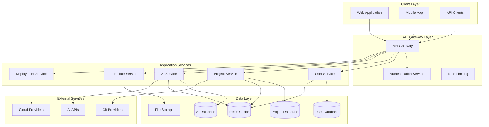

# Application Architecture

## Overview

This document describes the comprehensive application architecture for the dodo AI system, defining the structural design, component interactions, and architectural patterns that ensure scalability, maintainability, and performance.

## Architectural Principles

### 1. Microservices Architecture
- **Service Decomposition**: Break down the application into small, independent services
- **Single Responsibility**: Each service has a single, well-defined responsibility
- **Decentralized Governance**: Services own their data and business logic
- **Failure Isolation**: Failures in one service don't cascade to others

### 2. Domain-Driven Design (DDD)
- **Bounded Contexts**: Clear boundaries between different business domains
- **Ubiquitous Language**: Consistent terminology across teams and code
- **Aggregate Patterns**: Encapsulate business rules and maintain consistency
- **Event-Driven Communication**: Services communicate through domain events

### 3. Cloud-Native Principles
- **Containerization**: Applications packaged as lightweight containers
- **Orchestration**: Container orchestration with Kubernetes
- **Scalability**: Horizontal scaling based on demand
- **Resilience**: Built-in fault tolerance and recovery mechanisms

### 4. API-First Design
- **Contract-First**: Define APIs before implementation
- **Versioning Strategy**: Backward-compatible API evolution
- **Documentation**: Comprehensive API documentation
- **Testing**: Automated API testing and validation

## System Architecture Overview

### High-Level Architecture Diagram



## Core Application Services

### User Management Service

#### Responsibilities
- User registration and authentication
- Profile management and preferences
- Role-based access control (RBAC)
- Organization and team management
- Audit logging and compliance

#### API Endpoints
```yaml
# User Management API
/api/v1/users:
  GET: List users with pagination and filtering
  POST: Create new user account

/api/v1/users/{userId}:
  GET: Retrieve user profile
  PUT: Update user profile
  DELETE: Deactivate user account

/api/v1/users/{userId}/roles:
  GET: List user roles
  POST: Assign role to user
  DELETE: Remove role from user

/api/v1/auth/login:
  POST: Authenticate user credentials

/api/v1/auth/logout:
  POST: Invalidate user session

/api/v1/organizations:
  GET: List user organizations
  POST: Create new organization
```

#### Data Model
```typescript
interface User {
  id: string;
  email: string;
  username: string;
  firstName: string;
  lastName: string;
  roles: Role[];
  organizations: Organization[];
  preferences: UserPreferences;
  createdAt: Date;
  updatedAt: Date;
}

interface Role {
  id: string;
  name: string;
  permissions: Permission[];
  description: string;
}
```

### Project Management Service

#### Responsibilities
- Project lifecycle management
- Task and milestone tracking
- Team collaboration features
- Resource allocation and planning
- Project analytics and reporting

#### API Endpoints
```yaml
# Project Management API
/api/v1/projects:
  GET: List projects with filtering and pagination
  POST: Create new project

/api/v1/projects/{projectId}:
  GET: Retrieve project details
  PUT: Update project information
  DELETE: Archive project

/api/v1/projects/{projectId}/members:
  GET: List project team members
  POST: Add team member to project
  DELETE: Remove team member from project

/api/v1/projects/{projectId}/tasks:
  GET: List project tasks
  POST: Create new task

/api/v1/tasks/{taskId}:
  GET: Retrieve task details
  PUT: Update task information
  DELETE: Delete task
```

#### Data Model
```typescript
interface Project {
  id: string;
  name: string;
  description: string;
  status: ProjectStatus;
  organizationId: string;
  ownerId: string;
  members: ProjectMember[];
  settings: ProjectSettings;
  createdAt: Date;
  updatedAt: Date;
}

interface Task {
  id: string;
  projectId: string;
  title: string;
  description: string;
  status: TaskStatus;
  priority: Priority;
  assigneeId: string;
  dueDate: Date;
  estimatedHours: number;
  actualHours: number;
}
```

### AI Code Generation Service

#### Responsibilities
- Natural language to code conversion
- Code completion and suggestions
- Template-based code generation
- Code quality analysis and recommendations
- Learning from user feedback

#### API Endpoints
```yaml
# AI Service API
/api/v1/ai/generate:
  POST: Generate code from natural language prompt

/api/v1/ai/complete:
  POST: Provide code completion suggestions

/api/v1/ai/analyze:
  POST: Analyze code quality and provide recommendations

/api/v1/ai/templates:
  GET: List available AI templates
  POST: Create custom AI template

/api/v1/ai/feedback:
  POST: Submit feedback on AI-generated code
```

#### Data Model
```typescript
interface CodeGenerationRequest {
  prompt: string;
  context: CodeContext;
  templateId?: string;
  preferences: GenerationPreferences;
}

interface CodeGenerationResponse {
  generatedCode: string;
  explanation: string;
  suggestions: string[];
  confidence: number;
  templateUsed?: string;
}

interface CodeContext {
  projectId: string;
  language: string;
  framework: string;
  existingCode?: string;
  dependencies: string[];
}
```

This comprehensive application architecture document provides the foundation for building a scalable, maintainable, and robust dodo AI system that can evolve with changing requirements and growing user demands.
