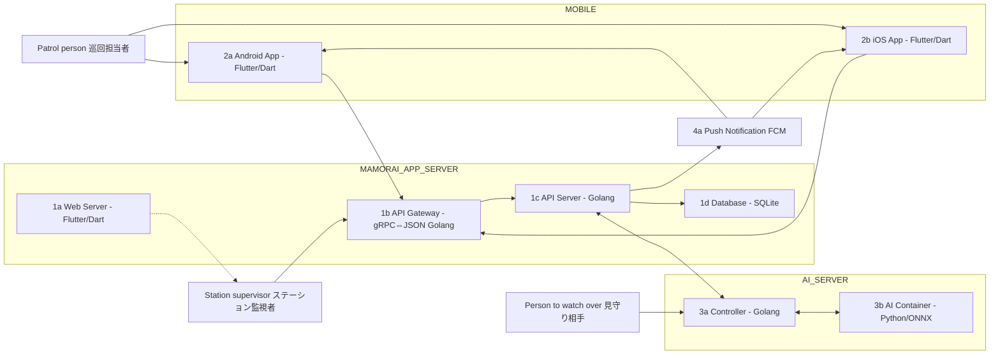

# Application Architecture

## System Architecture Overview

```mermaid
flowchart LR
    patrol[Patrol person 巡回担当者]
    supervisor[Station supervisor ステーション監視者]
    over_persons[Person to watch over 見守り相手]

    subgraph MAMORAI_APP_SERVER
        a1a[1a Web Server - Flutter/Dart]
        a1b[1b API Gateway - gRPC⇔JSON Golang]
        a1c[1c API Server - Golang]
        a1d[1d Database - SQLite]
    end

    subgraph MOBILE
        a2a[2a Android App - Flutter/Dart]
        a2b[2b iOS App - Flutter/Dart]
    end

    subgraph AI_SERVER
        a3a[3a Controller - Golang]
        a3b[3b AI Container - Python/ONNX]
    end

    a4a[4a Push Notification FCM]

    patrol --> a2a
    patrol --> a2b
    supervisor --> a1b

    a2a --> a1b
    a2b --> a1b

    a1b --> a1c
    a1c --> a1d

    a1c --> a4a
    a4a --> a2a
    a4a --> a2b

    a1c <--> a3a
    a3a <--> a3b

    over_persons --> a3a

    a1a -.-> supervisor
```

