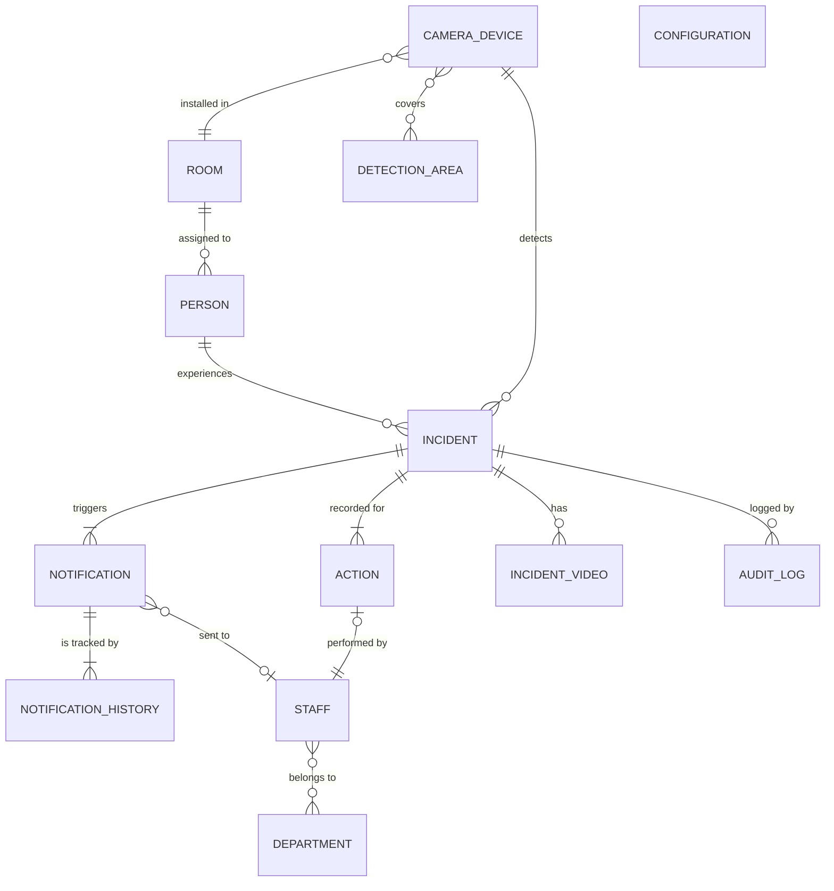

# Conceptual Data Model (sample-project/backend)

このドキュメントは `sample-project/backend` のドメインに特化した概念データモデルです。

## 概念データモデル図

## 概念エンティティ説明

### PERSON（監視対象者）
- **役割**: 監視対象となる入居者や患者
- **ライフサイクル**: 入居/入院から退去/退院まで
- **主要な関係**: ROOMに居住し、INCIDENTの主体となる

### INCIDENT（異常イベント）
- **役割**: AIによって検知された異常事象（転倒、離床、立入禁止エリア侵入等）
- **ライフサイクル**: 検知から対応完了まで
- **主要な関係**: PERSONに発生し、NOTIFICATION、ACTION、INCIDENT_VIDEOを生成

### NOTIFICATION（通知）
- **役割**: 異常イベントに対する通知メッセージ
- **ライフサイクル**: 生成から既読/エスカレーションまで
- **主要な関係**: INCIDENTから生成され、STAFFに送信される

### NOTIFICATION_HISTORY（通知履歴）
- **役割**: 各通知の配信・既読・エスカレーション状態の追跡
- **ライフサイクル**: 通知生成時から永続的に保持
- **主要な関係**: NOTIFICATIONの状態変化を記録

### ACTION（対応履歴）
- **役割**: スタッフによる異常イベントへの対応記録
- **ライフサイクル**: 対応開始から完了まで
- **主要な関係**: INCIDENTに対してSTAFFが実施

### STAFF（スタッフ）
- **役割**: 異常通知を受け、現場対応を行う職員
- **ライフサイクル**: 雇用から退職まで
- **主要な関係**: DEPARTMENTに所属し、NOTIFICATIONを受信、ACTIONを実施

### DEPARTMENT（部署）
- **役割**: スタッフの組織的な所属単位
- **ライフサイクル**: 組織編成に依存
- **主要な関係**: STAFFが所属

### ROOM（居室）
- **役割**: 監視対象の物理的空間
- **ライフサイクル**: 施設の物理的な存続期間
- **主要な関係**: PERSONが居住し、CAMERA_DEVICEが設置される

### CAMERA_DEVICE（カメラデバイス）
- **役割**: AI異常検知を行う監視カメラ
- **ライフサイクル**: 設置から撤去まで
- **主要な関係**: ROOMに設置され、INCIDENTを検知

### DETECTION_AREA（検知エリア）
- **役割**: カメラ内の特定監視領域
- **ライフサイクル**: 設定から削除まで
- **主要な関係**: CAMERA_DEVICEに属する論理的な監視範囲

### INCIDENT_VIDEO（異常動画）
- **役割**: 異常イベント前後の録画映像
- **ライフサイクル**: 録画から保存期限まで
- **主要な関係**: INCIDENTの証跡として保存

### AUDIT_LOG（監査ログ）
- **役割**: システム操作の監査証跡
- **ライフサイクル**: 永続的に保持
- **主要な関係**: 全エンティティの操作を記録

### CONFIGURATION（システム設定）
- **役割**: AI感度、通知ルール等のシステム全体設定
- **ライフサイクル**: システム稼働期間中継続
- **主要な関係**: システム全体の動作を制御

## 既存概念モデルとの差分

| エンティティ/関係 | 既存モデル | sample-backend モデル | コメント |
|-------------------|------------|----------------------|----------|
| 全体的なスコープ | システム全体（ADMIN除外版） | sample-backend マイクロサービス境界内 | 実装範囲に特化 |
| エンティティ数 | 同一（13エンティティ） | 同一（13エンティティ） | 概念レベルでは一致 |

※ 概念レベルでは既存モデルと同一のため、実質的な仕様差分はありません。

---

*生成日時: 2025/11/28*  
*対象モジュール: sample-project/backend*
