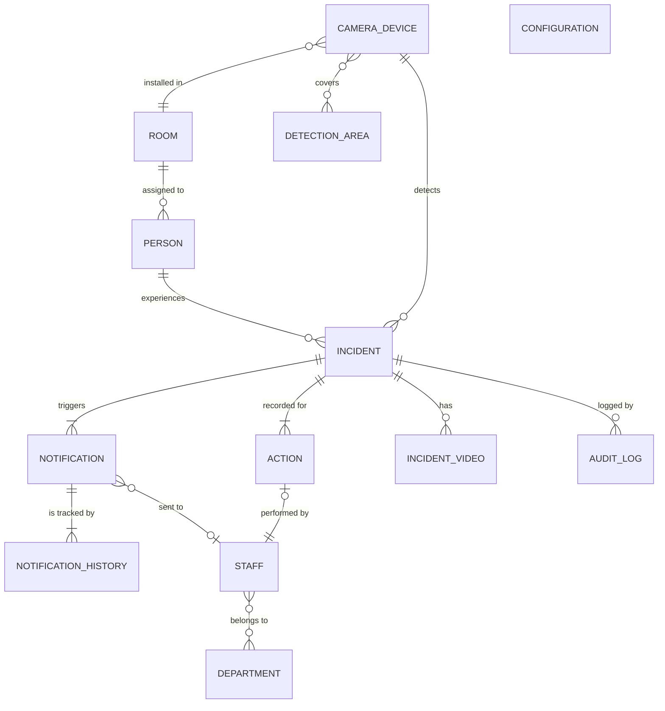

# Conceptual Data Diagram

# コンセプチュアルデータダイアグラム
## 異常検知・通知・現場対応システムの概念データモデル（ADMIN除外版）

---

---

## 概念エンティティ説明

### PERSON
- 監視対象となる入居者や患者情報を管理。
- 異常発生（INCIDENT）や履歴の主対象。

### INCIDENT（異常イベント）
- 転倒や離床などAIによって検知された異常イベント。
- 複数のNOTIFICATION（通知）やINCIDENT_VIDEO、ACTION（対応）と関連。

### NOTIFICATION（異常通知）
- 異常イベントに連動して生成・配信される各種プッシュ通知。
- STAFFへのルーティングや、NOTIFICATION_HISTORY（既読/未読）と紐付。

### NOTIFICATION_HISTORY（通知履歴）
- 各通知ごと、各スタッフごとの閲覧・既読/未読・エスカレーション履歴。

### ACTION（対応履歴）
- スタッフが実施した「対応中」「完了」などの現場対応情報。
- INCIDENTごと、STAFFごとに履歴として記録。

### STAFF
- 異常発生時に対応・通知を受ける現場スタッフ。

### DEPARTMENT（部署）
- スタッフの所属単位。

### ROOM（居室・監視エリア）
- カメラデバイス設置の物理空間。PERSONと紐付。

### CAMERA_DEVICE（カメラデバイス）
- AI異常検知のデバイス実態。
- ROOMに設置される。
- 派生的にINCIDENTを検知。

### DETECTION_AREA（検知エリア）
- カメラごと設定される検知用の監視エリア単位。

### INCIDENT_VIDEO（異常動画記録）
- INCIDENT発生直前後のモザイク動画/サムネイルファイル。

### AUDIT_LOG（監査ログ）
- 各種操作・設定・参照の証跡、スタッフ・管理者の全イベントをイベント単位で記録。

### CONFIGURATION（システム/AI/運用設定）
- AI検知感度・動画保存期間・通知ルール・ON/OFF管理など各種システム設定。

---

## 主な関係（日本語補足）

- 1人のPERSONには複数のINCIDENT（異常）が紐付く。
- 1つのINCIDENTは複数のNOTIFICATION（通知）・ACTION（現場対応）・INCIDENT_VIDEOが紐付。
- NOTIFICATIONはSTAFF（部署所属）へ配信され、配信先や履歴はNOTIFICATION_HISTORYで記録。
- 部屋（ROOM）にはCAMERA_DEVICEが設置され、各カメラは複数のDETECTION_AREAを持ち得る。
- 全操作や変更・検索等はAUDIT_LOGとして証跡化。

