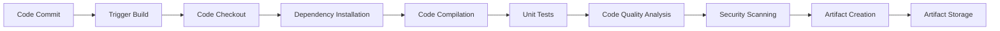
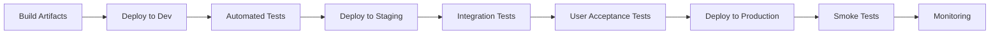

# DevOps Architecture

## Overview

This document outlines the DevOps architecture for the dodo AI system, defining the tools, processes, and practices that enable continuous integration, continuous deployment, and efficient collaboration between development and operations teams.

## DevOps Principles and Philosophy

### Core Principles
- **Collaboration and Communication**: Break down silos between development and operations
- **Automation First**: Automate repetitive tasks and processes
- **Continuous Improvement**: Implement feedback loops and iterative improvements
- **Infrastructure as Code**: Manage infrastructure through version-controlled code
- **Monitoring and Observability**: Implement comprehensive monitoring and logging

### Cultural Transformation
- **Shared Responsibility**: Development and operations share responsibility for system reliability
- **Fail Fast, Learn Fast**: Encourage experimentation and learning from failures
- **Continuous Learning**: Promote knowledge sharing and skill development
- **Customer Focus**: Align all activities with customer value delivery

## CI/CD Pipeline Architecture

### Source Code Management
- **Version Control System**: Git with GitLab or GitHub
- **Branching Strategy**: GitFlow or GitHub Flow
- **Code Review Process**: Pull/Merge request reviews
- **Branch Protection**: Enforce code review and status checks

### Continuous Integration (CI)

#### Build Pipeline


#### CI Tools and Technologies
- **Build Orchestration**: Jenkins, GitLab CI/CD, GitHub Actions
- **Build Agents**: Docker containers for consistent build environments
- **Artifact Repository**: Nexus, Artifactory, or cloud-native solutions
- **Code Quality**: SonarQube, CodeClimate, ESLint
- **Security Scanning**: Snyk, OWASP Dependency Check, Bandit

#### CI Process Steps
1. **Code Commit Trigger**: Automatic pipeline trigger on code changes
2. **Environment Setup**: Provision clean build environment
3. **Dependency Management**: Install and cache dependencies
4. **Code Compilation**: Build application artifacts
5. **Automated Testing**: Execute unit and integration tests
6. **Quality Gates**: Enforce code quality and coverage thresholds
7. **Security Scanning**: Identify vulnerabilities and compliance issues
8. **Artifact Publishing**: Store build artifacts in repository

### Continuous Deployment (CD)

#### Deployment Pipeline


#### CD Tools and Technologies
- **Deployment Orchestration**: ArgoCD, Spinnaker, AWS CodeDeploy
- **Container Orchestration**: Kubernetes, Docker Swarm
- **Infrastructure Provisioning**: Terraform, CloudFormation, Pulumi
- **Configuration Management**: Ansible, Chef, Puppet
- **Service Mesh**: Istio, Linkerd for microservices communication

#### Deployment Strategies
- **Blue-Green Deployment**: Zero-downtime deployments with instant rollback
- **Canary Deployment**: Gradual rollout to subset of users
- **Rolling Deployment**: Sequential update of instances
- **Feature Flags**: Control feature rollout independent of deployment

## Infrastructure as Code (IaC)

### Infrastructure Management
- **Declarative Configuration**: Define infrastructure state declaratively
- **Version Control**: Store infrastructure code in Git repositories
- **Automated Provisioning**: Provision infrastructure through automation
- **Environment Consistency**: Ensure consistent environments across stages

### IaC Tools and Practices
- **Terraform**: Multi-cloud infrastructure provisioning
- **CloudFormation**: AWS-native infrastructure management
- **Ansible**: Configuration management and application deployment
- **Helm**: Kubernetes application package management

### Infrastructure Components
```yaml
# Example Terraform configuration
resource "aws_instance" "app_server" {
  ami           = var.ami_id
  instance_type = var.instance_type
  
  tags = {
    Name        = "dodo-ai-app-server"
    Environment = var.environment
    Project     = "dodo-ai"
  }
}

resource "aws_rds_instance" "database" {
  identifier = "dodo-ai-db"
  engine     = "postgresql"
  engine_version = "13.7"
  instance_class = var.db_instance_type
  
  allocated_storage = 100
  storage_encrypted = true
  
  db_name  = var.db_name
  username = var.db_username
  password = var.db_password
}
```

## Container and Orchestration Architecture

### Containerization Strategy
- **Container Runtime**: Docker for application containerization
- **Base Images**: Minimal, security-hardened base images
- **Multi-stage Builds**: Optimize image size and security
- **Image Scanning**: Automated vulnerability scanning

### Kubernetes Architecture
```yaml
# Example Kubernetes deployment
apiVersion: apps/v1
kind: Deployment
metadata:
  name: dodo-ai-app
  labels:
    app: dodo-ai
spec:
  replicas: 3
  selector:
    matchLabels:
      app: dodo-ai
  template:
    metadata:
      labels:
        app: dodo-ai
    spec:
      containers:
      - name: app
        image: dodo-ai:latest
        ports:
        - containerPort: 8080
        env:
        - name: DATABASE_URL
          valueFrom:
            secretKeyRef:
              name: db-secret
              key: url
        resources:
          requests:
            memory: "256Mi"
            cpu: "250m"
          limits:
            memory: "512Mi"
            cpu: "500m"
```

### Service Mesh Implementation
- **Traffic Management**: Intelligent routing and load balancing
- **Security**: mTLS encryption and authentication
- **Observability**: Distributed tracing and metrics collection
- **Policy Enforcement**: Rate limiting and access control

## Monitoring and Observability

### Monitoring Stack
- **Metrics Collection**: Prometheus for metrics aggregation
- **Visualization**: Grafana for dashboards and alerting
- **Log Aggregation**: ELK Stack (Elasticsearch, Logstash, Kibana)
- **Distributed Tracing**: Jaeger or Zipkin for request tracing
- **APM**: Application Performance Monitoring with New Relic or Datadog

### Key Metrics and KPIs
- **Golden Signals**: Latency, Traffic, Errors, Saturation
- **Business Metrics**: User engagement, feature adoption, revenue impact
- **Infrastructure Metrics**: CPU, memory, disk, network utilization
- **Application Metrics**: Response times, error rates, throughput

### Alerting Strategy
- **Alert Hierarchy**: Critical, Warning, Info severity levels
- **Escalation Procedures**: Automated escalation based on response time
- **On-Call Rotation**: Structured on-call schedule with handoffs
- **Runbooks**: Documented procedures for common issues

## Security and Compliance

### DevSecOps Integration
- **Shift Left Security**: Integrate security early in development cycle
- **Automated Security Testing**: SAST, DAST, and dependency scanning
- **Compliance as Code**: Automate compliance checks and reporting
- **Secret Management**: Secure handling of credentials and API keys

### Security Tools and Practices
- **Static Analysis**: SonarQube, Checkmarx, Veracode
- **Dynamic Analysis**: OWASP ZAP, Burp Suite
- **Container Security**: Twistlock, Aqua Security, Falco
- **Infrastructure Security**: AWS Config, Azure Security Center

### Compliance Automation
- **Policy as Code**: Open Policy Agent (OPA) for policy enforcement
- **Audit Logging**: Comprehensive audit trail for all activities
- **Compliance Reporting**: Automated generation of compliance reports
- **Vulnerability Management**: Automated vulnerability assessment and remediation

## Environment Management

### Environment Strategy
- **Development**: Individual developer environments and shared dev environment
- **Testing**: Automated testing environment with test data management
- **Staging**: Production-like environment for final validation
- **Production**: High-availability production environment

### Environment Provisioning
```yaml
# Example environment configuration
environments:
  development:
    replicas: 1
    resources:
      cpu: "100m"
      memory: "128Mi"
    database:
      instance_type: "db.t3.micro"
  
  staging:
    replicas: 2
    resources:
      cpu: "250m"
      memory: "256Mi"
    database:
      instance_type: "db.t3.small"
  
  production:
    replicas: 5
    resources:
      cpu: "500m"
      memory: "512Mi"
    database:
      instance_type: "db.r5.large"
```

### Configuration Management
- **Environment-Specific Configs**: Separate configuration per environment
- **Secret Management**: HashiCorp Vault or cloud-native secret stores
- **Feature Flags**: LaunchDarkly or custom feature flag service
- **Configuration Validation**: Automated validation of configuration changes

## Backup and Disaster Recovery

### Backup Strategy
- **Automated Backups**: Scheduled backups of databases and critical data
- **Cross-Region Replication**: Geographic distribution of backups
- **Backup Testing**: Regular validation of backup integrity
- **Retention Policies**: Automated cleanup based on retention requirements

### Disaster Recovery
- **RTO/RPO Targets**: Recovery Time Objective < 1 hour, Recovery Point Objective < 15 minutes
- **Failover Procedures**: Automated failover to secondary regions
- **Data Synchronization**: Real-time or near-real-time data replication
- **DR Testing**: Regular disaster recovery drills and validation

## Performance and Scalability

### Auto-Scaling Configuration
```yaml
# Horizontal Pod Autoscaler example
apiVersion: autoscaling/v2
kind: HorizontalPodAutoscaler
metadata:
  name: dodo-ai-hpa
spec:
  scaleTargetRef:
    apiVersion: apps/v1
    kind: Deployment
    name: dodo-ai-app
  minReplicas: 3
  maxReplicas: 50
  metrics:
  - type: Resource
    resource:
      name: cpu
      target:
        type: Utilization
        averageUtilization: 70
  - type: Resource
    resource:
      name: memory
      target:
        type: Utilization
        averageUtilization: 80
```

### Performance Optimization
- **Caching Strategy**: Redis for application caching, CDN for static assets
- **Database Optimization**: Query optimization, indexing, connection pooling
- **Load Balancing**: Intelligent traffic distribution across instances
- **Resource Optimization**: Right-sizing of compute and storage resources

## Team Collaboration and Workflows

### Development Workflow
1. **Feature Development**: Branch-based development with feature branches
2. **Code Review**: Peer review process with automated checks
3. **Integration**: Merge to main branch triggers CI/CD pipeline
4. **Testing**: Automated testing in dedicated test environments
5. **Deployment**: Automated deployment to staging and production

### Communication and Collaboration
- **ChatOps**: Slack or Microsoft Teams integration for operations
- **Documentation**: Confluence or GitLab Wiki for knowledge sharing
- **Incident Management**: PagerDuty or Opsgenie for incident response
- **Project Management**: Jira or Azure DevOps for work tracking

### Knowledge Management
- **Runbooks**: Documented procedures for operational tasks
- **Architecture Decision Records (ADRs)**: Document architectural decisions
- **Post-Mortems**: Blameless post-mortem process for incidents
- **Training Programs**: Regular training on tools and processes

This DevOps architecture provides a comprehensive framework for implementing modern DevOps practices, ensuring efficient software delivery, reliable operations, and continuous improvement of the dodo AI system.
