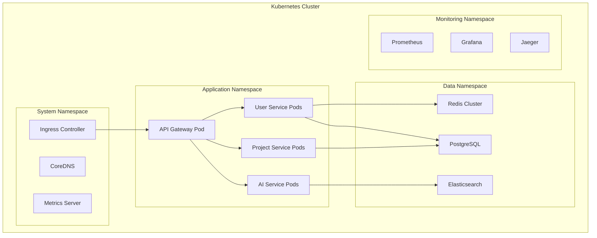

# Runtime Architecture

## Overview

This document describes the runtime architecture of the dodo AI system, defining how components interact during execution, resource management, performance characteristics, and operational behavior.

## Runtime Environment Overview

### Container Runtime Architecture



### Runtime Components

#### Pod Specifications
```yaml
# User Service Pod
apiVersion: apps/v1
kind: Deployment
metadata:
  name: user-service
  namespace: application
spec:
  replicas: 3
  selector:
    matchLabels:
      app: user-service
  template:
    metadata:
      labels:
        app: user-service
        version: v1.0.0
    spec:
      containers:
      - name: user-service
        image: dodo-ai/user-service:1.0.0
        ports:
        - containerPort: 8080
          name: http
        - containerPort: 9090
          name: metrics
        env:
        - name: DATABASE_URL
          valueFrom:
            secretKeyRef:
              name: database-credentials
              key: url
        - name: REDIS_URL
          valueFrom:
            configMapKeyRef:
              name: redis-config
              key: url
        resources:
          requests:
            memory: "256Mi"
            cpu: "250m"
          limits:
            memory: "512Mi"
            cpu: "500m"
        livenessProbe:
          httpGet:
            path: /health
            port: 8080
          initialDelaySeconds: 30
          periodSeconds: 10
        readinessProbe:
          httpGet:
            path: /ready
            port: 8080
          initialDelaySeconds: 5
          periodSeconds: 5
```

## Service Communication Patterns

### Synchronous Communication

#### HTTP/REST Communication
```typescript
// Service-to-Service HTTP Client
class ServiceClient {
  private baseURL: string;
  private timeout: number = 5000;
  private retryAttempts: number = 3;
  
  constructor(serviceName: string) {
    this.baseURL = `http://${serviceName}.application.svc.cluster.local:8080`;
  }
  
  async get<T>(path: string): Promise<T> {
    const response = await this.makeRequest('GET', path);
    return response.json();
  }
  
  async post<T>(path: string, data: any): Promise<T> {
    const response = await this.makeRequest('POST', path, data);
    return response.json();
  }
  
  private async makeRequest(
    method: string, 
    path: string, 
    data?: any
  ): Promise<Response> {
    const url = `${this.baseURL}${path}`;
    const options: RequestInit = {
      method,
      headers: {
        'Content-Type': 'application/json',
        'X-Request-ID': this.generateRequestId(),
        'X-Service-Name': process.env.SERVICE_NAME || 'unknown'
      },
      timeout: this.timeout
    };
    
    if (data) {
      options.body = JSON.stringify(data);
    }
    
    return await this.retryRequest(url, options);
  }
  
  private async retryRequest(
    url: string, 
    options: RequestInit
  ): Promise<Response> {
    let lastError: Error;
    
    for (let attempt = 0; attempt < this.retryAttempts; attempt++) {
      try {
        const response = await fetch(url, options);
        
        if (response.ok) {
          return response;
        }
        
        if (response.status >= 400 && response.status < 500) {
          // Client errors shouldn't be retried
          throw new Error(`HTTP ${response.status}: ${response.statusText}`);
        }
        
        throw new Error(`HTTP ${response.status}: ${response.statusText}`);
      } catch (error) {
        lastError = error;
        
        if (attempt < this.retryAttempts - 1) {
          const delay = Math.pow(2, attempt) * 1000; // Exponential backoff
          await new Promise(resolve => setTimeout(resolve, delay));
        }
      }
    }
    
    throw lastError;
  }
}
```

### Asynchronous Communication

#### Event-Driven Messaging
```typescript
// Event Bus Implementation
interface DomainEvent {
  id: string;
  type: string;
  aggregateId: string;
  data: any;
  timestamp: Date;
  version: number;
  correlationId?: string;
}

class EventBus {
  private messageQueue: MessageQueue;
  private eventStore: EventStore;
  
  constructor() {
    this.messageQueue = new RabbitMQAdapter();
    this.eventStore = new PostgreSQLEventStore();
  }
  
  async publish(event: DomainEvent): Promise<void> {
    // Store event for event sourcing
    await this.eventStore.append(event);
    
    // Publish to message queue for immediate processing
    await this.messageQueue.publish(event.type, event);
    
    // Emit metrics
    this.emitMetrics('event_published', {
      event_type: event.type,
      aggregate_id: event.aggregateId
    });
  }
  
  async subscribe(
    eventType: string, 
    handler: EventHandler,
    options: SubscriptionOptions = {}
  ): Promise<void> {
    await this.messageQueue.subscribe(eventType, async (event: DomainEvent) => {
      const startTime = Date.now();
      
      try {
        await handler.handle(event);
        
        this.emitMetrics('event_processed', {
          event_type: event.type,
          processing_time: Date.now() - startTime,
          status: 'success'
        });
      } catch (error) {
        this.emitMetrics('event_processed', {
          event_type: event.type,
          processing_time: Date.now() - startTime,
          status: 'error'
        });
        
        // Handle retry logic
        if (options.retryOnFailure) {
          await this.handleRetry(event, error, options);
        } else {
          throw error;
        }
      }
    });
  }
}
```

## Resource Management

### Memory Management

#### JVM Configuration (Java Services)
```yaml
# JVM Memory Settings
env:
- name: JAVA_OPTS
  value: >-
    -Xms512m
    -Xmx1024m
    -XX:+UseG1GC
    -XX:MaxGCPauseMillis=200
    -XX:+UseStringDeduplication
    -XX:+OptimizeStringConcat
    -Djava.security.egd=file:/dev/./urandom
    -Dspring.profiles.active=production

# Kubernetes Resource Limits
resources:
  requests:
    memory: "768Mi"  # 1.5x Xms for buffer
    cpu: "250m"
  limits:
    memory: "1536Mi" # 1.5x Xmx for overhead
    cpu: "1000m"
```

#### Node.js Configuration
```yaml
# Node.js Memory Settings
env:
- name: NODE_OPTIONS
  value: >-
    --max-old-space-size=512
    --max-semi-space-size=64
    --optimize-for-size
    --gc-interval=100

# Kubernetes Resource Limits
resources:
  requests:
    memory: "256Mi"
    cpu: "100m"
  limits:
    memory: "768Mi"  # 1.5x max-old-space-size
    cpu: "500m"
```

### CPU Management

#### CPU Affinity and Scheduling
```yaml
# CPU-Intensive AI Service
apiVersion: apps/v1
kind: Deployment
metadata:
  name: ai-service
spec:
  template:
    spec:
      containers:
      - name: ai-service
        resources:
          requests:
            cpu: "2000m"
            memory: "4Gi"
          limits:
            cpu: "4000m"
            memory: "8Gi"
      nodeSelector:
        node-type: compute-optimized
      tolerations:
      - key: "ai-workload"
        operator: "Equal"
        value: "true"
        effect: "NoSchedule"
      affinity:
        podAntiAffinity:
          preferredDuringSchedulingIgnoredDuringExecution:
          - weight: 100
            podAffinityTerm:
              labelSelector:
                matchExpressions:
                - key: app
                  operator: In
                  values:
                  - ai-service
              topologyKey: kubernetes.io/hostname
```

## Performance Optimization

### Connection Pooling

#### Database Connection Management
```typescript
// Database Connection Pool Configuration
class DatabasePool {
  private pool: Pool;
  
  constructor() {
    this.pool = new Pool({
      host: process.env.DB_HOST,
      port: parseInt(process.env.DB_PORT || '5432'),
      database: process.env.DB_NAME,
      user: process.env.DB_USER,
      password: process.env.DB_PASSWORD,
      
      // Connection pool settings
      min: 5,                    // Minimum connections
      max: 20,                   // Maximum connections
      acquireTimeoutMillis: 30000, // 30 seconds
      createTimeoutMillis: 30000,  // 30 seconds
      destroyTimeoutMillis: 5000,  // 5 seconds
      idleTimeoutMillis: 30000,    // 30 seconds
      reapIntervalMillis: 1000,    // 1 second
      createRetryIntervalMillis: 200, // 200ms
      
      // Connection validation
      validate: (connection) => {
        return connection.query('SELECT 1').then(() => true);
      },
      
      // Logging
      log: (message, logLevel) => {
        console.log(`[DB Pool ${logLevel}]: ${message}`);
      }
    });
  }
  
  async query<T>(sql: string, params?: any[]): Promise<T[]> {
    const client = await this.pool.connect();
    
    try {
      const result = await client.query(sql, params);
      return result.rows;
    } finally {
      client.release();
    }
  }
  
  async transaction<T>(callback: (client: PoolClient) => Promise<T>): Promise<T> {
    const client = await this.pool.connect();
    
    try {
      await client.query('BEGIN');
      const result = await callback(client);
      await client.query('COMMIT');
      return result;
    } catch (error) {
      await client.query('ROLLBACK');
      throw error;
    } finally {
      client.release();
    }
  }
}
```

### Caching Strategies

#### Multi-Level Caching
```typescript
// Cache Manager with Multiple Levels
class CacheManager {
  private l1Cache: Map<string, CacheEntry>; // In-memory
  private l2Cache: RedisClient;              // Redis
  private l3Cache: DatabaseClient;           // Database
  
  constructor() {
    this.l1Cache = new Map();
    this.l2Cache = new RedisClient();
    this.l3Cache = new DatabaseClient();
  }
  
  async get<T>(key: string): Promise<T | null> {
    // L1 Cache (In-memory)
    const l1Entry = this.l1Cache.get(key);
    if (l1Entry && !this.isExpired(l1Entry)) {
      this.recordCacheHit('l1', key);
      return l1Entry.value;
    }
    
    // L2 Cache (Redis)
    const l2Value = await this.l2Cache.get(key);
    if (l2Value) {
      this.recordCacheHit('l2', key);
      
      // Populate L1 cache
      this.l1Cache.set(key, {
        value: JSON.parse(l2Value),
        timestamp: Date.now(),
        ttl: 300000 // 5 minutes
      });
      
      return JSON.parse(l2Value);
    }
    
    // L3 Cache (Database)
    const l3Value = await this.l3Cache.get(key);
    if (l3Value) {
      this.recordCacheHit('l3', key);
      
      // Populate L2 and L1 caches
      await this.l2Cache.setex(key, 3600, JSON.stringify(l3Value)); // 1 hour
      this.l1Cache.set(key, {
        value: l3Value,
        timestamp: Date.now(),
        ttl: 300000 // 5 minutes
      });
      
      return l3Value;
    }
    
    this.recordCacheMiss(key);
    return null;
  }
  
  async set<T>(key: string, value: T, ttl: number = 3600): Promise<void> {
    // Set in all cache levels
    this.l1Cache.set(key, {
      value,
      timestamp: Date.now(),
      ttl: Math.min(ttl * 1000, 300000) // Max 5 minutes for L1
    });
    
    await this.l2Cache.setex(key, ttl, JSON.stringify(value));
    await this.l3Cache.set(key, value, ttl);
  }
}
```

## Error Handling and Resilience

### Circuit Breaker Implementation

```typescript
// Circuit Breaker for Service Resilience
enum CircuitState {
  CLOSED = 'CLOSED',
  OPEN = 'OPEN',
  HALF_OPEN = 'HALF_OPEN'
}

class CircuitBreaker {
  private state: CircuitState = CircuitState.CLOSED;
  private failureCount: number = 0;
  private successCount: number = 0;
  private lastFailureTime: number = 0;
  private nextAttempt: number = 0;
  
  constructor(
    private failureThreshold: number = 5,
    private recoveryTimeout: number = 60000,
    private successThreshold: number = 3,
    private monitorWindow: number = 60000
  ) {}
  
  async execute<T>(operation: () => Promise<T>): Promise<T> {
    if (this.state === CircuitState.OPEN) {
      if (Date.now() < this.nextAttempt) {
        throw new Error('Circuit breaker is OPEN');
      }
      
      this.state = CircuitState.HALF_OPEN;
      this.successCount = 0;
    }
    
    try {
      const result = await operation();
      this.onSuccess();
      return result;
    } catch (error) {
      this.onFailure();
      throw error;
    }
  }
  
  private onSuccess(): void {
    this.failureCount = 0;
    
    if (this.state === CircuitState.HALF_OPEN) {
      this.successCount++;
      
      if (this.successCount >= this.successThreshold) {
        this.state = CircuitState.CLOSED;
        this.successCount = 0;
      }
    }
    
    this.recordMetrics();
  }
  
  private onFailure(): void {
    this.failureCount++;
    this.lastFailureTime = Date.now();
    
    if (this.failureCount >= this.failureThreshold) {
      this.state = CircuitState.OPEN;
      this.nextAttempt = Date.now() + this.recoveryTimeout;
    }
    
    this.recordMetrics();
  }
  
  private recordMetrics(): void {
    // Record circuit breaker metrics
    const metrics = {
      state: this.state,
      failure_count: this.failureCount,
      success_count: this.successCount,
      timestamp: Date.now()
    };
    
    // Send to monitoring system
    this.sendMetrics('circuit_breaker_state', metrics);
  }
}
```

### Graceful Shutdown

```typescript
// Graceful Shutdown Handler
class GracefulShutdown {
  private isShuttingDown: boolean = false;
  private activeConnections: Set<any> = new Set();
  private shutdownTimeout: number = 30000; // 30 seconds
  
  constructor(private server: any) {
    this.setupSignalHandlers();
  }
  
  private setupSignalHandlers(): void {
    process.on('SIGTERM', () => this.shutdown('SIGTERM'));
    process.on('SIGINT', () => this.shutdown('SIGINT'));
    process.on('SIGUSR2', () => this.shutdown('SIGUSR2')); // Nodemon
  }
  
  private async shutdown(signal: string): Promise<void> {
    if (this.isShuttingDown) {
      return;
    }
    
    console.log(`Received ${signal}, starting graceful shutdown...`);
    this.isShuttingDown = true;
    
    // Stop accepting new connections
    this.server.close(() => {
      console.log('HTTP server closed');
    });
    
    // Set shutdown timeout
    const shutdownTimer = setTimeout(() => {
      console.log('Shutdown timeout reached, forcing exit');
      process.exit(1);
    }, this.shutdownTimeout);
    
    try {
      // Wait for active connections to finish
      await this.waitForActiveConnections();
      
      // Close database connections
      await this.closeDatabaseConnections();
      
      // Close message queue connections
      await this.closeMessageQueueConnections();
      
      // Flush metrics and logs
      await this.flushMetricsAndLogs();
      
      console.log('Graceful shutdown completed');
      clearTimeout(shutdownTimer);
      process.exit(0);
    } catch (error) {
      console.error('Error during shutdown:', error);
      clearTimeout(shutdownTimer);
      process.exit(1);
    }
  }
  
  private async waitForActiveConnections(): Promise<void> {
    return new Promise((resolve) => {
      const checkConnections = () => {
        if (this.activeConnections.size === 0) {
          resolve();
        } else {
          console.log(`Waiting for ${this.activeConnections.size} active connections...`);
          setTimeout(checkConnections, 1000);
        }
      };
      
      checkConnections();
    });
  }
}
```

## Monitoring and Observability

### Runtime Metrics Collection

```typescript
// Runtime Metrics Collector
class RuntimeMetrics {
  private metricsRegistry: MetricsRegistry;
  private collectInterval: number = 10000; // 10 seconds
  
  constructor() {
    this.metricsRegistry = new MetricsRegistry();
    this.setupMetrics();
    this.startCollection();
  }
  
  private setupMetrics(): void {
    // System metrics
    this.metricsRegistry.gauge('memory_usage_bytes', () => {
      const usage = process.memoryUsage();
      return {
        rss: usage.rss,
        heap_used: usage.heapUsed,
        heap_total: usage.heapTotal,
        external: usage.external
      };
    });
    
    this.metricsRegistry.gauge('cpu_usage_percent', () => {
      return process.cpuUsage();
    });
    
    // Application metrics
    this.metricsRegistry.counter('http_requests_total');
    this.metricsRegistry.histogram('http_request_duration_seconds');
    this.metricsRegistry.gauge('active_connections');
    
    // Business metrics
    this.metricsRegistry.counter('user_registrations_total');
    this.metricsRegistry.counter('projects_created_total');
    this.metricsRegistry.counter('ai_generations_total');
  }
  
  private startCollection(): void {
    setInterval(() => {
      this.collectRuntimeMetrics();
    }, this.collectInterval);
  }
  
  private collectRuntimeMetrics(): void {
    // Collect and export metrics
    const metrics = this.metricsRegistry.getMetrics();
    
    // Send to monitoring system
    this.sendToPrometheus(metrics);
    this.sendToDatadog(metrics);
  }
}
```

This runtime architecture document provides comprehensive guidance for operating the dodo AI system efficiently, ensuring optimal performance, reliability, and observability in production environments.
