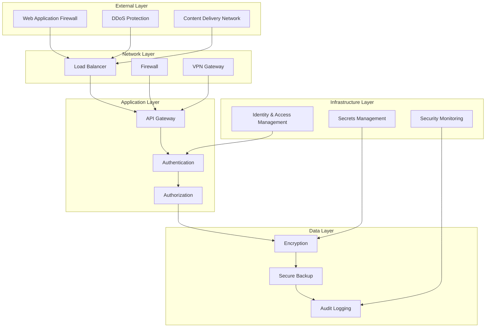

# Security Architecture

## Overview

This document defines the comprehensive security architecture for the dodo AI system, establishing security controls, threat mitigation strategies, and compliance frameworks to protect data, systems, and users.

## Security Principles

### 1. Zero Trust Architecture
- **Never Trust, Always Verify**: Verify every user and device before granting access
- **Least Privilege Access**: Grant minimum necessary permissions
- **Assume Breach**: Design systems assuming they will be compromised
- **Continuous Verification**: Continuously validate security posture

### 2. Defense in Depth
- **Multiple Security Layers**: Implement overlapping security controls
- **Fail Secure**: Systems fail to a secure state
- **Security by Design**: Integrate security from the beginning
- **Continuous Monitoring**: Real-time threat detection and response

### 3. Data Protection
- **Data Classification**: Classify data based on sensitivity
- **Encryption Everywhere**: Encrypt data at rest and in transit
- **Data Minimization**: Collect and retain only necessary data
- **Privacy by Design**: Build privacy into system architecture

### 4. Compliance and Governance
- **Regulatory Compliance**: Meet industry and legal requirements
- **Security Policies**: Establish and enforce security policies
- **Audit and Accountability**: Maintain comprehensive audit trails
- **Risk Management**: Identify, assess, and mitigate security risks

## Security Architecture Overview

### Security Layers Diagram

This comprehensive security architecture document establishes a robust security framework for the dodo AI system, ensuring protection against threats while maintaining compliance with regulatory requirements and industry standards.
