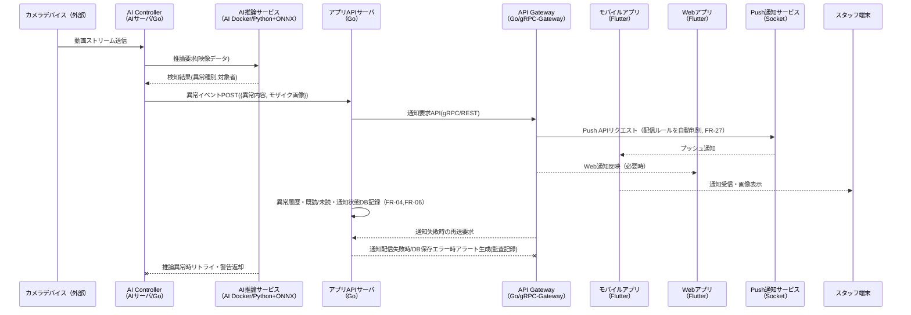
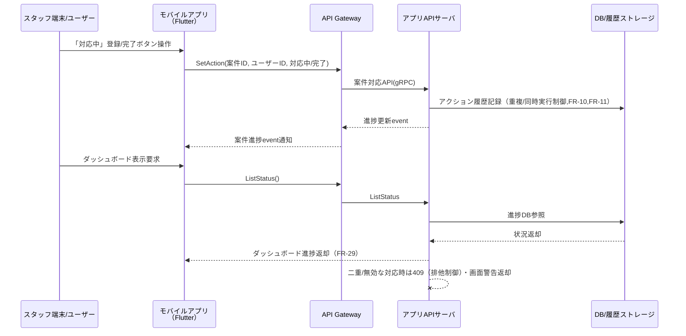
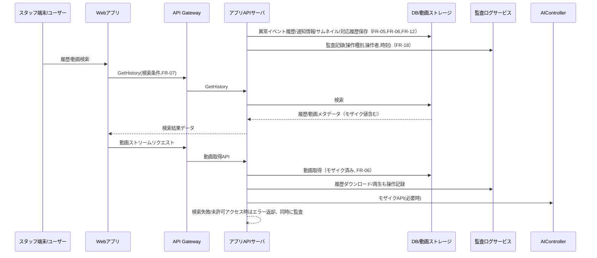
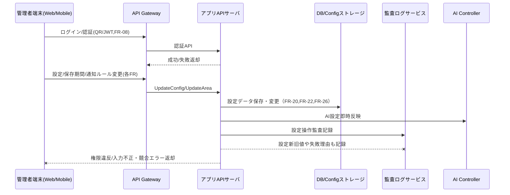
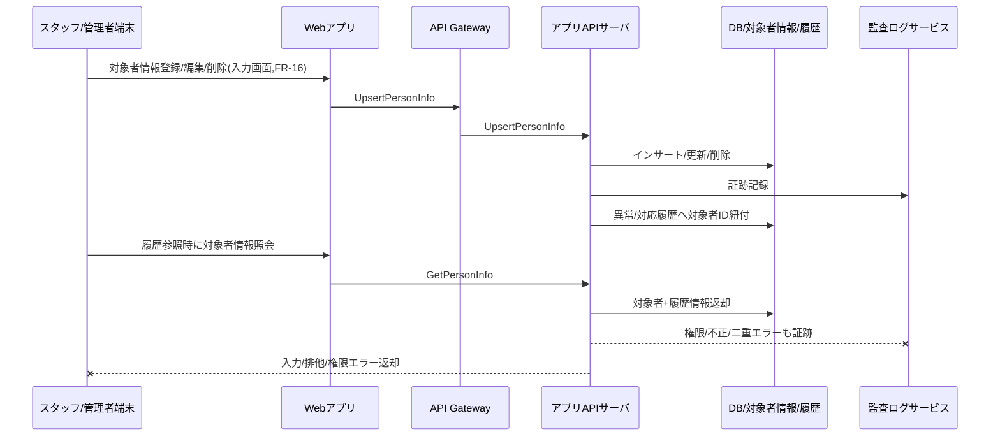

# Sequence Diagram

Epic 1: 異常検知および通知
(FR-01, FR-02, FR-04, FR-03, FR-06, FR-27)

シナリオコンテキスト
カメラ映像からAIが異常を検知し、速やかにモザイク画像付きで通知。配信ルール(部署・時間帯)や既読/未読制御、エスカレーションも反映。

---

Epic 2: 異常対応アクション管理・可視化
(FR-10, FR-11, FR-29)

シナリオコンテキスト
通知後、現場スタッフによる自己対応登録、進捗・完了・再監視切替やダッシュボードで全体進捗可視化。重複対応や対応漏れ防止ルールあり。

---

Epic 3: 履歴・証跡管理
(FR-05, FR-06, FR-12, FR-07, FR-18)

シナリオコンテキスト
異常通知・対応・動画履歴をすべてDBに保存。モザイク動画, 高度検索, 履歴ダウンロード、監査証跡ログも全操作で残す。

---

Epic 4: システム設定・管理
(FR-08, FR-22, FR-20, FR-26)

シナリオコンテキスト
AI検知パラメータ・動画保存期間・通知タイムアウト、カメラ別監視ON/OFF・検知エリア等を管理者がWeb/モバイルから更新。認証エラーや履歴も記録。

---

Epic 5: 対象者管理
(FR-16)

シナリオコンテキスト
現場管理者/スタッフが見守り対象者（患者等）の情報登録・編集・削除、および異常/対応履歴と柔軟な情報紐付・取得が可能。

