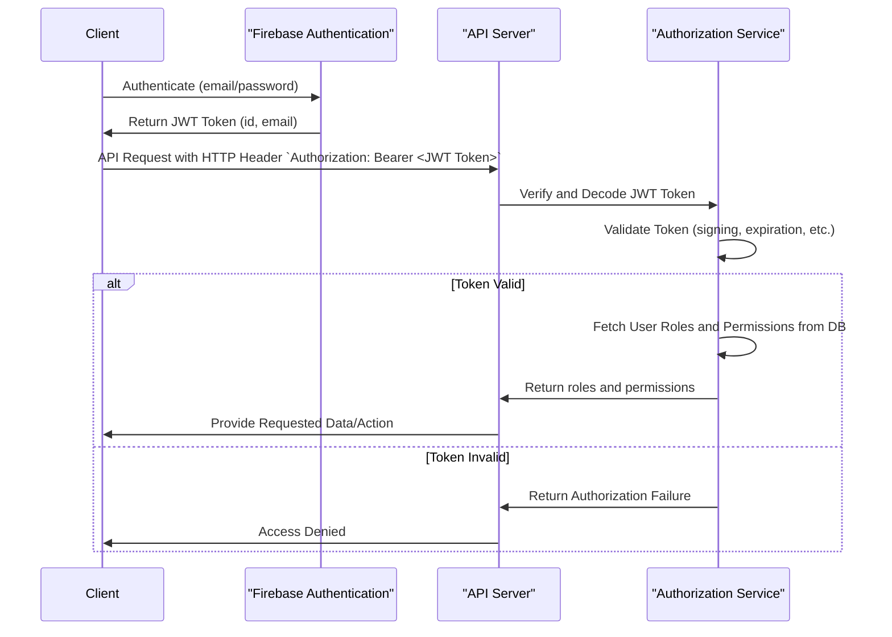

## Instruction
Create Sequence Diagram(High Level) in Markdown according to the following format.

## Overview
Sequence Diagrams represent how objects and components interact within specific scenarios of a system.

## Goal
To illustrate high-level system sequences, capturing key external interactions and user-facing processes without delving into detailed internal mechanics.

**Remember: Customize the sequence diagram example below to represent your project's high-level system interactions accurately.**

## Sample Sequence Diagram
**The sample specified is for format use; the content should depict your system's high-level interactions.**

