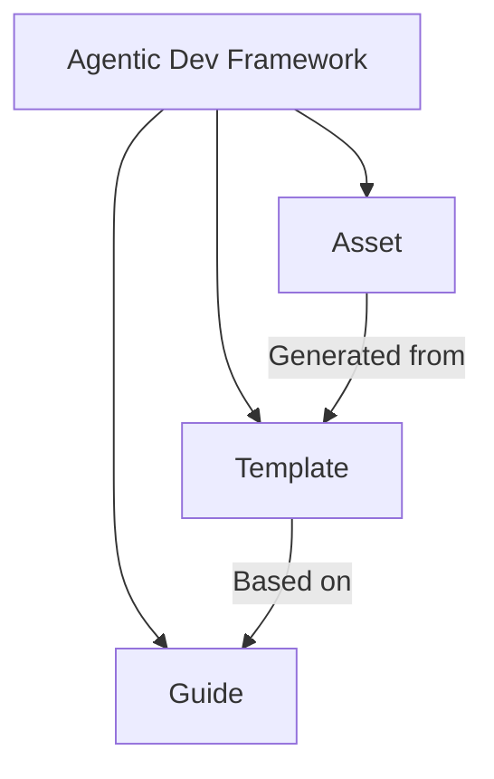

# Introduction

The Agentic Dev Framework (ADF) is the foundational set of development rules designed for use with dodoAI. Its primary goal is to place all aspects of software development under AI management, enabling seamless collaboration between humans and AI agents.

## Structure of ADF

The following diagram illustrates the conceptual structure of the Agentic Dev Framework (ADF):

- **Guide**: Enterprise-grade development rules tailored for large-scale organizations.
- **Template**: Blueprints for design documents and code, based on the Guide.
- **Asset**: Actual deliverables and code generated from the Templates.

## Key Benefits of ADF

- Enables full AI-managed development, fostering true human-AI collaboration.
- Ensures compliance with enterprise-level development standards.
- Automates document analysis and management by leveraging templates and user input.
- Provides end-to-end traceability across requirements, design, development, and operations.
- Identifies gaps by comparing Templates and Assets, ensuring nothing is overlooked.
- Templates are adaptable to various development frameworks, such as React or Vue.

By adopting ADF, your team can achieve higher quality, efficiency, and consistency in every phase of the software lifecycle—all under the intelligent guidance of dodoAI.
