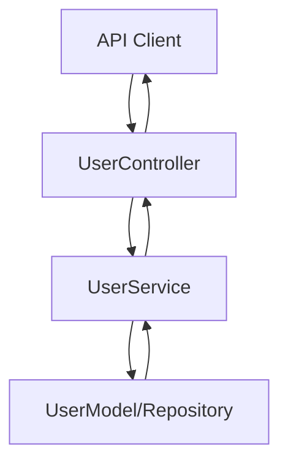

# Controller Development and Unit Testing

> **Note:**  
> This document is **not needed as part of your Docusaurus documentation.**  
> Refer to these guidelines directly in source code, not as formal documentation.

---

## Key Source Code Practices

- **Develop and reference controllers, services, and models only in source code.**  
  Do not create Markdown or documentation files for individual endpoints/controllers as part of Docusaurus Docs.

- **Organize source code by Feature Unit:**  
  For each feature (e.g., user, order, product), create a dedicated feature directory.
    - Example:
      ```
      src/
        user/
          controller/
          service/
          model/
        order/
          controller/
          service/
          model/
      ```
  This structure increases cohesion and maintainability by keeping all related components together.

- **Separation of Concerns:**  
  Always separate Controller, Service, and Model (domain/entity/schema) layers within each feature folder.

---

## Development Flow Visualization

- Use a **Mermaid diagram in code comments or architecture docs** to clarify how requests flow between Controller, Service, and Model layers for a given feature.



---

## Processing Flow Explanation

1. **Controller**  
   - Receives HTTP request, validates input, and invokes appropriate service methods.
2. **Service**  
   - Contains business logic, calls model/repository for data operations, applies business rules.
3. **Model/Repository**  
   - Manages data persistence, schema, and constraints.

---

**Reminder:**  
- Do not create feature or endpoint documentation like this in Docusaurus/Markdown.
- Always refer to and maintain these principles within the source code itself, grouped by feature for high cohesion and clarity.
```