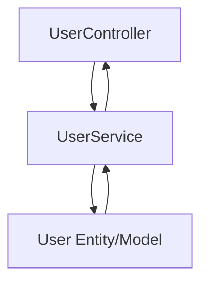

# Model Development and Unit Testing

> **Note:**  
> This document is **not required as Docusaurus documentation**.  
> Reference these guidelines directly in your source code when developing domain models and their unit tests.

---

## Source Code Organization & Cohesion

- **Do not document entities or unit tests in Markdown docs.**  
  - Maintain all model/entity code and tests in the source tree only.
- **Group code by Feature:**  
  - Place Model (and its tests) under each feature directory alongside Controller and Service.
  - Example layout:
    ```
    src/
      user/
        controller/
        service/
        model/
        model/__tests__/
      order/
        model/
        ...
    ```

- **Purpose:**  
  This structure strengthens cohesion, making it easier to maintain, evolve, and test business logic specific to each microservice or feature.

---

## Expected Model Design & Testing Practice

- **Entity (Model) Design:**  
  - Use framework-native annotations (e.g., JPA annotations for Java/Spring) for mapping.
  - Encapsulate business/domain logic as methods within the entity.
  - Handle lifecycle via event hooks (e.g., @PrePersist, @PreUpdate).
  - Use builder or factory patterns for object creation when appropriate.

- **Unit Testing the Model Layer:**  
  - Place all tests in the corresponding feature/model/__tests__/ or similar directory.
  - Test all business rules, lifecycle hooks, getters/setters, and validation logic.
  - Each test should have a clear, descriptive name and verify one business rule or behavior.
  - Avoid duplicating boilerplate or trivial getter/setter tests; focus on domain logic and invariants.

---

## Flow Visualization

- **Visualize** the design in your architecture docs or source using a **Mermaid diagram** if necessary, to clarify how Model/Entity ties into Service and Controller within the feature.



---

**Reminder:**  
Systematically separate models/entities by feature, implement and test business rules within the model layer, and always keep these within the codebase—not in Docs.
```