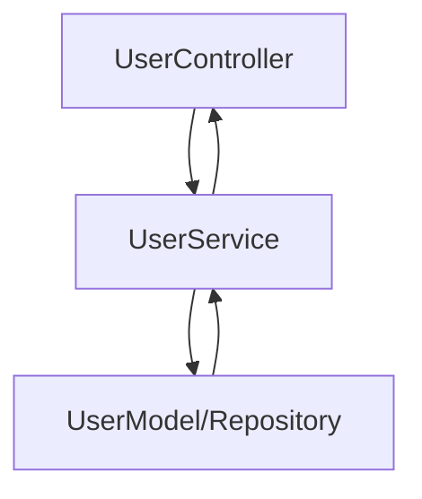

# Service Development and Unit Testing

> **Note:**  
> This document should **not** be created as a Docusaurus doc.  
> Reference and implement these guidelines directly in the source code, not in project Docs.

---

## Source Code & Development Structure

- **Do not document service development or test implementations in Markdown.**
- All business logic (`Service`), interface definitions, and unit tests must reside within the source code repository.
- **Directory organization:**  
  - Implement by feature for high cohesion:
    ```
    src/
      user/
        controller/
        service/
        model/
        service/__tests__/
    ```
  - Always separate Service, Controller, and Model layers within each feature directory.

---

## Service Development Expectations

- Clearly define service interface and implementation in code.
- Use dependency injection for all collaborators and external integrations.
- Encapsulate all business logic in services. Models/entities should only contain domain logic that truly belongs to them.
- Implement proper error handling, logging, and dependency boundary checks in each method.

---

## Unit Testing Guidelines

- All service methods and main business logic paths must be covered by unit tests.
- Use mocks/stubs for external dependencies and collaborators.
- Place tests in `service/__tests__/` folders unique to each feature/service.
- Name tests specifically to indicate the expected business scenario.

---

## Flow Visualization

- (Optional but recommended) Use a **Mermaid diagram** in code comments or architecture documentation to clarify the core flow for each feature set:



---

## Processing Flow

1. **Controller**
   - Receives HTTP request and delegates to corresponding service.
2. **Service**
   - Executes business logic and orchestrates multiple models if needed.
   - Handles validation, exception, and logging logic.
3. **Model/Repository**
   - Manages raw persistence and schema validation for entities.

---

**Reminder:**  
- Do not create controller/service/model/unit test documentation in the Docusaurus project.
- Reference these principles only in your source code, keeping all business logic and tests highly cohesive under `feature/service`.
