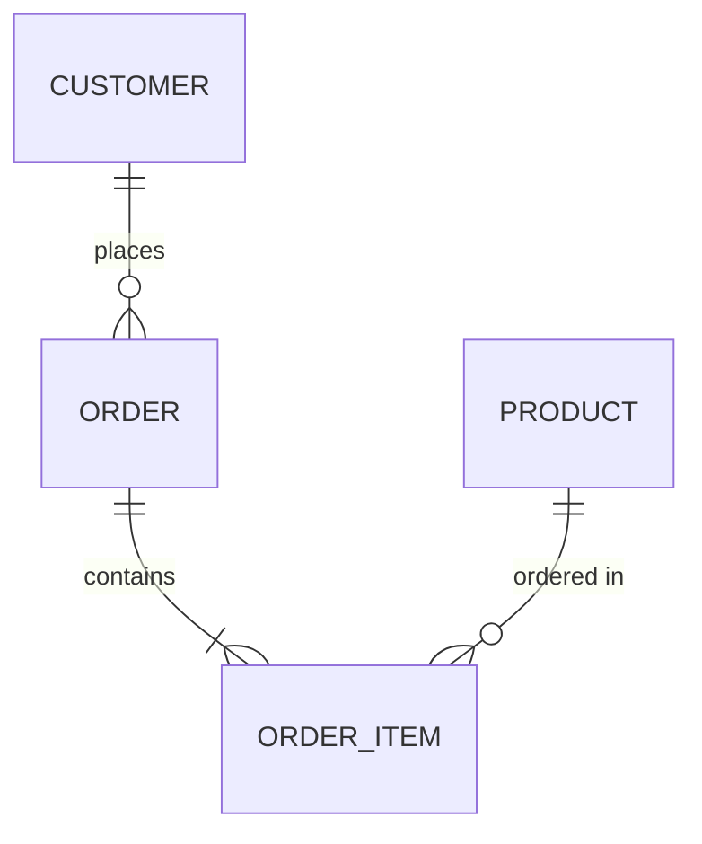

# Definition Guide

- Use this guide to define the conceptual data diagram that bridges business and technology understanding.
- Do not copy any sample diagram as-is; always create diagrams tailored to your own business domain.

A conceptual data diagram provides a high-level, technology-agnostic visualization of the key business entities and their inter-relationships.  
Its primary purpose is to create a shared mental model of the data structure, supporting communication and planning between business and technical stakeholders.

## What to Include

1. **Key Entities:**  
   Identify the main business objects relevant to your domain (such as CUSTOMER, ORDER, PRODUCT, etc.).

2. **Relationships:**  
   Clearly define the relationships between these entities. Indicate multiplicity (one-to-many, many-to-many, etc.), and provide short, descriptive relationship labels.

3. **Abstraction:**  
   The diagram should be independent of implementation or schema; do not display fields, columns, or technical attributes.

4. **Contextual Description:**  
   Optionally, provide a brief explanation of each entity and relationship below the diagram, especially if some business terms may not be universally understood.

5. **Visualization with Mermaid:**  
   - Express relationships using Mermaid's erDiagram, keeping the diagram simple and focusing only on entities and their links.
   - **Do not include attributes/columns** in your Mermaid diagram—only entities and the connections between them.
   - Use ER notation for intuitive, shared communication.

6. **Documentation Placement:**  
   Place the diagram near the top of your data requirements or domain model section, and update it as business concepts evolve.

7. **Versioning and Evolution:**  
   Review and revise the conceptual data diagram whenever business requirements or data domains change significantly.

---

## Mermaid Diagram Example

> Do not use the following diagram as-is. Create a conceptual data diagram reflecting your actual domain and relationships.

