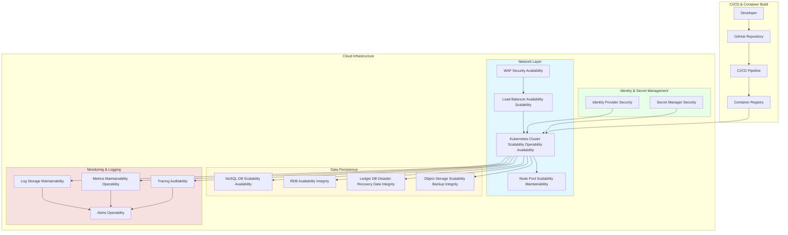

# Cloud Infrastructure Architecture Definition Guide

This guide describes the key infrastructure requirements and architectural patterns for building, operating, and maintaining cloud-native applications—addressing non-functional requirements (NFRs) including Availability, Security, Maintainability, Scalability, and Disaster Recovery.  
It presents the main components using a Mermaid diagram and maps each component to the NFRs they help fulfill.

---

## Cloud Utilization: Key Non-Functional Perspectives

When defining your cloud architecture, clarify for each item:

- **Cloud architecture element (what, why)**
- **Which NFR(s) it supports** (Availability, Security, Maintainability, Scalability, Operability, Disaster Recovery, etc.)
- **Typical cloud services/solutions** (Azure/AWS as an example)
- **Mermaid mapping (what part of the diagram describes it)**

### Examples (expand as needed):

---
#### 1. Availability
- **Zonal/Regional Redundancy:** Use Availability Zones, region pairs for design (ref: `Availability Zones`, `Site Recovery` in Mermaid diagram).  
- **Load Balancer & WAF:** Prevent SPOF, handle dynamic traffic—[LB], [WAF] nodes.  
- **Disaster Recovery:** Cross-region/site backup and failover (see `Disaster Recovery`, `LedgerDB` cluster for data persistence).

#### 2. Scalability
- **Kubernetes/EKS/AKS:** Demand-based scaling for compute; Node Pool (spot, on-demand) for cost control [NodePool, K8s].  
- **Object Storage/NoSQL:** Auto-scale storage layers [ObjectStorage, NoSQL].

#### 3. Maintainability & Operability
- **CI/CD Pipeline / IaC:** Automated deployment, versioning, environment rollback—[CI/CD Pipeline, Registry] in Mermaid.
- **Monitoring & Alerting:** Observability stack with real-time tracing, logs, alerting—[Logs, Metrics, Tracing, Alerts].
- **Patch Automation:** Integrated via IaC and rolling upgrades (represented by workflows in `CI` and `NodePool`).

#### 4. Security
- **IAM, Identity Provider:** Fine-grained RBAC, SSO, password policies—[IDP, Secrets] in diagram.
- **Secret Management:** Central API keys/passwords vault [Secrets].
- **Zero Trust:** Network isolation via VPC/Subnet boundaries; explicit egress and ingress points (`VPC`, `WAF`, `LB`).

#### 5. Disaster Recovery / Data Integrity
- **Geo-Redundant Storage:** Cross-region backup, immutable ledgers [LedgerDB, ObjectStorage].
- **DR Automation:** Automated restore with IaC and cross-region failover plans.

#### 6. Monitoring / Logging / Auditability
- **Central Log Aggregation:** For auditing, incident response [Logs].
- **Distributed Tracing:** End-to-end transaction visibility [Tracing].

---

## Mermaid: Cloud Infrastructure Components and NFR Mapping

The following diagram expresses key architectural elements and their mapping to the above non-functional requirements.

