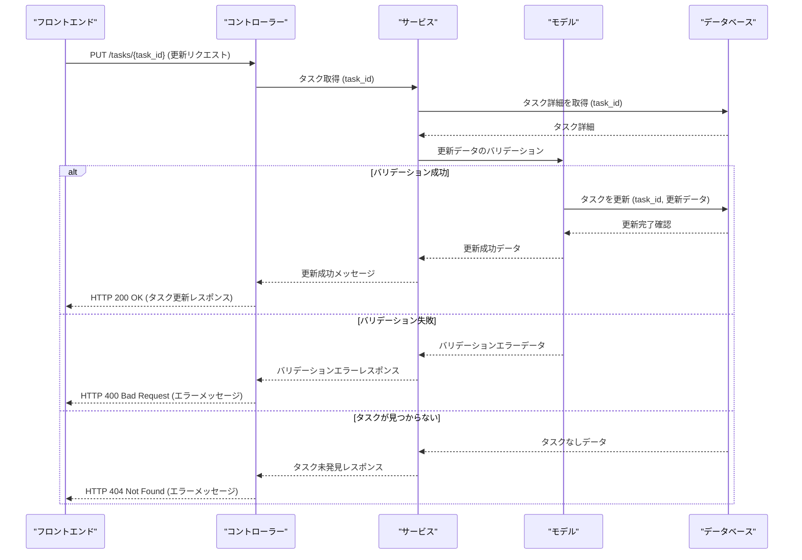

# API 設計

## 手順
以下の要件を満たす Markdown ファイルを作成してください。

## 概要
API 設計は、アプリケーションのインターフェース構造を決定し、データ交換や内部操作の明確なプロトコルを確立するものです。

## 目的
- アプリケーションコンポーネント間の操作を円滑にする。
- インターフェース構造を文書化し、開発の一貫性と明確性を確保する。

## 重要ポイント
- エンドポイントの役割、リクエスト形式、レスポンスの詳細を明確にする。
- エラーハンドリングの手順を明記する。
- 成功時とエラー時のシーケンス図を作成し、ワークフローを可視化する。

## サンプル API 設計

### タスク更新プロセスのシーケンス図
このシーケンス図は、タスク更新 API の処理フローを示します。初回のデータ取得と更新プロセスを含んでいます。

### 処理手順
1. フロントエンドは `task_id` と更新データを含む PUT リクエストをコントローラーに送信する。
2. コントローラーはサービス層にタスクの詳細をリクエストし、サービス層はデータベースをクエリする。
3. データ取得後、サービス層は更新データをモデル層に送信し、バリデーションを実施する。
4. バリデーションが成功した場合、モデル層はデータベースにタスクの更新を指示する。
5. データベースが更新完了を確認し、モデル層、サービス層を経由してコントローラーにデータを返す。
6. タスクの更新が確認された場合、コントローラーはフロントエンドに成功レスポンスを送信する。
7. バリデーションエラーまたはタスクが見つからなかった場合、モデル層がサービス層に通知し、サービス層が適切なエラーメッセージをコントローラーを通じてフロントエンドに返す。
