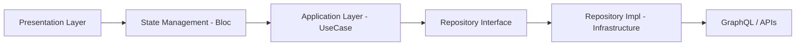

# 02. アーキテクチャ原則

## 2.1 Modular Onion Architectureとは？

Modular Onion Architectureは3つの設計思想を融合します：

1. **Onion Architecture**:
   * 依存関係は内向き（内側の円に向かって）に限定
   * ビジネスロジックが中心、UIとインフラストラクチャが周辺

2. **Flutter Modular DI/Routing**:
   * モジュール単位での完全なDI・ルーティング分離、責任分離

3. **Atomic Design**:
   * Atom/Molecule/Organism粒度での統一されたUI構成

これにより「ドメイン閉じたビジネスルール」「疎結合なUI」「再利用可能なコンポーネント」「DIによるテスタビリティ向上」を同時に実現します。

## 2.2 レイヤー構造（依存方向）

💡 依存方向は常に外側 → 内側であり、UIレイヤーがインフラストラクチャに直接依存することはありません。

## 2.3 レイヤー分類マッピング

| レイヤー | Flutter実装 | 概要 |
|-------|----------------------|----------|
| Domain | `core/`, `features/*/domain/` | Entity、Repository Interfaceなどの純粋な契約 |
| Application | `features/*/application/` | UseCase基盤のビジネス操作実装 |
| Presentation | `features/*/presentation/`, `pages/` | Blocによる状態管理、UI反映 |
| Infrastructure | `features/*/infrastructure/`, `infrastructure/` | APIクライアント、Storage実装など |
| Composition | `app/`, `modular/` | DI、ルーティング設定 |
