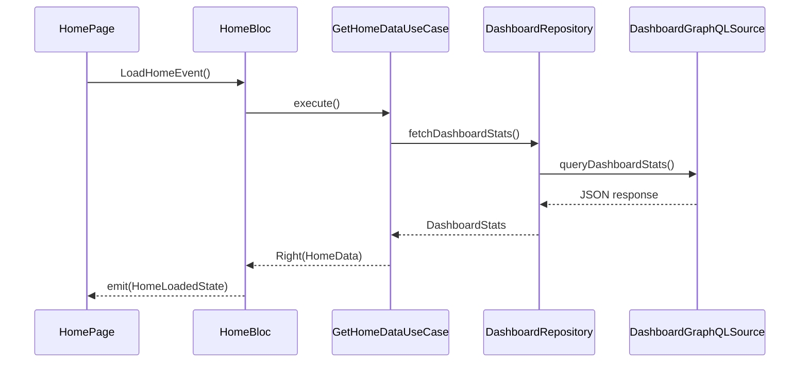

# 06. Bloc + UseCase + Repository統合設計

Bloc、UseCase、Repositoryを組み合わせてアプリの主要機能を構成する際の標準的な連携パターンを定義します。この構成は責任の明確化、テスタビリティ、明示的な状態遷移に貢献します。

## 6.1 フロー概要（ホーム画面例）



## 6.2 Bloc

* `HomeBloc`は`LoadHomeEvent`を受け取り、`GetHomeDataUseCase`を実行
* 結果に応じて`HomeLoadingState` → `HomeLoadedState`または`HomeErrorState`をemit

```dart
on<LoadHomeEvent>((event, emit) async {
  emit(HomeLoadingState());
  final result = await getHomeDataUseCase();
  result.fold(
    (failure) => emit(HomeErrorState(failure)),
    (data) => emit(HomeLoadedState(data))
  );
});
```

## 6.3 UseCase

* `GetHomeDataUseCase`は複数のRepositoryを組み合わせ、画面に必要なデータを集約
* 外部依存にはRepository Interfaceのみに依存

```dart
class GetHomeDataUseCase {
  final UserRepository userRepo;
  final DashboardRepository dashboardRepo;

  GetHomeDataUseCase(this.userRepo, this.dashboardRepo);

  Future<Either<Failure, HomeData>> call() async {
    try {
      final user = await userRepo.fetchCurrentUser();
      final stats = await dashboardRepo.fetchDashboardStats();
      return Right(HomeData(user: user, stats: stats));
    } catch (e) {
      return Left(Failure(e));
    }
  }
}
```

## 6.4 Repository Interface

* Infrastructureレイヤーへの依存を切るための契約

```dart
abstract class DashboardRepository {
  Future<DashboardStats> fetchDashboardStats();
}
```

## 6.5 Repository実装 + DataSource

* GraphQLなどのデータ取得手段をDataSourceに限定
* RepositoryImplはEntity変換と失敗処理も担当

```dart
class DashboardRepositoryImpl implements DashboardRepository {
  final DashboardGraphQLSource source;

  DashboardRepositoryImpl(this.source);

  @override
  Future<DashboardStats> fetchDashboardStats() async {
    final result = await source.queryDashboardStats();
    if (result.hasException) throw ServerException(result.exception);
    return DashboardStats.fromJson(result.data);
  }
}
```

## 6.6 DI（Modular）

* ModularのBindを使用して依存関係を解決

```dart
class HomeModule extends Module {
  @override
  List<Bind> get binds => [
    Bind.factory((i) => DashboardGraphQLSource(i())),
    Bind.factory<DashboardRepository>((i) => DashboardRepositoryImpl(i())),
    Bind.factory((i) => GetHomeDataUseCase(i(), i())),
    Bind.factory((i) => HomeBloc(i())),
  ];
}
```
