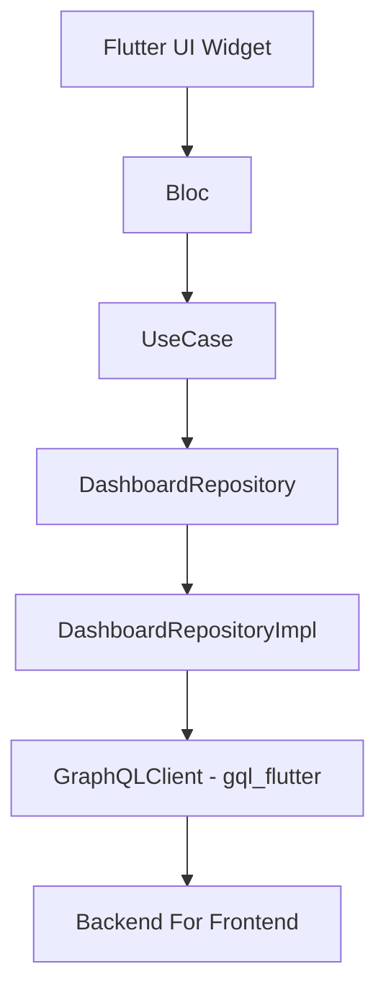
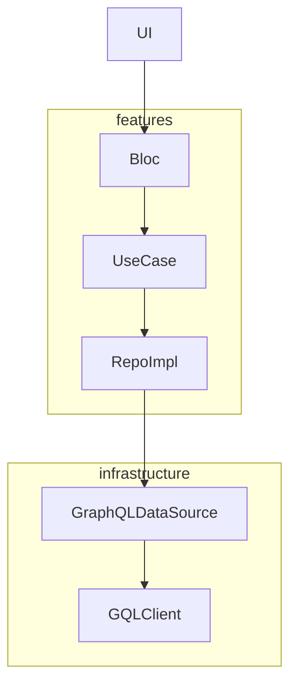

# 07. GraphQL + BFF統合設計

GraphQLは、モバイルとSPAに最適化されたクエリベースのAPI設計手法であり、Flutterとの互換性が非常に良好です。このプロジェクトでは、単一のGraphQLエンドポイントから画面最適化されたデータを取得するために、BFF（Backend For Frontend）構成をオプションで採用できます。

## BFFの考慮事項

**BFFは必須ではなく**、アプリケーションの特性に基づいて検討すべきです：

* **大規模システムに推奨**: 複数のマイクロサービスを扱う場合、BFFはフロントエンド消費用にデータを集約・最適化できます
* **複雑なデータ要件を考慮**: フロントエンドが異なる形式の複数のバックエンドサービスからデータを必要とする場合
* **チームリソースを評価**: BFFはアーキテクチャの複雑性を追加し、追加のメンテナンスが必要です
* **マイクロサービス環境**: 多くのマイクロサービスを持つシステムでは、BFFは統一されたインターフェースを提供することでフロントエンドの複雑性を軽減します

**大規模システムの主要な考慮事項:**
- データ集約の複雑性はバックエンドサービス数に比例して増加
- ネットワーク遅延の最適化がより重要になる
- サービス間での認証・認可の調整
- キャッシング戦略には慎重な計画が必要
- エラーハンドリングとフォールバック機構がより複雑になる

## 7.1 構成図（GraphQL + Repositoryパス）



## 7.2 実装レイヤー構成

| レイヤー | ファイル例 | 役割 |
|-------|--------------|------|
| DataSource | `dashboard_graphql_source.dart` | GraphQLクエリ実行と結果返却 |
| RepositoryImpl | `dashboard_repository_impl.dart` | GraphQL結果をEntityに変換。失敗処理も担当 |
| UseCase | `get_home_data_usecase.dart` | 複数のRepositoryをバンドルし、Blocに渡すオブジェクトを構成 |
| Bloc | `home_bloc.dart` | イベントに応じてUseCaseを実行し、状態をemit |
| UI | `home_page.dart` | Bloc状態に応じたWidget表示 |

## 7.3 GraphQLクライアント初期化

```dart
class GraphQLService {
  late final GraphQLClient client;
  GraphQLService() {
    final httpLink = HttpLink('https://api.example.com/graphql');
    final authLink = AuthLink(getToken: () async => 'Bearer ${await getToken()}');
    final link = authLink.concat(httpLink);
    client = GraphQLClient(link: link, cache: GraphQLCache());
  }
}
```

* `infrastructure/services/`に配置
* Modular DIで`Bind.singleton`として管理

## 7.4 データ取得責任分離



* GraphQL構文・例外処理をSourceに限定
* Response → Domain Entity変換をRepositoryImplに
* UseCaseはRepository Interfaceに依存し、複数を統合可能
* Blocは状態のみを管理
