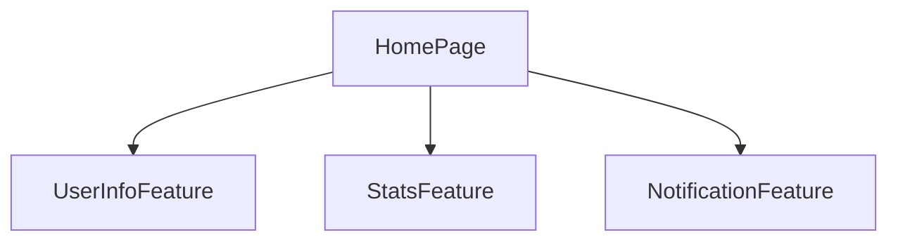

# 08. PageとFeature分離ガイドライン

大規模なFlutterアプリでは、機能単位（Feature）と画面単位（Page）の責任分離が、再利用性、保守性、テスタビリティの向上に重要です。

## 8.1 PageとFeatureの責任の違い

| タイプ | 説明 |
|------|-------------|
| Page | Modularルーティングの対象。画面単位。複数のFeatureを統合したUI構築の場所。 |
| Feature | 特定のビジネスユースケース。Feature内でBloc、Widget、UseCaseが自己完結。 |

## 8.2 Mermaid構造図：Page視点からのFeature呼び出し

各Featureは個別のBlocと状態を持ち、ページ側はMultiBlocProviderとColumnで組み立てるだけです。

## 8.3 再利用性の観点

* 同じFeatureを複数のPageで再利用可能
* Featureは画面コンテキストに依存しない（例：`UserProfileCardWidget`はプロフィール画面とサイドメニューの両方で使用可能）
* Blocは画面外での再生成なしにFeature内で完全に管理

この構造により、画面と機能の責任が明確になり、開発とレビューの効率が大幅に向上します。
