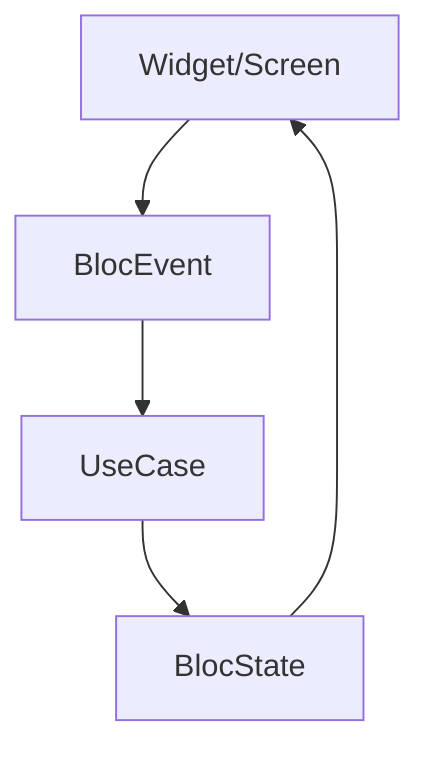

# 09. UIレイヤー責任制約とAtomic Design適用

UIレイヤーは、アプリの「見た目」と「操作」のみを担当するレイヤーであり、ビジネスロジックを持たず、状態に応じた画面構成を処理することを原則とします。ここではUIに対する明示的な制約とAtomic Designとの一貫した統合を定義します。

## 9.1 UIレイヤー原則：UIは「愚か」、ロジックは「賢い」

| 項目 | 原則 |
|------|-----------|
| 状態依存 | BlocStateまたはProvider Stateにのみ反応（状態に応じたWidget切り替え） |
| API禁止 | UIレイヤーからの直接API/DBアクセス禁止。必ずBloc/Event経由 |
| ビジネスロジック禁止 | UIレイヤーにドメインルールを書かない（ボタン活性化判定もState側で処理） |
| ナビゲーション許可 | BlocまたはState指示に基づく`Modular.to.pushNamed(...)`などは許可 |

## 9.2 責任分離：UIと状態とイベント

「UIは状態を表示するだけ」の役割を守ることで、変更の伝播を最小化します。

## 9.3 Atomic Designとの統合

FlutterのAtomic Designは、UI再利用性と保守性を確保するため、以下の階層に従ってWidgetを構成します。

| 階層 | 内容 | 配置例 |
|-----------|---------|-------------------|
| Atom | 最小UI単位。Text、Icon、Buttonなど | `shared/presentation/components/atoms/` |
| Molecule | 複数のAtomの組み合わせ。ラベル付きフォームなど | `shared/presentation/components/molecules/` |
| Organism | ヘッダー、カード、リストなど大きな構成要素 | `shared/presentation/components/organisms/` |
| Page | 全体レイアウト（Scaffold単位） | `features/{feature}/presentation/pages/` |

## 9.4 UI構成での考慮事項

* 状態の受け渡しは上位Widgetの責任
  * GlobalBloc → Page → Organism → Molecule → Atom
  * 下位コンポーネントはBlocに直接依存しない（引数で受け取る）
* 共通Widgetはsharedに切り出し
  * 2箇所以上で使用される場合は`shared/presentation/components/`下への配置を検討
* スタイルはThemeに依存
  * `AppColors`、`AppTextStyle`などの一元管理に従い、独自の色・サイズ定義は極力避ける

## 9.5 Story（Widgetbook）統合

* Atoms/Molecules/OrganismsはWidgetbookストーリーを必須とする
* ストーリーは`lib/widgetbook/stories/atoms/`、`molecules/`、`organisms/`で階層化
* ストーリーにより簡単なデザイン確認とリグレッションテストを可能にする
