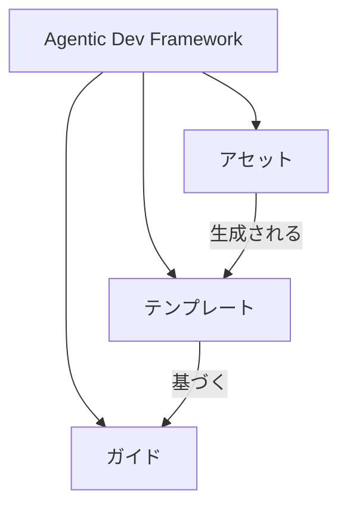

# はじめに

Agentic Dev Framework (ADF) は、dodoAI と組み合わせて使用するために設計された基盤的な開発ルールセットです。その主な目標は、ソフトウェア開発のあらゆる側面をAI管理下に置き、人間とAIエージェント間のシームレスなコラボレーションを可能にすることです。

## ADFの構造

以下の図は、Agentic Dev Framework (ADF) の概念的構造を示しています：

- **ガイド**: 大規模組織向けにカスタマイズされたエンタープライズグレードの開発ルール。
- **テンプレート**: ガイドに基づいた設計文書とコードの設計図。
- **アセット**: テンプレートから生成された実際の成果物とコード。

## ADFの主な利点

- AI管理による完全な開発を可能にし、真の人間-AIコラボレーションを促進します。
- エンタープライズレベルの開発標準への準拠を保証します。
- テンプレートとユーザー入力を活用して文書分析と管理を自動化します。
- 要件、設計、開発、運用全体にわたるエンドツーエンドのトレーサビリティを提供します。
- テンプレートとアセットを比較してギャップを特定し、見落としがないことを保証します。
- テンプレートはReactやVueなど、さまざまな開発フレームワークに適応可能です。

ADFを採用することで、チームはソフトウェアライフサイクルのあらゆる段階で、dodoAIの知的ガイダンスの下、より高い品質、効率性、一貫性を実現できます。
