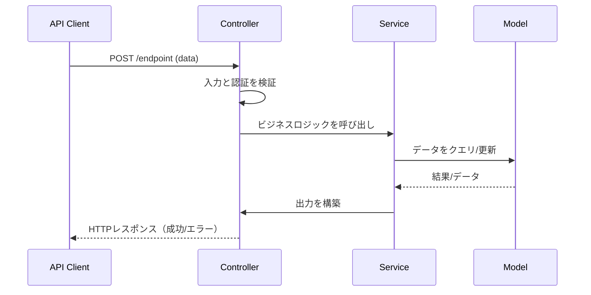

# ガイド: API設計内部ドキュメント

- このガイドを使用して、APIエンドポイント内部設計の詳細で一貫したドキュメントを作成・維持してください。
- これは**一般的なAPI設計ガイド**です。
- 各APIエンドポイントについて、Controller、Service、Modelの間のフローと境界を明確に文書化し、Mermaid図で可視化してください。
- 擬似コードは含めず、システム/プロセスフローと責任分離のみを記述してください。

---

## 定義すべき内容

### 1. エンドポイントごとの個別ファイル

- すべてのRESTエンドポイントについて、APIドキュメントディレクトリ（例：`docs/apis/[resource]/[method-endpoint].md`）に専用のMarkdownファイルを作成してください。
- 各ファイルは以下を指定する必要があります：
  - エンドポイント定義（HTTPメソッド/パス）
  - 目的と主要な動作
  - リクエスト例/スキーマ
  - レスポンス例/スキーマ
  - 検証/ビジネスルール
  - 処理フロー

---

### 2. Controller / Service / Model の境界

- ドキュメントで責任を明確に区別してください：
  - **Controller**: HTTPリクエストの処理、入力解析/検証、認可、Serviceへの委譲を担当します。
  - **Service**: ビジネスロジック、ワークフロー、調整、ルール適用、ドメイン操作の管理を担当します。
  - **Model**: 永続化、スキーマ、直接的なデータベース/エンティティ操作、低レベル検証を担当します。

---

### 3. プロセスフロー可視化

- 各エンドポイントファイルで**Mermaid図（sequenceDiagramまたはflowchart）**を使用してプロセスを明確にしてください。
- 図は、リクエストがControllerからServiceからModel（そして戻り）へどのように移動するかを、すべての検証、チェック、エラーハンドリングパスを含めて明確に示す必要があります。

#### Mermaidシーケンス図の例

