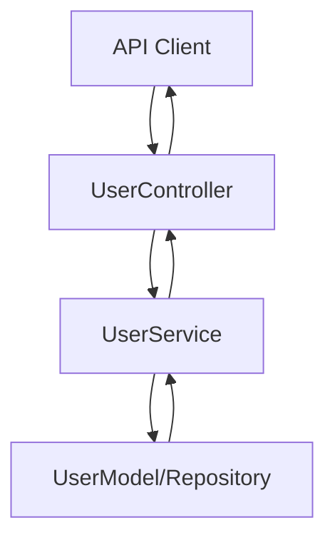

# コントローラー開発と単体テスト

> **注意:**  
> このドキュメントは**Docusaurusドキュメントの一部として必要ありません**。  
> これらのガイドラインを正式なドキュメントとしてではなく、ソースコード内で直接参照してください。

---

## 主要なソースコード実践

- **コントローラー、サービス、モデルの開発と参照はソースコード内でのみ行ってください。**  
  Docusaurusドキュメントの一部として個別のエンドポイント/コントローラーのMarkdownまたはドキュメントファイルを作成しないでください。

- **フィーチャーユニットごとにソースコードを整理:**  
  各フィーチャー（例：user、order、product）について、専用のフィーチャーディレクトリを作成してください。
    - 例:
      ```
      src/
        user/
          controller/
          service/
          model/
        order/
          controller/
          service/
          model/
      ```
  この構造は、関連するすべてのコンポーネントを一緒に保つことで凝集性と保守性を向上させます。

- **関心の分離:**  
  各フィーチャーフォルダー内でController、Service、Model（ドメイン/エンティティ/スキーマ）レイヤーを常に分離してください。

---

## 開発フロー可視化

- **コードコメントまたはアーキテクチャドキュメントでMermaid図**を使用して、特定のフィーチャーについてController、Service、Modelレイヤー間でリクエストがどのように流れるかを明確にしてください。



---

## 処理フロー説明

1. **Controller**  
   - HTTPリクエストを受信し、入力を検証し、適切なサービスメソッドを呼び出します。
2. **Service**  
   - ビジネスロジックを含み、データ操作のためにモデル/リポジトリを呼び出し、ビジネスルールを適用します。
3. **Model/Repository**  
   - データ永続化、スキーマ、制約を管理します。

---

**リマインダー:**  
- Docusaurus/Markdownでこのようなフィーチャーやエンドポイントドキュメントを作成しないでください。
- これらの原則をソースコード自体内で常に参照・維持し、高い凝集性と明確性のためにフィーチャーごとにグループ化してください。
