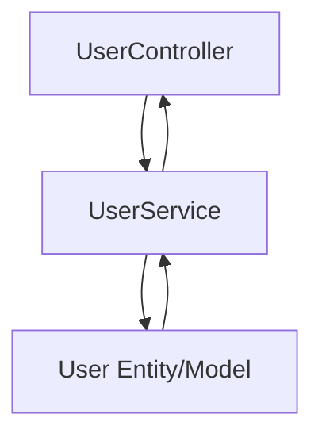

# モデル開発と単体テスト

> **注意:**  
> このドキュメントは**Docusaurusドキュメントとして必要ありません**。  
> ドメインモデルとその単体テストを開発する際は、ソースコード内でこれらのガイドラインを直接参照してください。

---

## ソースコード構成と凝集性

- **エンティティや単体テストをMarkdownドキュメントに記載しないでください。**  
  - すべてのモデル/エンティティコードとテストはソースツリー内でのみ維持してください。
- **フィーチャーごとにコードをグループ化:**  
  - モデル（とそのテスト）をコントローラーとサービスと一緒に各フィーチャーディレクトリ下に配置してください。
  - レイアウト例:
    ```
    src/
      user/
        controller/
        service/
        model/
        model/__tests__/
      order/
        model/
        ...
    ```

- **目的:**  
  この構造は凝集性を強化し、各マイクロサービスまたはフィーチャー固有のビジネスロジックの維持、進化、テストを容易にします。

---

## 期待されるモデル設計とテスト実践

- **エンティティ（モデル）設計:**  
  - マッピングにはフレームワークネイティブアノテーション（例：Java/Spring用のJPAアノテーション）を使用してください。
  - ビジネス/ドメインロジックをエンティティ内のメソッドとしてカプセル化してください。
  - イベントフック（例：@PrePersist、@PreUpdate）を介してライフサイクルを処理してください。
  - 適切な場合はオブジェクト作成にビルダーまたはファクトリーパターンを使用してください。

- **モデルレイヤーの単体テスト:**  
  - すべてのテストを対応するfeature/model/__tests__/または同様のディレクトリに配置してください。
  - すべてのビジネスルール、ライフサイクルフック、ゲッター/セッター、検証ロジックをテストしてください。
  - 各テストは明確で説明的な名前を持ち、1つのビジネスルールまたは動作を検証する必要があります。
  - 定型文や些細なゲッター/セッターテストの重複を避け、ドメインロジックと不変条件に焦点を当ててください。

---

## フロー可視化

- アーキテクチャドキュメントまたはソース内で**Mermaid図**を使用して設計を**可視化**し、フィーチャー内でModel/EntityがServiceとControllerにどのように結び付くかを明確にしてください（必要に応じて）。



---

**リマインダー:**  
モデル/エンティティをフィーチャーごとに体系的に分離し、モデルレイヤー内でビジネスルールを実装・テストし、常にこれらをコードベース内に保持してください—ドキュメント内ではありません。
