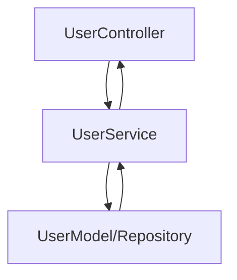

# サービス開発と単体テスト

> **注意:**  
> このドキュメントはDocusaurusドキュメントとして**作成すべきではありません**。  
> これらのガイドラインをプロジェクトドキュメントではなく、ソースコード内で直接参照・実装してください。

---

## ソースコードと開発構造

- **サービス開発やテスト実装をMarkdownで文書化しないでください。**
- すべてのビジネスロジック（`Service`）、インターフェース定義、単体テストはソースコードリポジトリ内に存在する必要があります。
- **ディレクトリ構成:**  
  - 高い凝集性のためにフィーチャーごとに実装してください:
    ```
    src/
      user/
        controller/
        service/
        model/
        service/__tests__/
    ```
  - 各フィーチャーディレクトリ内でService、Controller、Modelレイヤーを常に分離してください。

---

## サービス開発の期待事項

- サービスインターフェースと実装をコード内で明確に定義してください。
- すべてのコラボレーターと外部統合に依存性注入を使用してください。
- すべてのビジネスロジックをサービス内にカプセル化してください。モデル/エンティティには真にそれらに属するドメインロジックのみを含めるべきです。
- 各メソッドで適切なエラーハンドリング、ログ記録、依存関係境界チェックを実装してください。

---

## 単体テストガイドライン

- すべてのサービスメソッドと主要なビジネスロジックパスは単体テストでカバーされる必要があります。
- 外部依存関係とコラボレーターにはモック/スタブを使用してください。
- 各フィーチャー/サービス固有の`service/__tests__/`フォルダーにテストを配置してください。
- 期待されるビジネスシナリオを示すように具体的にテストに名前を付けてください。

---

## フロー可視化

- （オプションですが推奨）コードコメントまたはアーキテクチャドキュメントで**Mermaid図**を使用して、各フィーチャーセットのコアフローを明確にしてください:



---

## 処理フロー

1. **Controller**
   - HTTPリクエストを受信し、対応するサービスに委譲します。
2. **Service**
   - ビジネスロジックを実行し、必要に応じて複数のモデルを調整します。
   - 検証、例外、ログ記録ロジックを処理します。
3. **Model/Repository**
   - エンティティの生の永続化とスキーマ検証を管理します。

---

**リマインダー:**  
- Docusaurusプロジェクトでcontroller/service/model/単体テストドキュメントを作成しないでください。
- これらの原則をソースコード内でのみ参照し、すべてのビジネスロジックとテストを`feature/service`下で高い凝集性を保ってください。
