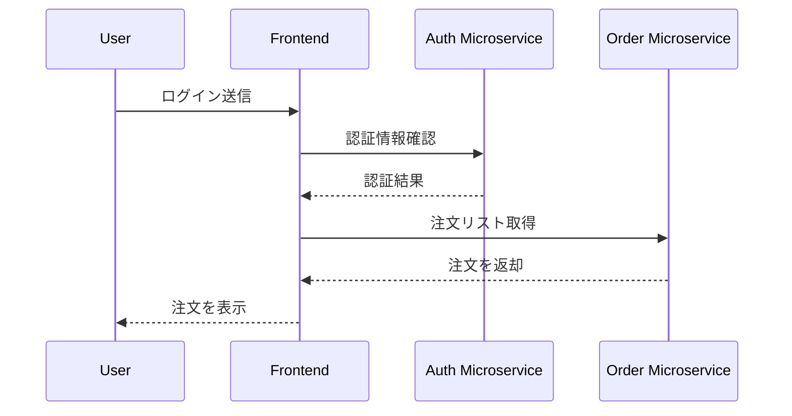

# ガイド: マイクロサービス シーケンス図の定義

- このガイドを使用して、システム内のマイクロサービスが境界を越えてどのように相互作用するかを定義してください。
- シーケンス図は、マイクロサービス間の正確なリクエスト、レスポンス、データ/制御フローを明確にする必要があります。
- **常にMermaidシーケンス図を使用して、マイクロサービスの境界と個々のサービスの役割を明示的にしてください。**

---

## 定義すべき内容

### 1. シナリオコンテキスト
- モデル化するフィーチャー、ビジネスフロー、またはイベントシーケンスを記述してください。

### 2. 参加者と境界
- 関与するすべての外部アクター（ユーザー、システム）とすべてのマイクロサービスをリストアップしてください。
- 各マイクロサービスにシステムドキュメントと一致する正確な名前を付けてください。
- 図内で各マイクロサービスの境界を明確に示してください。

### 3. 相互作用シーケンス
- 各ステップを順序立てて記述してください：
  - 誰が呼び出しを開始するか（ソース）？
  - 誰がそれを受信するか（ターゲット）？
  - どの操作/メッセージまたはAPI？
  - 戻り値またはイベント（同期/非同期）。

### 4. エラー/例外フロー
- 関連する場合、エラーハンドリング、検証失敗、リトライ、またはタイムアウトのステップを含めてください。

### 5. サービス発見/動的呼び出し（使用する場合）
- 発生するサービスレジストリ、発見、または動的ルーティングを示してください。

### 6. 図の実践
- MermaidのsequenceDiagram形式を使用してください。
- 各参加者はシステム内の実際のマイクロサービスまたは境界と一対一でマップしてください。
- 複数のマイクロサービスを1つの参加者にマージしないでください。
- 追加の明確性が必要な場合は、短いインラインコメントを追加してください。

---

## Mermaid図のサンプル

