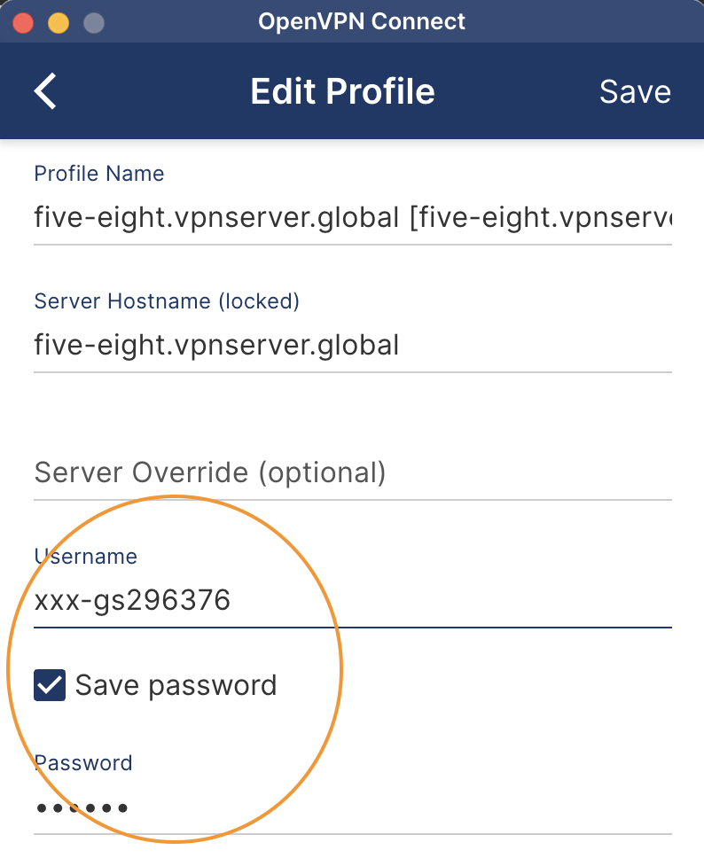
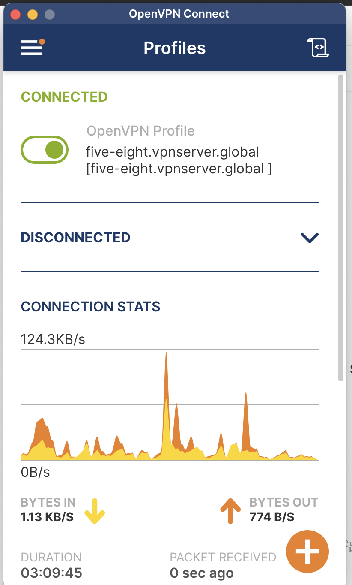

## Mục Đích (Mục Tiêu)

Mục Đích Của Tài Liệu Này Là Đưa Hướng Dẫn Kết Nối VPN Chi Tiết Vào Trong Sổ Tay, Đảm Bảo Việc Truy Cập Dễ Dàng Và Hướng Dẫn Người Dùng Được Nâng Cao.

## Phương Pháp Kết Nối 58VPN

### Phía Công Ty

1. **Cấp Phát VPN**: Liên Hệ @HanChenglin Để Nhận Thông Tin Đăng Nhập VPN.
2. **Chia Sẻ Thông Tin Đăng Nhập**: Tên Người Dùng Và Mật Khẩu Sẽ Được Chia Sẻ Qua Tin Nhắn Trực Tiếp Trên Slack.

### Phía Người Dùng

1. **Cài Đặt Client OpenVPN**:
   - Tải Về Và Cài Đặt Client OpenVPN Từ [OpenVPN Client](https://openvpn.net/client/).
2. **Tải Về Tệp Cấu Hình**:
   - Tải Về Tệp .ovpn: [five-eight.vpnserver.global.ovpn](https://prod-files-secure.s3.us-west-2.amazonaws.com/6c3f9a7d-2689-4572-b405-53079dc4da9a/fcde0572-410f-4806-b2ce-59838ce1e7cc/five-eight.vpnserver.global.ovpn).
3. **Thiết Lập Kết Nối**:
   - Nhấp Đúp Vào Tệp `five-eight.vpnserver.global.ovpn`.
   
   - Nhập Tên Người Dùng Và Mật Khẩu Của Bạn Để Thiết Lập Kết Nối.
   

## Liên Kết Và Tài Nguyên Liên Quan

- [Hướng Dẫn Cấu Hình Mạng](https://www.notion.so/929675712be747ceafce360315fa0be1?v=fe7b68a3ba064bd1bbdc14a346168035&p=2251fed8c290488eb67c5c92a25a8c6d&pm=s)
