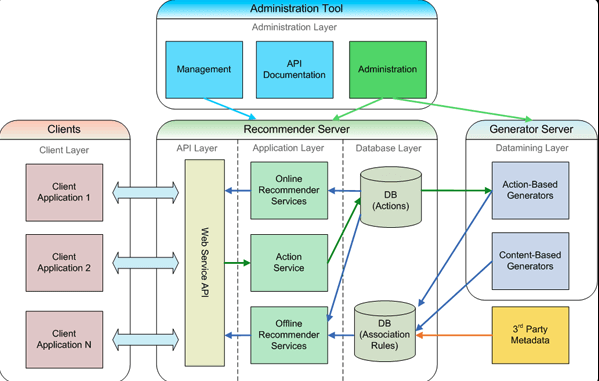
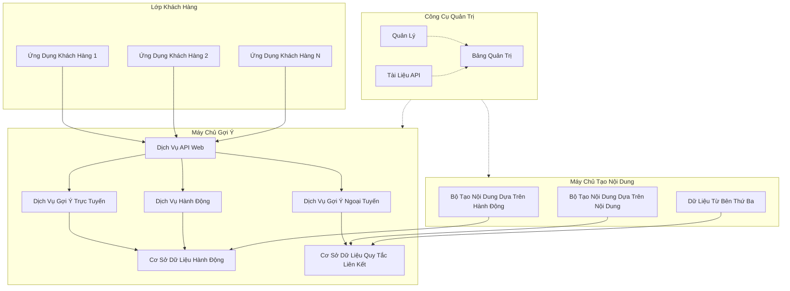

## Hướng Dẫn

Tạo Kiến Trúc Ứng Dụng bằng Markdown hoặc các công cụ khác như draw.io theo định dạng sau đây.

## Tổng Quan

Kiến trúc ứng dụng cung cấp mô tả về các thành phần cấu trúc của phần mềm, cách chúng tương tác và hợp tác để hỗ trợ các chức năng của ứng dụng.

## Mục Tiêu

Thiết kế một khung hệ thống có tổ chức để định nghĩa cách các phần khác nhau của ứng dụng hoạt động cùng nhau, đảm bảo sự nhất quán, khả năng mở rộng và dễ bảo trì.

## Các Điểm Chính Của Kiến Trúc Ứng Dụng

- Xây dựng các lớp với vai trò cụ thể, như lớp trình bày (presentation), lớp logic nghiệp vụ (business logic), và lớp truy cập dữ liệu (data access).
- Đảm bảo tính mô-đun để dễ dàng thực hiện các thay đổi và nâng cấp.
- Thiết kế hướng đến khả năng mở rộng thông qua việc phân tách trách nhiệm giữa các thành phần khác nhau.
- Duy trì sự rõ ràng để ứng dụng dễ hiểu, dễ kiểm thử và tích hợp.

## Ví Dụ Về Kiến Trúc Ứng Dụng

**Lưu Ý: Dưới đây là một ví dụ minh họa trực quan về kiến trúc ứng dụng. Ví dụ này chỉ mang tính tham khảo và cần được điều chỉnh theo yêu cầu cụ thể của ứng dụng của bạn. Việc sử dụng Mermaid hay một công cụ như Draw.io để tạo sơ đồ là tùy chọn của bạn.**

