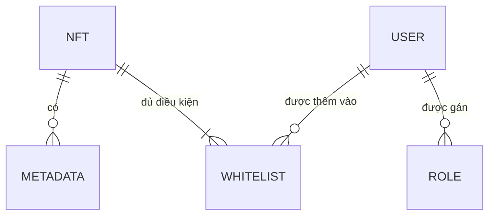

## Hướng Dẫn

Tạo Sơ Đồ Dữ Liệu Khái Niệm (Conceptual Data Diagram - CDD) bằng Markdown theo định dạng sau đây.

## Tổng Quan

Sơ Đồ Dữ Liệu Khái Niệm (Conceptual Data Diagram - CDD) minh họa các thực thể dữ liệu cơ bản và mối quan hệ của chúng trong một hệ thống. CDD giúp làm rõ kiến trúc khái niệm mà không đi vào chi tiết kỹ thuật của việc triển khai.

## Mục Tiêu

Mục đích của CDD là cầu nối giữa các mục tiêu kinh doanh và phạm vi kỹ thuật, nhấn mạnh các mối liên kết giữa các đối tượng dữ liệu trong khi loại trừ các chi tiết kỹ thuật như cột cụ thể của bảng, điều này sẽ được bổ sung ở giai đoạn thiết kế chi tiết.

## Sự Cần Thiết Của Sơ Đồ Dữ Liệu Khái Niệm

- Minh họa các thực thể chính và mối quan hệ của chúng.
- Cho phép giao tiếp rõ ràng giữa các nhóm kinh doanh và kỹ thuật.
- Định hình một kế hoạch tổng quan ở cấp cao để làm cơ sở xây dựng mô hình dữ liệu chi tiết hơn.
- Cung cấp cái nhìn tổng quan giúp làm sáng tỏ kiến trúc dữ liệu của hệ thống.

## Ví Dụ Mẫu Về Sơ Đồ Dữ Liệu Khái Niệm

**Lưu Ý: Ví dụ sau đây chỉ mang tính tham khảo về định dạng. Cần tùy chỉnh nội dung dựa trên yêu cầu cụ thể của dự án và hệ thống dữ liệu khái niệm của bạn.**

