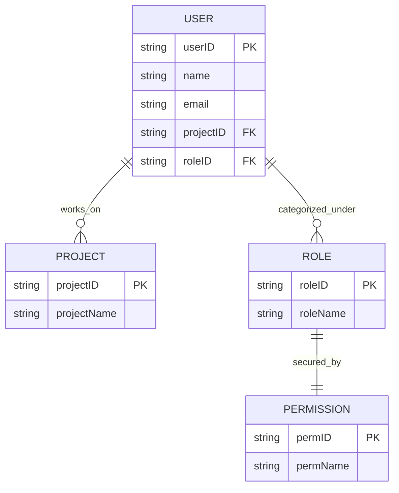

## Hướng Dẫn

Tạo Mô Hình Dữ Liệu Vật Lý bằng Markdown theo định dạng dưới đây.

## Tổng Quan

Mô Hình Dữ Liệu Vật Lý xác định cấu trúc của cơ sở dữ liệu, chẳng hạn như các bảng, cột, kiểu, ràng buộc và mối quan hệ.

## Mục Tiêu

Nhằm mô tả chính xác lược đồ cơ sở dữ liệu để triển khai, tạo điều kiện cho giao tiếp và đảm bảo đáp ứng được các yêu cầu của hệ thống.

## Các Điểm Cần Lưu Ý Khi Tạo Mô Hình Dữ Liệu Vật Lý

- Chọn giữa NoSQL và Hệ Quản Trị Cơ Sở Dữ Liệu Quan Hệ (RDBMS) dựa trên các trường hợp sử dụng cụ thể và mẫu truy cập dữ liệu.
- Xác định khóa chính và khóa ngoại để đảm bảo tính toàn vẹn quan hệ trong RDBMS hoặc thiết kế các cấu trúc khóa-giá trị, tài liệu, cột rộng hoặc đồ thị phù hợp cho NoSQL.
- Cung cấp chính xác kiểu dữ liệu và các ràng buộc để đảm bảo chất lượng dữ liệu.
- Kết hợp các chỉ mục và chiến lược chuẩn hóa (cho RDBMS) hoặc phi chuẩn hóa (cho NoSQL) để tối ưu hóa hiệu suất và truy xuất dữ liệu.

### Lựa Chọn NoSQL vs. RDBMS

- Đối với thiết kế lược đồ linh hoạt và yêu cầu mở rộng cao, hãy cân nhắc các cơ sở dữ liệu NoSQL.
- Khi các mối quan hệ dữ liệu và tính toàn vẹn trong giao dịch là ưu tiên hàng đầu, hãy chọn RDBMS.

### Các Điểm Xem Xét Quan Trọng Cho Mỗi Lựa Chọn

- **NoSQL:**
  - Lên kế hoạch cho khả năng mở rộng ngang và tiềm năng cho các cấu trúc dữ liệu khác nhau.
  - Tối ưu hóa cho tốc độ và khối lượng dữ liệu lớn có thể không phù hợp trong bảng truyền thống.
  
- **RDBMS:**
  - Sử dụng mô hình nhất quán dữ liệu mạnh mẽ và ngôn ngữ truy vấn có cấu trúc (SQL) cho các truy vấn phức tạp.
  - Tổ chức dữ liệu thành các bảng với các mối quan hệ được định nghĩa, làm cho nó trở nên lý tưởng cho các ứng dụng phức tạp với dữ liệu có liên quan.

## Ví Dụ Về Mô Hình Dữ Liệu Vật Lý

**Lưu ý: Dưới đây là ví dụ về định dạng khái niệm. Hãy điều chỉnh theo nhu cầu kiến trúc cơ sở dữ liệu của bạn.**

