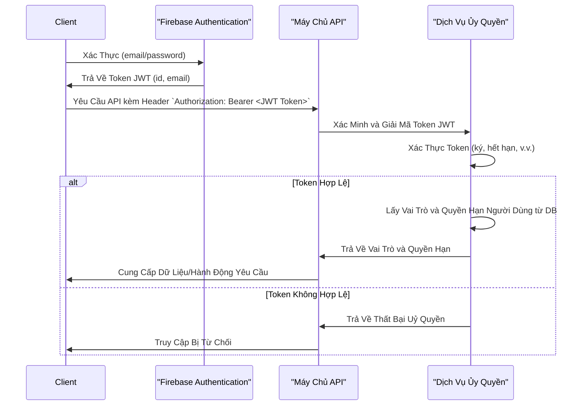

## Hướng Dẫn

Tạo Sơ Đồ Tuần Tự (Cấp Cao) bằng Markdown theo định dạng dưới đây.

## Tổng Quan

Sơ đồ tuần tự thể hiện cách các đối tượng và thành phần tương tác trong các kịch bản cụ thể của một hệ thống.

## Mục Tiêu

Nhằm minh họa trình tự hệ thống cấp cao, ghi lại các tương tác quan trọng từ bên ngoài và các quy trình hướng người dùng mà không đi sâu vào chi tiết các cơ chế nội bộ.

**Lưu ý: Tùy chỉnh ví dụ sơ đồ tuần tự dưới đây để thể hiện chính xác các tương tác hệ thống cấp cao của dự án của bạn.**

## Ví Dụ Về Sơ Đồ Tuần Tự

**Ví dụ dưới đây chỉ mang tính tham khảo về định dạng; nội dung nên thể hiện các tương tác cấp cao của hệ thống của bạn.**

