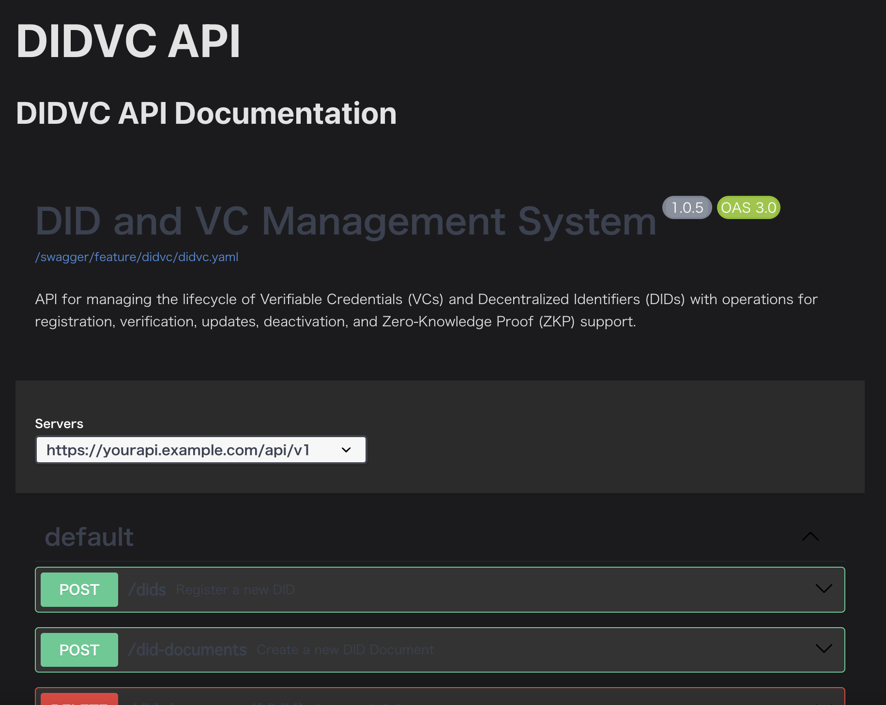

## Hướng Dẫn

Tạo Swagger (Định Nghĩa API) trong Openapi.yaml theo định dạng dưới đây.

## Tổng Quan

Swagger tạo điều kiện cho việc tạo tài liệu có cấu trúc cho các giao diện API, điều này rất quan trọng để đảm bảo sự giao tiếp rõ ràng giữa các nhóm phát triển.

## Mục Tiêu

Tạo tài liệu API toàn diện và cấp cao, phản ánh chính xác các điểm cuối và hoạt động khả dụng, không bao gồm xử lý hệ thống ở mức thấp. Tài liệu này hỗ trợ tích hợp và cung cấp thông tin cho cả phát triển giao diện người dùng và back-end.

## Các Điểm Chính Cho Định Nghĩa Swagger

- Cung cấp định nghĩa và mô tả API rõ ràng.
- Chỉ định các hoạt động, phản hồi và mã lỗi tiềm năng.
- Bao gồm các ví dụ phản hồi để cải thiện sự hiểu biết.
- Giải thích các phương pháp xác thực nếu có sử dụng.

## Ví Dụ Định Nghĩa Swagger

**Lưu ý: Dưới đây là một định dạng ví dụ cho tài liệu Swagger. Hãy điều chỉnh nó để phù hợp với các yêu cầu cụ thể của API của bạn.**



```yaml
openapi: 3.0.0
info:
  version: "1.0.0"
  title: "API Mẫu"
  description: "Tài liệu ví dụ API."

servers:
  - url: "https://api.sample.com/v1"

paths:
  /items:
    get:
      summary: "Lấy danh sách các mục"
      operationId: "listItems"
      responses:
        "200":
          description: "Một danh sách các mục."
          content:
            application/json:
              schema:
                type: "array"
                items:
                  $ref: "#/components/schemas/Item"

components:
  schemas:
    Item:
      type: "object"
      properties:
        id:
          type: "integer"
          format: "int64"
        name:
          type: "string"
        description:
          type: "string"
      required:
        - id
        - name
```
