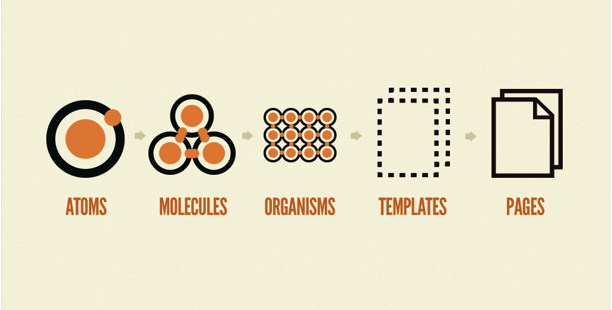
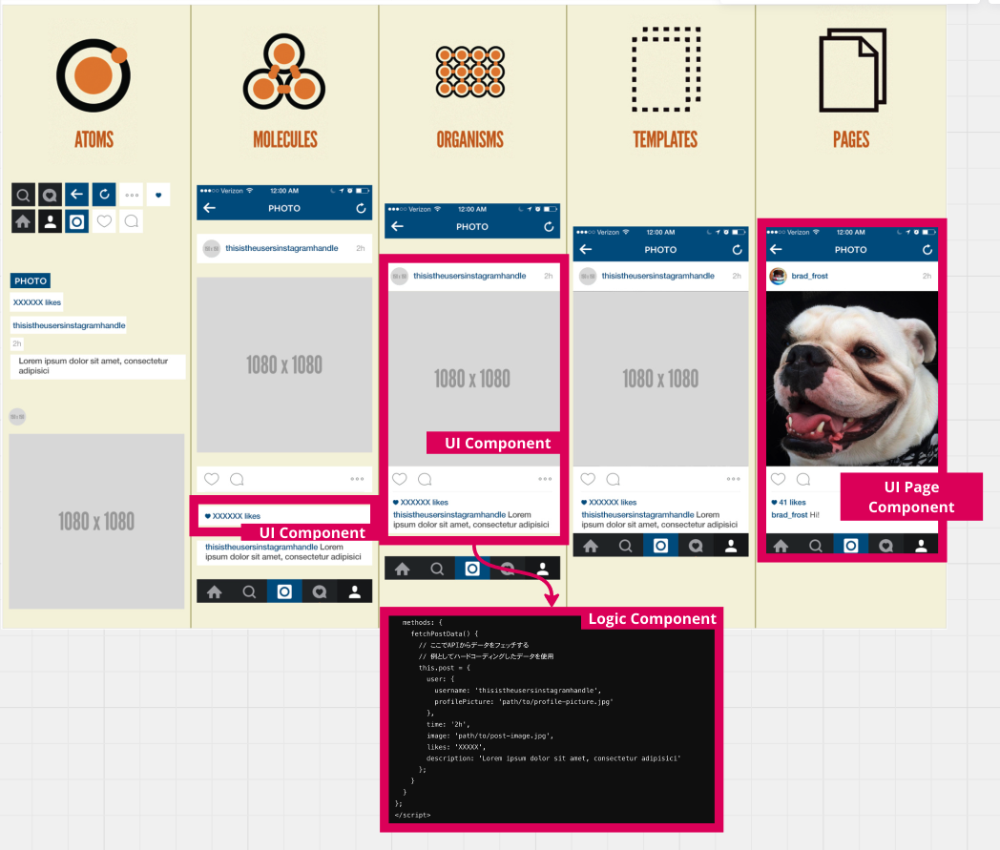
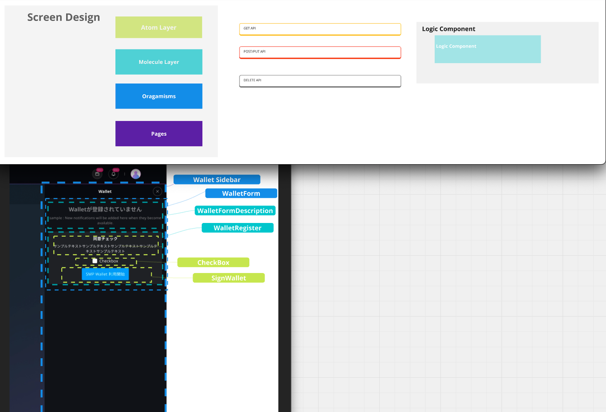

## Tổng Quan

Sử dụng Miro cho thiết kế thành phần giao diện người dùng liên quan đến việc minh họa các yếu tố giao diện để thiết lập một ngôn ngữ thiết kế nhất quán cho các sản phẩm kỹ thuật số.

## Nguyên Tắc

Áp dụng phương pháp thiết kế nguyên tử (Atomic Design) để xây dựng thành phần giao diện người dùng một cách có hệ thống, tập trung vào phân cấp từ các yếu tố cơ bản đến các trang hoàn chỉnh. Tham khảo hướng dẫn chi tiết [tại đây](https://atomicdesign.bradfrost.com/chapter-2/).

Trong SDF, các thành phần được chia và phát triển dựa trên các nguyên tắc của Atomic Design.

1. **Nguyên Tử (Atoms):** Các yếu tố UI cơ bản như nút và nhãn.
2. **Phân Tử (Molecules):** Nhóm chức năng của nguyên tử như một biểu mẫu tìm kiếm.
3. **Thể Chức (Organisms):** Các tổ hợp phức tạp của phân tử như tiêu đề.
4. **Mẫu (Templates):** Bố cục tổ chức các thể chức thành các trang.
5. **Trang (Pages):** Mẫu thể hiện với nội dung thực tế.

## Lợi Ích Của Phát Triển Thành Phần

Lợi ích của phát triển dựa trên thành phần sử dụng Atomic Design bao gồm:

- **Ranh Giới Mô-đun:** Ranh giới rõ ràng giữa các mô-đun, dẫn đến kích thước mô-đun nhỏ hơn và khả năng kiểm thử cải thiện.
- **Giải Thích AI:** Tuân thủ Atomic Design giúp dễ dàng hơn cho các AI tiêu chuẩn như ChatGPT trong việc giải thích và hiểu, vì các thiết kế này thường phù hợp với các mô hình đã được huấn luyện trước.
- **Giảm Thời Gian Tiến Hành:** Kích thước tệp nhỏ hơn giảm thời gian tiến hành cho các đầu ra của AI Agent.
- **Dễ Dàng Chuyển Đổi:** Dễ dàng chuyển đổi từ các thành phần thiết kế trong các công cụ như Figma thành các thành phần giao diện người dùng.
- **Nhất Quán:** Đảm bảo tính nhất quán của UI thông qua các thành phần tái sử dụng.
- **Khả Năng Mở Rộng:** Giúp hệ thống dễ mở rộng hơn bằng cách chia nhỏ UI thành các phần quản lý được.
- **Hiệu Quả:** Tăng cường hiệu quả phát triển bằng cách tái sử dụng các thành phần.

## Định Nghĩa Tại 58

Chúng tôi có các định nghĩa cụ thể được ánh xạ tới các nguyên tắc của Atomic Design. Bằng cách thực hiện kiểm thử đơn vị và kiểm thử chức năng UI cho từng thành phần này, chúng tôi hướng đến việc cải thiện chất lượng:

- **Trang UI (UI Page):** Tương ứng với thành phần Trang và Mẫu.
- **Thành Phần UI (UI Component):** Tương ứng với Phân Tử và Thể Chức.
- **Thành Phần Logic (Logic Component):** Thể hiện logic nghiệp vụ không có UI, như giao tiếp API và xử lý kết quả, thường được viết bằng JavaScript cho các framework như Vue.js.
- **Nguyên Tử Trong SDF:** SDF không định nghĩa các quy tắc phát triển cụ thể cho Nguyên Tử. Lý do là Nguyên Tử thường đi kèm với chức năng được đảm bảo như một phần các thành phần thiết kế như Vuetify hoặc các thành phần tiêu chuẩn trong iOS mà chúng tôi thường xuyên sử dụng.

Bằng cách tuân theo những nguyên tắc và định nghĩa cụ thể này, chúng tôi có thể đảm bảo quy trình phát triển thành phần UI nhất quán và hiệu quả.

## Định Nghĩa Luồng UI Trên Miro

1. Chuẩn bị thiết kế Figma để chuyển sang Miro.
2. Thiết lập một bảng Miro mới và chọn mẫu nếu cần.
3. Nhập thiết kế từ Figma sử dụng tích hợp của Miro hoặc bằng cách tải lên.
4. Sắp xếp các màn hình, kết nối chúng với các đầu nối và thêm chú thích.
5. Sử dụng hình dạng, biểu tượng và mã hóa màu để làm phong phú biểu đồ luồng.
6. Mời nhóm để cộng tác và sử dụng nhận xét để phản hồi.
7. Lặp lại dựa trên đầu vào và đồng bộ hóa các cập nhật với Figma.

### Ví Dụ

Thiết lập các luồng UI trên Miro giúp chuyển đổi các thiết kế từ Figma thành các hình ảnh trực quan dễ hiểu, tối ưu hóa giao tiếp nhóm và làm rõ dự án.
