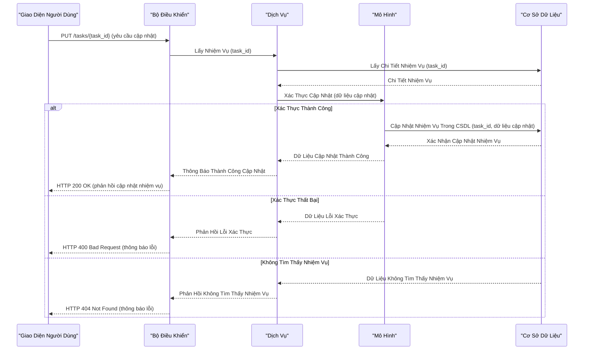

## Hướng Dẫn

Viết một tệp Markdown đáp ứng các yêu cầu sau.

## Tổng Quan

Thiết kế API cấu trúc giao diện ứng dụng, thiết lập các giao thức rõ ràng cho việc trao đổi dữ liệu và các hoạt động nội bộ.

## Mục Tiêu

- Tạo ra luồng hoạt động liền mạch trong và giữa các thành phần ứng dụng.
- Biên soạn cấu trúc giao diện để đảm bảo sự rõ ràng và nhất quán trong phát triển.

## Điểm Quan Trọng

- Làm rõ vai trò của điểm cuối, các yêu cầu dự kiến và các phản hồi tiềm năng.
- Phác thảo các giao thức xử lý lỗi.
- Phát triển sơ đồ trình tự minh họa cả quy trình thành công và quy trình lỗi.

## Ví Dụ Thiết Kế API

### Sơ Đồ Trình Tự Mẫu Cho Quá Trình Cập Nhật Nhiệm Vụ

Sơ đồ trình tự này cho thấy quy trình API cập nhật nhiệm vụ, bao gồm việc lấy dữ liệu ban đầu và các bước cập nhật tiếp theo.

### Thủ Tục

1. Giao diện người dùng gửi yêu cầu PUT đến Bộ điều khiển với `task_id` và dữ liệu cập nhật.
2. Bộ điều khiển yêu cầu chi tiết nhiệm vụ hiện tại từ Dịch vụ, và dịch vụ sẽ truy vấn từ Cơ sở dữ liệu.
3. Khi nhận được, Dịch vụ gửi dữ liệu cập nhật đến Mô hình để xác thực.
4. Nếu xác thực thành công, Mô hình sẽ chỉ thị Cơ sở dữ liệu cập nhật nhiệm vụ.
5. Cơ sở dữ liệu xác nhận hoàn tất cập nhật, gửi dữ liệu ngược lại qua Mô hình và Dịch vụ đến Bộ điều khiển.
6. Bộ điều khiển gửi phản hồi thành công đến Giao diện người dùng nếu việc cập nhật nhiệm vụ được xác nhận.
7. Trong trường hợp xác thực thất bại hoặc không tìm thấy nhiệm vụ, Mô hình thông báo cho Dịch vụ, và Dịch vụ chuyển tiếp các thông báo lỗi phù hợp qua Bộ điều khiển đến Giao diện người dùng.
